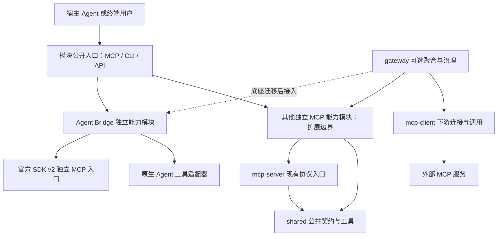

# ai-mcp 总体架构与模块边界

日期：2026-10-08（Asia/Shanghai）。状态：第一版架构与候选实现；实际验证和未完成项见[Bridge 实现记录](reviews/2026-10-08-agent-bridge-implementation.md)。

本文记录本次讨论确认的仓库定位、多模块边界以及与 ai-code 的分工。底座现有实现、SDK v2 迁移和新增 Agent Bridge 分别维护自己的规格与验证证据，不以一份设计稿替代全部模块的契约。

## 1. 文档导航与当前事实

| 主题                                    | 权威入口                                                                                                                                                   | 状态与适用范围                           |
| --------------------------------------- | ---------------------------------------------------------------------------------------------------------------------------------------------------------- | ---------------------------------------- |
| 仓库分层、多个 MCP 能力模块、跨项目边界 | 本文                                                                                                                                                       | 本次设计；公共边界与模块责任             |
| Agent Bridge 模块与公开 API             | [模块设计](modules/agent-bridge.md)                                                                                                                        | 候选实现；CLI、MCP、任务服务、执行器适配 |
| 已实现通用底座                          | [P0 架构](superpowers/specs/2026-10-01-mcp-foundation-architecture.md)、[整体返修报告](superpowers/reviews/2026-10-03-mcp-overall-review-repair-report.md) | 历史设计与实际交付证据分开阅读           |
| 连接恢复与 peer fault 修复              | [2026-10-08 修复报告](superpowers/reviews/2026-10-08-mcp-foundation-defect-repair-report.md)                                                               | 独立修复记录，不代表 Bridge 验收         |
| SDK v2 与新协议                         | [现代化设计](superpowers/specs/2026-10-03-mcp-v2-modernization-design.md)                                                                                  | 仍是独立设计与实施阶段                   |
| ai-code 多插件及派发插件                | [ai-code 架构](../../ai-code/docs/architecture.md)、[派发插件设计](../../ai-code/docs/design/2026-10-08-agent-delegation-plugin-design.md)                 | 上层使用规范与插件发行                   |

本次起草基线为 `main@2c6a767`，原有 `shared`、`mcp-server`、`mcp-client`、`gateway` 四个基础包仍采用 SDK 1.27.1。现已新增独立 `packages/agent-bridge` 候选实现，包含 CLI、可导入客户端、任务服务、三适配器和官方 SDK v2 MCP 入口。它不等于四个基础包已迁移，也不证明现有 v1 Gateway 或原生宿主 MCP 已接入。使用入口见[模块 README](../packages/agent-bridge/README.md)；未提交、未安装或发布。

2026-09-30 的[协作设计](superpowers/specs/2026-09-30-agent-collaboration-design.md)保留历史原文。本稿及 Bridge 模块稿更新其“Codex 固定主控”、执行器范围和默认流程：三种工具均可发起或执行；独立派发只在用户明确要求时进入；首版不要求桌面可见。旧平台文档中的自主业务规划、数据库和企业治理设想不自动成为本轮范围。

## 2. 项目定位与多模块原则

ai-mcp 是承载多个 MCP 能力模块及其程序化入口的技术仓库。公共底座提供协议、校验、连接和治理；各能力模块提供自己的领域操作。某模块可以同时提供 MCP、CLI 和可导入 API，仓库名称不会限制该模块只能通过 MCP 使用。

- 四个基础包是公共工程与协议能力，不等同于四个已经发布的业务 MCP 产品。
- `agent-bridge` 是其中一个独立能力模块，不成为所有模块的根控制器。
- 新模块有独立操作契约、配置、生命周期、测试和支持声明；不要求其他模块具有 Agent 会话、任务或进程状态。
- 各模块按显式入口启用。Gateway 的后端配置选择实例，不因目录中存在包就自动加载、启动或授权。
- 可以独立使用一个模块，也可以按需聚合多个模块。聚合不改变各模块的身份、资源所有权及执行语义。
- 本版不增加通用动态模块市场、任意代码 hook、依赖自动安装、热插拔或跨机器调度。

## 3. 分层与依赖

图中的“其他模块”表示仓库允许的扩展边界，不表示存在已实现的虚构模块。Bridge 当前独立使用官方 SDK v2；已有 mcp-server/client/gateway 仍为 SDK v1，Gateway 到 Bridge 的线表示底座迁移后的接入，不是已完成集成。Gateway 聚合模块的 MCP 入口；直接 CLI/API 不必绕行 Gateway，也不把普通 Agent CLI 当成 MCP 服务。

| 层           | 责任                                            | 依赖边界                                    |
| ------------ | ----------------------------------------------- | ------------------------------------------- |
| `shared`     | 协议无关的公共描述、校验、调用关联及错误工具    | 不持有 Agent 任务状态，不依赖某个能力模块   |
| `mcp-server` | 注册与调用管线、官方 SDK 协议适配、传输资源管理 | 业务 handler 通过模块注入；不嵌入执行器流程 |
| `mcp-client` | 发现、调用、结果校验、连接和错误处理            | 连接 MCP peer；不推断自然语言派发授权       |
| `gateway`    | 显式后端聚合、命名空间、策略、审计和下游所有权  | 不管理 Bridge 工作流、Agent 会话或代码验收  |
| 能力模块     | 独立领域 API、应用服务、领域资源和模块测试      | 复用基础包，避免把领域状态塞进公共包        |
| 模块入口     | MCP/CLI/API 对同一应用服务的映射                | 不各自实现一份状态机或不同错误语义          |

Bridge 第一版在一个独立包内按目录组织，不为尚无需求的每一层创建额外 npm 包。模块版本来自其包清单；公开 API 主版本和原生工具版本分别记录，不复制为根仓库统一产品版本。

## 4. 与 ai-code 的责任契约

| 事项                                 | ai-mcp                                             | ai-code                                     |
| ------------------------------------ | -------------------------------------------------- | ------------------------------------------- |
| 用户是否明确要求跨工具或独立会话派发 | 接收可关联的派发请求；不把模型布尔标记当成人类证明 | 指导发起会话核对真实用户要求与任务范围      |
| 选择与交接目标                       | 校验明确 engine、会话绑定和可用能力，不自动替换    | 整理目标、任务与上下文；缺失信息时补齐      |
| Bridge CLI/MCP/API                   | 定义并实现；共享同一应用语义                       | 通过版本化接口调用，必要时提供薄调用辅助    |
| 原生 CLI/会话接口适配                | 启动、解析事件、续接、取消、资源回收               | 不复制驱动与进程管理                        |
| 持久化、恢复、幂等、工作区占用       | 任务服务拥有并校验                                 | 不维护另一份执行真相源                      |
| 代码交付与验收                       | 保存代码快照、diff、日志和验证证据                 | 指导发起会话对具体交付作出验收与返修判断    |
| 插件身份、资源、宿主包装及市场       | 不维护 ai-code 插件发行状态                        | 各插件自维护；公共工具按 catalog 构建与校验 |

ai-code 是多插件仓库，派发插件只是其中一项产品。Bridge 不依赖 CodeVow 的 `.ai-workflow` 状态、策略或 Reviewer；派发插件也不会重写兄弟插件的默认行为。两个仓库通过版本化操作契约衔接，不复制源码或运行状态。

## 5. 已确认的行为约束

1. 用户明确要求跨工具或同工具另一个独立会话时才派发。普通开发、开启多代理或讨论某工具能力，不产生 Bridge 写操作。
2. Claude Code、ZCode、Codex 均可发起和执行。候选建议默认优先其他引擎；用户明确选择同工具独立会话时允许执行。
3. 明确目标不可自动替换；目标缺失或能力不支持时返回可解释状态，不能静默改为当前会话、子代理或另一工具。
4. 首版支持独立、持久化、按准确 ID 续接的执行会话。桌面可见、手动接着聊、接管现有桌面会话留到独立宿主验证。
5. 验收回到发起会话。进程结束、任务 completed 和代码验收通过是不同事实。
6. 安装插件、启动服务、发现工具和以前执行过派发，都不会授予未来普通任务的派发权限。
7. 不自动创建额外审阅会话、递归派发或形成固定 Agent 流水线；用户明确选择的协作流程按其范围执行。
8. 模型、供应商和账号沿用执行器当前可用配置。Claude Code、ZCode 使用官方或第三方模型均可；Bridge 不维护模型白名单、不固定模型分工，也不因模型品牌拒绝派发。安装、Git 提交/推送/合并/PR 与发布仍需各自明确授权。

## 6. 统一适配与易用性

Bridge 类似多浏览器操作封装：上层使用稳定动词和对象，下层适配不同工具。统一的是 start/get/continue/cancel 等操作意图，不是假定所有引擎具有相同事件、权限和会话能力。

每个模块为自己的 CLI 和 MCP API 维护名称、帮助、示例及语义测试。公共要求为：

- 名称清楚、常用路径短、对象 ID 稳定；避免一个接受任意命令字符串的万能 `execute` 工具。
- CLI 人读帮助与机器 JSON 分开，日志写 stderr；MCP descriptor 提供明确输入、输出和副作用说明。
- 跨入口共用参数定义和应用服务；传输外壳可以不同，但成功、失败、幂等、取消和执行状态的含义一致。
- 能力查询说明 supported/unsupported/unverified，不能因某工具缺失能力而伪造成功。
- 原生 session ID、MCP session ID、任务 ID 和一次运行 ID 分开；使用者优先按任务 ID操作。
- 输出摘要有明确截断标记及产物引用，大日志分页读取；内部协议差异由适配器处理，诊断仍可追溯。

具体命名、示例和错误契约见 [Bridge 模块设计](modules/agent-bridge.md)。这些 API 已有候选实现；实际原生能力仍按运行证据声明，不能由命令存在推导所有宿主可用。

## 7. 实施与验证边界

SDK v2 现代化是已单独选择的底座方向。Bridge 的原生 CLI 适配可以先独立验证；正式 MCP 接入须使用底座最终契约并通过真实宿主协议矩阵，不重新增加双栈长期兼容路线。

每个模块分别报告静态契约、单元、真实传输、原生工具执行和宿主使用证据。Gateway 可见、CLI 帮助有参数、SDK 接口存在或历史测试通过，都不能代替新模块的实际执行验收。

本轮已依照模块设计新增候选源码和测试，并独立维护实现证据。全局配置、宿主安装、Git 与正式发行仍需用户针对相应操作授权；未以实现或文档登记代替这些授权。
