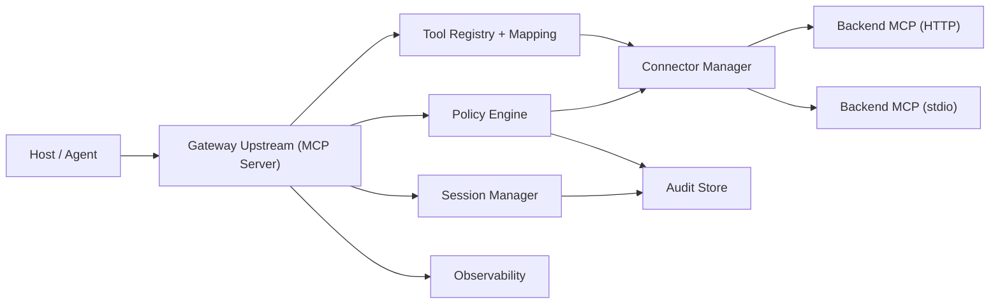

# MCP Gateway + Server 设计文档（V2，可实施版）

状态：Draft  
作者：ai-mcp 团队  
日期：2026-03-02  
适用仓库：`/Users/zhouze/Documents/git-projects/ai-mcp`

## 1. 目标与原则

本设计用于在 `ai-mcp` 基础上重构为生产可用的 MCP Gateway（上游扮演 MCP Server、下游扮演 MCP Client），并保留 demo server 能力。

核心原则：

- 协议优先：以 MCP `2025-11-25` 为主，实现标准握手、能力协商、传输语义。
- 兼容优先：必须支持 `2025-03-26` 缺省行为；支持 `2024-11-05` 回退路径（兼容模式）。
- SDK 优先：协议细节优先复用官方 TypeScript SDK；自研集中在治理、路由、观测、存储。
- 安全优先：默认拒绝高风险行为（token passthrough、无限重试、无边界队列）。
- 先小后大：MVP 只做“可用且可验证”的最小闭环，后续再扩展资源/提示词/高级能力。

## 2. 本版修正点（相对上一版）

本 V2 文档显式修正以下问题：

1. 引用可追溯

- 不再使用不可解析的中间态引用标记。
- 规范来源统一在文末“参考链接”中给出可访问 URL。

2. 协议版本策略与类型定义一致

- 兼容策略声明与代码契约统一：`2025-11-25 | 2025-03-26 | 2024-11-05`。
- 回退只在兼容模式开启时生效，默认关闭。

3. 重试策略不信任下游注解

- 不以工具注解单独作为重试依据。
- 仅在“平台 allowlist + 幂等键 + 风险等级通过”同时满足时允许重试。

4. 审计摘要抗枚举

- `input_hash` 采用 `HMAC-SHA256(secret, canonical_input)`。
- 明确密钥轮换和日志脱敏规则。

5. MVP 范围收敛

- 第一阶段仅实现：`initialize`、`tools/list`、`tools/call`、`notifications/cancelled`、stdio + Streamable HTTP。
- resources/prompts/tasks/elicitation 等延后到后续里程碑。

## 3. 范围（MVP 与非 MVP）

### 3.1 MVP（必须完成）

- 上游接入：
  - Streamable HTTP `/mcp`
  - 可选 stdio（用于本地联调）
- 下游连接：
  - MCP over Streamable HTTP
  - MCP over stdio 子进程
- 协议能力：
  - `initialize` / `notifications/initialized`
  - `tools/list`（支持聚合与分页透传）
  - `tools/call`（路由 + 策略 + 错误映射）
  - `notifications/cancelled`（向下游传播取消）
- 网关治理：
  - Tool allowlist
  - 每租户基础限流
  - 基础审计日志
- 可观测性：
  - 结构化日志
  - 基础 metrics
  - trace id 贯通

### 3.2 非 MVP（后续迭代）

- `resources/*`、`prompts/*`
- `tasks/*`、elicitation、sampling
- Registry 自动发现
- 策略 DSL 与复杂 ABAC 条件编排

## 4. 总体架构



说明：

- Upstream 处理协议握手与对外能力声明。
- Connector Manager 负责与下游后端建立独立会话。
- Session Manager 保存 upstream session 与 downstream session 映射。

## 5. 协议与兼容策略

### 5.1 版本兼容

代码契约：

```ts
export type SupportedProtocolVersion = '2025-11-25' | '2025-03-26' | '2024-11-05';
```

策略：

- 默认主版本：`2025-11-25`
- 未显式协议头时：按 `2025-03-26` 处理
- `2024-11-05`：仅在 `compatibility.legacyHttpSse = true` 时允许
- 非支持版本：返回 `400` + 协议错误

### 5.2 工具映射

默认映射策略：

- 对外工具名：`{backendId}__{toolName}`
- 路由键：`backendId + toolName`
- 允许可选 alias，但 alias 必须唯一并可回溯到原始工具

### 5.3 错误模型

- JSON-RPC 标准错误：`-32700/-32600/-32601/-32602/-32603`
- 网关错误（`-32000 ~ -32099`）：
  - `-32010` rate_limited
  - `-32020` policy_denied
  - `-32030` backend_unavailable
  - `-32040` backend_timeout
- 工具业务错误：优先返回 MCP tool result 的 `isError: true`

## 6. 安全设计

### 6.1 认证与授权

- 上游：JWT/OIDC 或 API Key（按部署模式配置）
- 下游：独立凭证，不透传上游 token
- 禁止 token passthrough（默认 hard fail）

### 6.2 重试与副作用控制

`tools/call` 重试必须同时满足：

- 工具在平台配置中被标记 `retry_allowed=true`
- 请求携带幂等键（例如 `x-idempotency-key`）
- 策略引擎判定为低风险

否则：不自动重试。

### 6.3 审计与脱敏

审计最小字段：

- `ts`, `tenant_id`, `client_id`, `subject`
- `action`, `tool`, `backend_id`, `decision`, `trace_id`
- `input_hash`

摘要算法：

- `input_hash = HMAC_SHA256(audit_secret_vN, canonical_json(input))`
- `audit_secret` 轮换：支持 `vN/vN+1` 双读，回收旧版本

日志规则：

- 严禁记录 token、api key、cookie、完整 PII
- 对参数和结果做字段级脱敏（先脱敏再序列化）

## 7. 数据模型（MVP）

MVP 只保留必要实体：

- `tenant`
- `backend`
- `tool_mapping`
- `gateway_session`
- `backend_session`
- `audit_event`
- `policy_binding`（只含 allowlist + rate limit）

存储建议：

- MVP：SQLite（单实例）或 Postgres（团队环境）
- 生产：Postgres（建议）

## 8. 代码组织（与当前仓库对齐）

建议在现有 monorepo 增量演进：

- `packages/gateway-core`：路由、映射、策略接口、错误模型
- `packages/gateway-server`：上游 MCP server（http/stdio）
- `packages/gateway-connectors`：下游 http/stdio 连接器
- `packages/gateway-policy`：allowlist + 限流实现
- `packages/gateway-storage`：存储抽象与实现
- `apps/gateway`：可运行入口

保留现有：

- `packages/mcp-server`、`packages/mcp-client` 作为 demo/兼容包，逐步内聚到 gateway 相关包。

## 9. 里程碑与验收门禁

### M1：协议与路由闭环（1-2 周）

交付：

- 单 upstream endpoint 可聚合两个 backend 的 `tools/list`
- `tools/call` 正确路由与响应
- `notifications/cancelled` 向下游传播

门禁：

- 单元 + 集成测试通过
- typecheck/lint/build 全通过

### M2：治理与观测（1 周）

交付：

- allowlist + per-tenant rate limit
- 审计事件落库
- metrics + trace id

门禁：

- 压测下无明显内存泄漏
- 审计字段完整且敏感字段不落盘

### M3：兼容与发布（1 周）

交付：

- `2025-11-25 / 2025-03-26` 回归通过
- `2024-11-05` 兼容模式验证通过
- Inspector E2E 可用

门禁：

- 兼容矩阵测试通过
- 发布说明明确支持范围与限制

## 10. 测试策略

必须覆盖：

- 协议握手：initialize 生命周期
- 聚合一致性：tools/list 结果稳定
- 路由正确性：tools/call -> 正确 backend
- 取消竞态：请求完成前后取消的行为一致
- 错误映射：网关错误码与 JSON-RPC 错误码一致
- 安全回归：token 脱敏、allowlist、生效限流

建议命令：

- `pnpm lint`
- `pnpm typecheck`
- `pnpm test`
- `pnpm build`

## 11. 开工前冻结项（必须确认）

开工前需要一次性冻结以下配置：

- 默认协议版本：`2025-11-25`
- 是否开启 legacy `2024-11-05` 兼容模式（默认关）
- 工具命名约定：`backend__tool`
- 重试策略：默认禁用，仅 allowlist 开启
- 审计存储：SQLite 还是 Postgres（MVP 环境）

## 12. 参考链接

- MCP SDK 文档：https://modelcontextprotocol.io/docs/sdk
- MCP 规范：https://spec.modelcontextprotocol.io
- TypeScript SDK 仓库：https://github.com/modelcontextprotocol/typescript-sdk
- JSON-RPC 2.0：https://www.jsonrpc.org/specification
