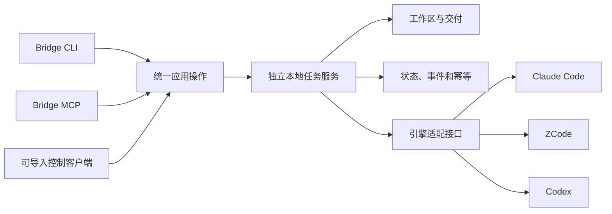

# Agent Bridge 模块设计：统一 CLI 与 MCP 操作

日期：2026-10-08（Asia/Shanghai）；2026-10-09 补充。状态：设计与 0.1.0 候选实现。CLI/API/runtime/适配器/MCP 已有源码和测试，完整三端宿主与 ZCode 原生会话执行尚未验收；详见[实现记录](../reviews/2026-10-08-agent-bridge-implementation.md)与[使用说明](../../packages/agent-bridge/README.md)。本文按[总体架构](../architecture.md)定义职责，不改变其他 MCP 模块。上层插件见 [ai-code 派发设计](../../../ai-code/docs/design/2026-10-08-agent-delegation-plugin-design.md)。

## 1. 已确认范围与本稿建议

| 类型     | 决策                                                                           |
| -------- | ------------------------------------------------------------------------------ |
| 已确认   | ai-mcp 多能力模块与 ai-code 多插件保持独立；Bridge 是其中一项模块              |
| 已确认   | CLI 与 MCP 均纳入；实际原生工具调用、状态和恢复由 ai-mcp 承载                  |
| 已确认   | 三执行器为 Claude Code、ZCode、Codex；调用者与执行者对等                       |
| 已确认   | 只有用户明确要求派发才进入；默认当前会话及原生子代理行为不变                   |
| 已确认   | 同工具可派发到另一个独立会话；首版独立、持久、可续接，桌面可见性后验           |
| 本稿建议 | 包名 `@ai-mcp/agent-bridge`、CLI 名 `agent-bridge`、应用契约 `agent-bridge/v1` |
| 本稿建议 | 单用户、单机器；一个工作区同时最多一个 Bridge 写运行；默认新建独立会话         |
| 本稿建议 | 任务使用登记项目；工作区默认选择隔离模式，使用现有目录必须显式指定             |

CLI 命名、目录布局及默认值已按本版落为候选实现。实现状态与原生能力仍逐项验证，不能由 API 存在推导通过。首版不做任意 Agent 编排、跨机器调度、模型/账号管理、自动安装、自动 Git 交付或固定开发审阅循环。

## 2. 适配模型与模块组织

类似 Playwright 的多浏览器封装，Bridge 将统一操作映射到不同引擎。统一 API 面向任务和独立会话；驱动声明真实差异。它不转发任意 shell 指令，也不要求原生 CLI 自己实现 MCP。

```text
packages/agent-bridge/                  # 一项独立能力模块
  package.json                        # 模块身份、版本、公开入口
  src/contracts/                      # 模块 DTO、Schema、错误与版本
  src/application/                    # 两种入口共用的操作服务
  src/runtime/                        # 本地任务服务、锁、事件与恢复
  src/workspaces/                     # 项目绑定、工作区、代码交付
  src/adapters/                       # claude-code / zcode / codex
  src/entrypoints/                     # CLI、MCP、runtime serve
  src/client/                         # 可导入的控制客户端
  test/                               # 模块契约与真实执行器验收
```

不为三个适配器或每个目录提前拆独立 npm 包。契约首先位于模块内部；`shared` 保留公共工具，不成为所有能力模块的 Agent 状态库。Gateway 只连接 Bridge MCP 入口，CLI/API 直接访问同一个任务服务。



入口是短请求控制面，任务服务拥有长任务。MCP 客户端关闭或某次 CLI 查询退出不取消已登记任务。任务服务使用当前用户权限的本地 IPC；不自动安装系统服务。服务可以按实际操作需要启动，但发现/预检不得启动模型执行。

## 3. 调用者、目标与授权边界

规范 engine ID 固定为 `claude-code`、`zcode`、`codex`；插件宿主名 `claude` 映射为 `claude-code`，两种名称不能混用。

- caller 标识发起工具及原会话；target 标识执行引擎和执行会话策略。身份由受控连接/启动配置关联，不从模型名或提示词猜测。
- `engine list` 的 `preferredTargets` 默认排除 caller 的引擎，完整目录仍包括三个引擎。未知 caller 时不推断默认目标。
- `task start` 必须明确 engine，且始终创建独立根会话。相同引擎额外要求 `sameEngineIntent: independent-session`；缺少该字段时拒绝，不能从默认 `sessionPolicy: new` 推导明示。CLI 的 `--independent-session` 与 MCP/API 的该字段一一映射，由上层依据用户明确要求提供。该字段表达意图，不证明人类授权来源；不得把原生子代理或发起会话当作独立目标。
- 继续已登记任务使用其精确会话绑定，不能用 `--last`、当前目录最近历史或 MCP session ID 代替。
- 目标不可用、续接能力未通过验证或会话绑定冲突时明确拒绝，不静默替换引擎、会话或权限。
- 用户自然语言明示由上层技能核对并保存范围引用；终端用户直接提交命令也构成显式操作入口。任务服务校验请求角色、范围、绑定、权限及幂等。
- 模型填写的 `approved:true` 或 `explicitRequested:true` 不能证明人类授权。没有宿主可验证用户事件或原生审批证据时，只能说明使用了指令层约束，不声称程序已验证人类来源。
- 执行会话使用 worker 控制权限，不拥有新派发及上游验收权限；用户授权的进一步派发由发起控制路径处理。此约束不代替原生执行器沙箱。
- 同一已授权任务的查询、取消与范围内续接沿用任务授权；新目标、新任务或扩大范围需要新的明确用户指令，不机械重复确认既有授权。

安装插件、启用多代理、任务复杂、模型建议“交给另一个工具”及讨论某工具能力，均不是派发意图。具体正负场景由插件稿和宿主验收共同覆盖。

## 4. 公开操作：易读、短路径、同语义

以下为候选实现的统一 API。CLI 使用名词与动词；MCP 名称带模块前缀，防止多个模块聚合时碰撞；可导入客户端使用同一对象与方法。TypeScript 输入、输出类型见 contracts/operations.ts，默认字段可省略。

| CLI             | MCP tool                     | 控制客户端       | 语义                                               |
| --------------- | ---------------------------- | ---------------- | -------------------------------------------------- |
| `engine list`   | `agent_bridge_engines`       | `engines.list`   | 能力、版本、验证状态及候选建议；不启动任务         |
| `preflight`     | `agent_bridge_preflight`     | `preflight`      | 目录、引擎、权限与会话预检；不启动模型或创建工作区 |
| `task start`    | `agent_bridge_start`         | `tasks.start`    | 幂等登记，返回任务 ID；异步启动                    |
| `task get`      | `agent_bridge_get`           | `tasks.get`      | 查询当前状态与交付摘要                             |
| `task list`     | `agent_bridge_list`          | `tasks.list`     | 有范围和分页的任务列表                             |
| `task watch`    | `agent_bridge_events`        | `tasks.events`   | cursor 增量事件、有界等待                          |
| `task continue` | `agent_bridge_continue`      | `tasks.continue` | 续接同任务已绑定会话，新增一次 run                 |
| `task cancel`   | `agent_bridge_cancel`        | `tasks.cancel`   | 请求取消；确认运行退出后才是 cancelled             |
| `artifact list` | `agent_bridge_artifacts`     | `artifacts.list` | 查询登记产物和摘要                                 |
| `artifact read` | `agent_bridge_artifact_read` | `artifacts.read` | 按产物 ID、offset/limit 分页读取                   |

首版不提供任意命令 `run-shell`，不提供默认自动选引擎的 `auto`，不暴露模型内部步骤作为控制 API。已有会话的导入、分叉、接管和桌面显示为后续能力，不混入 start/continue 的默认行为。

### 4.1 CLI 示例

以下均是说明性命令，本轮不执行：

```sh
agent-bridge engine list --json
agent-bridge preflight --engine claude-code --project ai-mcp --json
agent-bridge task start --engine claude-code --project ai-mcp \
  --spec-file ./task.json --request-id req-demo-1 --json
agent-bridge task get task_123 --json
agent-bridge task watch task_123 --cursor event_7 --wait-ms 30000 --json
agent-bridge task continue task_123 --message-file ./feedback.md \
  --request-id req-demo-2 --json
agent-bridge task cancel task_123 --request-id req-demo-3 --json
agent-bridge artifact list --task task_123 --json
agent-bridge artifact read artifact_456 --task task_123 --offset 0 --limit 16384 --json
```

对同工具新会话派发，在 start 时显式传 `--independent-session`。它仍经过 caller/session 检查，不把一个开关当成授权来源证明。所有副作用操作有 `requestId`；CLI 可生成，但必须在发送前保存本地操作凭据并提供可恢复查询方式，成功响应也显示该 ID。网络结果不确定时重用原 ID，不应自行再生成新 ID重跑任务；自动化调用建议显式传入 ID。

每条命令都有自己的 `--help` 和可复制示例。`--json` 下 stdout 每次返回一个完整 JSON 对象；watch 每次有界返回一个事件批次，连续消费由 cursor 驱动。诊断写 stderr。无 `--json` 时显示短摘要和任务/产物 ID，不倾倒原始模型日志。

`--spec-file -` 与 `--message-file -` 接收最多 4 MiB 的 UTF-8 stdin；前者适用于 preflight/start，后者适用于 continue。文件与 stdin 共用契约校验，不把输入当 shell。ai-code 薄客户端通过 stdin 编码交接内容，避免宿主沙箱把控制临时文件回退到源码目录并污染 isolated 预检。

### 4.2 参数与语义映射

| CLI 字段                | API/MCP 字段                            | 要求                                              |
| ----------------------- | --------------------------------------- | ------------------------------------------------- |
| `--engine`              | `engine`                                | canonical ID，start 必填                          |
| `--project`             | `projectId`                             | 已登记项目，不接受模型任意指定执行程序            |
| `--spec-file`           | `taskSpec`                              | CLI 本地读取后解析；MCP 直接提交对象              |
| `--request-id`          | `requestId`                             | 写操作幂等键                                      |
| `--independent-session` | `sameEngineIntent: independent-session` | 同引擎 start 必填；默认新建会话不能替代该明示字段 |
| 位置参数 `task_123`     | `taskId`                                | 查询、续接、取消的主对象                          |
| `--message-file`        | `message`                               | CLI 读取反馈文件；不拼接进 shell 命令             |
| `--wait-ms`             | `waitMs`                                | 全部时间预算使用毫秒；事件等待最多 50000          |
| `--offset` / `--limit`  | `offset` / `limit`                      | 产物分页边界                                      |

write 操作缺必要参数时在启动前拒绝。MCP inputSchema、CLI 参数解析和控制客户端验证从同一模块契约产生或共享，防止三种入口对同参数解释不同。

### 4.3 返回与错误

应用 DTO 只描述业务对象及操作结果，不依赖 SDK wire 类型。CLI 使用互斥 `data` / `error` 的 JSON 记录：

```json
{
  "apiVersion": "agent-bridge/v1",
  "operation": "task.start",
  "requestId": "req-demo-1",
  "data": {
    "taskId": "task_123",
    "engine": "claude-code",
    "state": "queued",
    "sessionPolicy": "new"
  }
}
```

此响应表示任务已登记，不表示模型执行完成。会话实际创建后才写入真实 engine session ID；排队时不伪造原生 ID。`task get` 成功返回 `state: failed` 仍是查询成功。

MCP 在本模块用官方 SDK v2 factory 将相同 DTO 映射到原生 ToolResult：操作失败为 `isError:true`，成功查询失败任务为 `isError:false`。不嵌套 legacy StandardToolResult。当前验证现代协议 `2026-07-28`，legacy 明确拒绝；现有 v1 Gateway 接入与全底座迁移仍是[独立 SDK v2 阶段](../superpowers/specs/2026-10-03-mcp-v2-modernization-design.md)。

| 情况                    | 项目错误名（建议）                                       | 结果要求                                 |
| ----------------------- | -------------------------------------------------------- | ---------------------------------------- |
| 缺目标/参数不合法       | `TARGET_REQUIRED` / `INVALID_ARGUMENT`                   | 不启动模型，指出字段                     |
| 引擎或所需能力不可用    | `ENGINE_UNAVAILABLE` / `UNSUPPORTED_CAPABILITY`          | 原目标保留，带验证状态                   |
| 请求角色或范围不允许    | `POLICY_DENIED`                                          | 不产生新派发                             |
| 同 requestId 不同内容   | `IDEMPOTENCY_CONFLICT`                                   | 原任务不重跑                             |
| 会话、工作区或状态冲突  | `SESSION_MISMATCH` / `WORKSPACE_BUSY` / `STATE_CONFLICT` | 不误续接、不并行写入                     |
| 调用结果未知/服务不可达 | `EXECUTION_UNKNOWN` / `SERVICE_UNAVAILABLE`              | 保留 task/request/run 关联，禁止自动重放 |
| 产物未登记或越界        | `ARTIFACT_NOT_FOUND` / `INVALID_ARGUMENT`                | 不读取任意路径                           |

CLI exit 0 表示当前控制操作成功，exit 2 表示参数/策略/状态等可解释的操作拒绝，exit 1 表示配置、连接或内部故障。watch 被终端中断只退出等待，不自动取消任务；用户通过 cancel 明确请求。错误包含 code/message、可用的 taskId/requestId/traceId 与执行确定性；不泄露命令中的凭据。

## 5. 任务交接与会话对象

start 的任务契约至少包括：

| 字段                               | 内容与责任                                                                    |
| ---------------------------------- | ----------------------------------------------------------------------------- |
| `taskSpecVersion`                  | 本次需求版本；范围变化不能复用旧交付验收                                      |
| `objective` / `acceptanceCriteria` | 用户目标与可检验验收项，由发起会话整理                                        |
| `constraints` / `writeScope`       | 约束、允许修改范围；与原生权限分别记录                                        |
| `contextRefs`                      | 最小必要文档/代码/问题证据引用及来源，避免复制整段聊天                        |
| `projectId` / `workspacePolicy`    | 登记项目、isolated 或显式 existing；记录实际 cwd                              |
| `engine` / `sessionPolicy`         | 明确执行器；start 固定 new，continue 使用已绑定会话                           |
| `sameEngineIntent`                 | 同引擎 start 时必须为 independent-session；不自动补默认值，不作为授权来源证明 |
| `scopeReference`                   | 与真实用户要求关联的记录，不能自由填 approved 标记代替                        |
| `limits`                           | 被批准的运行时间、日志和调用预算；不覆盖模型配置                              |
| `requestId`                        | 控制写操作幂等键                                                              |

Task 是长期需求对象；ExecutionSession 是某引擎独立会话；Run 是一次实际启动/续接；Delivery 是一次完整代码状态与证据。caller 会话、MCP transport session、engine session、task/run/delivery 各有自己的 ID。

continue 沿用任务的 engine、精确 engine session、项目、工作区和已批准范围，追加新 run；只能用于范围内修复、补充说明及继续执行。首版没有修改既有任务契约的公开操作：实质改变目标、项目、writeScope 或验收条件时，continue 返回 STATE_CONFLICT，发起会话依据新的明确用户要求执行新的 task start，创建新 task 和独立会话。旧任务、session 和 delivery 保留，不能用旧交付验收新范围。若新任务以旧 delivery 为起点，必须通过交接引用和工作区预检明确继承的代码状态，不自动继承旧权限。

代码交付包含基线、已跟踪修改/删除、新增文件、文件模式与链接目标、diff、内容哈希、实际验证命令和结果。只看 HEAD 或 `git diff` 不能涵盖未跟踪文件。执行器声称测试通过与受控 runner 取得的实际结果分别标注来源。

## 6. 状态、恢复与取消

本稿建议的任务执行状态为 `queued`、`running`、`cancel_requested`、`completed`、`failed`、`cancelled`、`recovery_required`。`completed` 只代表执行阶段有有效终态；上层验收结论作为绑定 delivery 的独立记录，不混入原生工具退出码。

- 先持久化完整任务及启动 intent，再产生工作区和进程副作用。状态写入由任务服务单 writer 管理。
- 首版采用可校验事件日志与可重建 snapshot；具体 state root 由本地受控配置指定，不默认写入项目源码或插件包。
- 原生事件在运行中写入私有 run 日志，outcome 先落盘再做交付捕获；同 caller/requestId 的键使用无歧义组合，CLI 回执按 caller 隔离。
- task 持久化原权限和登记项目配置指纹；续接不随配置变更扩大权限、换项目目录或改验证命令。新契约需要新的 start。
- 相同 requestId 与相同内容返回原操作结果；不同内容冲突。并发重复提交也只能有一个实际启动。
- 服务重启核对 run 身份、进程和工作区占用；PID 单独不足以证明进程身份。启动是否发生不能确认时进入 recovery_required，不自动重跑写操作。
- caller 断开、MCP 调用超时和 watch 结束不取消任务。执行期限与控制请求期限分别管理。
- 短客户端以私有 caller 凭据、完整 runtime binding 的哈希和每次随机 challenge 认证 IPC 请求/响应，不向 socket 对端发送长期 token，也不依赖宿主沙箱可能禁止的 `ps`。服务端在派发前验证 MAC、绑定及有界重放窗口；回复覆盖完整 DTO。启动握手共享 5 秒绝对期限，单次 RPC 使用不会被零碎数据延长的绝对期限。不可信回复、过期或重放的写请求保留 unknown，按原 requestId 恢复。
- 创建、恢复和终止 runtime 的进程身份核对仍在服务端执行。私有权限与 HMAC 不构成同一 UID 内不同模型进程的隔离；能读取其他 caller 凭据或修改受控配置的进程仍在信任边界内。宿主须控制这些路径的访问，不能从 0600 推导人类身份或不可伪装的 Agent 身份。
- cancel 接受后为 cancel_requested；适配器中断并确认目标运行退出后才为 cancelled。只能回收自己拥有的运行和子进程树，不能杀掉用户正在使用的共享桌面进程。
- 强制终止不能证明尚未发生副作用，保留 executionDisposition 和文件现状；不自动 reset、checkout、清理工作区或删除会话历史。
- runtime 恢复锁使用原子发布的带 owner/nonce 私有目录；只有确认 owner 已消失才回收。停止未确认时保留 recovery_required 和工作区租约，不发布 completed。Codex app-server 还要求 leader 退出、stdout/stderr 真正关闭及进程所有权可信；`executionStopped:false` 不会被 group 消失或后续日志异常覆盖，不抓取交付或运行 verifier。重启、cancel、continue 也不能仅凭 PID 消失解除隔离。
- app-server run 在原生 launch 前持久化 `terminationProofRequired:true`；outcome 写入前的存储失败或崩溃不会丢失这个恢复约束。marked run 缺少明确停止证明时保持隔离，即使旧 PID/group 已消失。已确认未启动的本地拒绝与未知启动分别记录。
- 需要原生交互输入而驱动无法处理时，保留 attention 信息，返回明确能力限制；不得悄悄升级为无限权限。

## 7. 工作区与权限

本稿建议默认 isolated 工作区。它基于明确 Git 基线创建，不默认复制用户主目录未提交或被忽略文件；若需携带它们，先形成显式交接清单。existing 模式要求明确目录并记录开始状态，避免把原有修改当成任务新增修改。

同一工作区只允许一个 Bridge 写 run。租约约束 Bridge 自身，不阻止用户或其他软件写入；交付与验收前重新核对代码状态。首版不做多任务并发写同一目录。

cwd 只指定目录，不是沙箱。writeScope 若只能事后检测，报告 `scopeEnforcement: detect_only`，不得宣称已阻止副作用。原生沙箱/权限与允许工具按引擎能力实际验证；不默认 bypass/yolo，不使用一句提示词替代约束。

Bridge 沿用原生认证环境，不管理模型、供应商和账号，不读取或输出密钥值。启动使用明确可执行程序和 argv 数组，提示词通过受支持输入传递，不拼接 shell 字符串。执行日志访问受限，按结构化字段脱敏后再供上层读取。

2026-10-09 用户明确补充：Claude Code、ZCode 可使用各自当前可用的官方或第三方模型，例如 GLM-5.3 或 GLM-5.3-Flash。模型名称不构成 Bridge 的能力门禁；预检与验收判断原生工具是否能启动、续接、遵守权限并交付结果。原生 CLI 与桌面配置来源不一致时，应先核对既有受支持配置，不能直接要求用户换模型或把第三方模型列为阻塞。

## 8. 三执行器适配与能力声明

统一适配接口的操作意图为 probe、startSession、continueSession、interruptRun、observeCompletion。实现可以调用原生 CLI 或公开会话协议，不因“都是 stdio”而把 app-server 误当 MCP。

| 引擎        | 首版接入起点                                                                   | 已有调查与仍需验证的事实                                                                                                     |
| ----------- | ------------------------------------------------------------------------------ | ---------------------------------------------------------------------------------------------------------------------------- |
| Claude Code | 非交互 CLI、结构化输出、准确 session ID续接                                    | 2.1.177 已有真实新建、续接、取消及交付证据；正式完整宿主验收仍未完成                                                         |
| ZCode       | 应用内置 CLI，通过显式 cwd、prompt、resume、JSON 参数                          | 0.16.9 公开参数已适配，强制 edit/plan 而不沿用 yolo；standalone 不支持桌面 start-plan 账户路径，成功会话尚未验证             |
| Codex       | 默认公开 `app-server --listen stdio://`；显式 `codexTransport: exec` 保留 exec | App 0.162.0-alpha.2 已观察独立新建、服务重启后准确 root 续接和取消；全局配置哈希变化使该轮整体验收未通过；read-only 明确拒绝 |

这些版本是本次会话的本机帮助观察，实施前重新探测，不从版本号推导所有能力可用。能力条目分别包含 supported/unsupported/unverified、原生版本、验证时间与证据引用。需要但尚未验证的能力，不发布为可自动执行路径。

实施补充：Codex 的默认 app-server 配置归一并进入能力指纹，不能复用此前隐式 exec 证据。app-server 是原生会话 JSON-RPC，不是 Bridge MCP。系统 Codex 0.154.0 的历史 HTTP 400 与 App 版本分开记录。ZCode 桌面 start-plan 使用账户 JWT/Bearer，不能把 legacy apiKey 字段转换为 API-key 来冒充等价接入；当前公开 CLI 适配没有遗漏的桌面会话参数。模型品牌仍不构成门禁。具体能力与证据见[开发收口记录](../reviews/2026-10-09-agent-bridge-development-delivery.md)。

首版每引擎都验证独立会话，但不保证在桌面 UI 可见；不导入、接管或并行写入已活动桌面会话。执行器已有的原生子代理方式可在批准范围内沿用，Bridge 不替它切换默认代理模式。

公开来源：[Claude 程序化 CLI](https://code.claude.com/docs/en/headless)、[Codex 非交互模式](https://learn.chatgpt.com/docs/non-interactive-mode)、[Codex app-server](https://learn.chatgpt.com/docs/app-server)、[ZCode MCP 接入](https://zcode.z.ai/cn/docs/mcp-services)。官方文档是可行性依据，仍需指定安装版本的真实任务验证；本稿不依赖未公开桌面接口。

## 9. 模块验收与易用性门禁

| 验收项                 | 必须观察的结果                                                                      |
| ---------------------- | ----------------------------------------------------------------------------------- |
| 普通请求不派发         | 插件与宿主场景中，无 start/continue 副作用，无新独立会话                            |
| 跨工具与同工具独立会话 | 明确目标正确，真实执行 session 与 caller 区分，非原生子代理                         |
| 全入口一致             | CLI/MCP/API 对相同 DTO 的验证、错误、requestId、状态及产物语义一致                  |
| 不同模块共存           | Bridge 与另一实际测试模块可并行发现/调用；名称、配置及关闭资源互不污染              |
| 幂等与结果未知         | 并发重复 start 只启动一次；响应丢失后原 requestId 可对账，不重放业务                |
| 精确续接               | 两个项目/会话并存，continue 只进入绑定目标；忙会话、错目录明确拒绝                  |
| 取消与恢复             | cancel 请求与退出确认区分；服务重启不重跑未知任务，无遗留运行被误当可写             |
| 权限与工作区           | 实测工具/目录限制；超范围修改、已有 dirty 文件及禁止 Git 操作有证据                 |
| 交付准确               | diff 含新增/删除/模式等状态，测试失败不能声明验收通过，任务失败查询仍成功           |
| API 易用性             | 首次使用者仅凭 help 可完成 start/get/continue/cancel；输入错误指出具体字段          |
| 输出可消费             | stdout JSON可解析，stderr独立，分页/截断/游标明确；无需解析原生模型自由文本判断完成 |
| 插件互不影响           | 各宿主普通开发、多代理及兄弟插件入口继续原样工作                                    |

行为实现按有效 RED → GREEN → 必要整理；运行模块测试及仓库 lint/typecheck/coverage/build/Gateway e2e。真实原生引擎验收与静态测试分别报告，不降低底座覆盖率门槛。多模块测试使用受控 fixture，不登记虚构正式模块。

## 10. 开发顺序与未包含的阶段

1. 审阅应用契约与插件触发规则，冻结可读 API 名称、任务对象及建议默认值。
2. 实现模块应用服务、状态与 CLI，建立无模型 fixture 的有效回归。
3. 先验证一个原生引擎完整闭环，再依同一接口验证另外两个，按实际证据开放能力。
4. 在底座 SDK v2 契约稳定后提供 MCP 入口，并验证三宿主真实使用及多模块共存。
5. 最后按明确选择接入审阅/返修等上层流程；桌面可见与既有会话接管另立验收阶段。

本设计已进入候选实现，源码、ai-code catalog 和生成制品已有变更，详见本轮实现记录。全局配置、宿主安装、Git/公开发行没有因此获得授权；真实支持声明仍按对应版本和实际证据维护。
