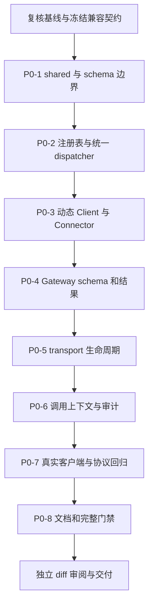

# ai-mcp 通用 MCP 底座实施路线

状态：待确认，未实施。日期：2026-10-01（Asia/Shanghai）。

设计依据：[MCP 底座设计](/Users/zhouze/Documents/git-projects/ai-mcp/docs/superpowers/specs/2026-10-01-mcp-foundation-design.md)。基线为 `main@8dad112cb633bffbdc7ae893b7efc87acbb958a1`；已有协作设计与本轮文档均保留。以下文件名是拟议修改范围，未创建任何测试或实现文件。

补充依据：[当前成熟架构设计](../specs/2026-10-01-mcp-foundation-architecture.md)、[详细改造设计](../specs/2026-10-01-mcp-foundation-refactoring-detail.md)。P0 采用版本无关 shared 内核，SDK 原生对象/wire schema 留在 adapter；文末新增 SDK v2 与现代协议的 P1 迁移，需单独确认，不改变本期 P0 验收范围。

## 1. 执行约束

用户确认设计、P0 范围与路线后才执行。每项行为变更遵循 Red → Green → 必要整理：先写能够观察外部行为的失败测试，运行并记录预期失败，再实现，再跑相关回归。类型限制使用 typecheck 中的编译契约测试证明；不以类型断言或镜像测试证明通用能力。

开发开始前复核 Git、规则与依赖状态。按项目/技能要求处理隔离工作区，保留用户原有未提交文件；不自动移动、覆盖或删除协作设计稿。本轮没有创建分支/worktree。实施不包含 commit/push/merge/PR；四项 Git 动作各待明确授权。

不调用 Claude/ZCode，不安装 skill/插件，不创建聊天或唤醒机制，不修改模型/供应商/账号配置，不接入数据库或完整 Agent Runtime。实现完成后的审阅独立于实现步骤，依据真实 diff 和源码调用链重新检查；若采用独立审阅者，也只能只读审阅，不能自授权 Git 操作。

## 2. 依赖顺序

P0-2 已提供 protocol factory/registry 分离，因此 P0-5 不需要重做工具注册。P0-3 在 P0-4 前保留原生结果，避免先包装导致错误标记丢失。P0-5 在 P0-6 前解决会话身份和取消，使上下文贯通有实际生命周期载体。P0-7 是完整验收；各步的局部真实验证仍在该步运行，不拖到最后才发现所有权或 schema 不可行。

## 3. P0-0：基线与兼容契约冻结

依赖：用户确认；开发前重新只读检查。

修改范围：先不改产品代码。确认当前 Git 未提交范围、本地/CI Node 差异、pnpm 锁文件及 SDK 版本；复查用户文档是否变化。

冻结如下成功契约作为后续回归断言：

- 直接 echo/time 的 SDK 返回数据与 CLI `{output}`。
- Gateway `local__echo` 的 StandardToolResult 外层和内层 payload。
- 默认 tools list 的 name/description 投影。
- handleRawRequest 的 `{name,input}` 与 `{output}` 旧格式、已有字符串错误字段。
- --transport/--endpoint/--json/--protocolVersion、端口与 SSE path。
- Gateway 默认 stateful、Server 默认 stateless、legacy 默认关闭。

可以在确认后运行现有完整基线检查；失败时记录属于原有问题、环境限制还是新测试证明的缺口。基线失败不自动扩展建设范围，也不放宽门禁。

交付：版本、基线和兼容样本的记录。完成后才修改依赖和实现。

## 4. P0-1：共享契约、schema 与错误边界

依赖：P0-0。

修改范围：`packages/shared/src/types.ts`、`error.ts`、`index.ts`；新增 `invocation.ts`、`tool-contract.ts`、`tool-schema.ts`、`result-schema.ts`（按职责可合并）；对应 shared 测试；shared/package.json 与 pnpm-lock.yaml。SDK 版本统一放在相关 adapter 所属包，shared 不增加 SDK 运行时依赖；增加直接 Ajv/ajv-formats 依赖，不在 P0 安装 v2。

先证明的失败行为：

- 通用名称接受合法业务名，非法/空/过长名字明确失败；旧 echo/time 类型继续可用。
- 项目 JSON 契约拒绝非 JSON 值；原生 wire/内容块校验在 adapter 局部集成验证，不能用 shared semantic parser 代替官方协议校验。
- standard/v1 与 native-json/v1 的声明、上下文 metadata 能解析；旧 StandardToolResult 导出保持。
- 2020-12 默认、draft-07 显式、闭合对象、枚举、oneOf、$defs/$ref 正确验证；不支持方言/外部引用在注册前失败。
- schema 编译不修改输入，不能默认值填充、coerce 或删除未知字段。
- 包装后的 schema 保持引用作用域，用独立 validator 校验正确值并拒绝错误值。
- isError 的优先级、错误分类与 trace 保存不受 structuredContent 影响。

建议测试范围：shared/tool-contract、tool-schema、invocation/context、result-contract；基于输入输出行为，不给每个小 helper 单独写镜像测试。

实现：增量版本无关契约、严格 JSON/schema 校验、结果与错误语义转换、方言 validator factory、标准包装 schema 工厂。原生 wire schemas/SDK error 留在 adapter；业务 typed payload 只来自注册 schema 解析或调用者提供的真实 outputSchema，不提供不校验的泛型转换。

局部验证：focused Vitest、shared typecheck/lint；JSON Schema 的 native 与 standard 两类示例均有正负验证。完成 A03/A04 的基础部分。

## 5. P0-2：任意工具注册、统一调用与协议实例工厂

依赖：P0-1。

修改范围：`packages/mcp-server/src/types.ts`、`server.ts`、`tools.ts`、`middlewares.ts`、`index.ts`；新增 `tool-registry.ts`、`tool-dispatcher.ts`、`sdk-server-factory.ts`；Server/tools/middleware 测试。Resource/Prompt 仅为按协议实例绑定与兼容回归调整，不扩展产品能力。

先证明的失败行为：

- 无 echo/time 枚举增补即可注册 `catalog.lookup`，schema 嵌套且有必填/额外属性约束；handler 有正确推断类型。
- includeBuiltInTools=false 下注册自定义工具，legacy handleRawRequest 与原生 SDK 调用都使用该定义自己的 inputSchema。
- 覆盖同名 echo 的自定义 schema（不带默认工具）后，不再被全局 toolSchemas.echo 校验。
- 非法输入不执行 handler；错误输出、不可序列化输出和不支持 schema 注册失败。
- 重复注册拒绝，启动后注册拒绝；多协议实例从同一快照发现一致工具。
- ToolDefinition 的 handler 参数/返回与 schema 不匹配会 typecheck 失败，不能靠 generic fallback 接受错误 echo 参数。
- 中间件 audit 在实际 handler 失败后记 error，在成功后记 ok；短路仍阻止执行。
- 未知工具为 JSON-RPC 错误；已知工具参数失败为 isError；legacy 对应原错误格式。

实现：保存类型安全的 invoke 闭包，旧入口与原生入口复用 dispatcher；将 terminal 包含校验/业务执行；创建一次只接一个 transport 的协议 factory；官方低层 tools handlers 保留错误数据，原 Resource/Prompt handlers 重新绑定。

局部真实验证：使用 SDK in-memory linked transport 走 initialize/list/call，证明不是 handleRawRequest 的自测假成功；stdio 示例正负输入回归。完成 A01/A02/A10 的直接路径。

## 6. P0-3：动态 Client、原生 Connector 与协议版本

依赖：P0-2。

修改范围：`packages/mcp-client/src/client.ts`、`cli.ts`、`index.ts`；新增结果解码和 SDK connection/版本 transport adapter；`packages/gateway/src/connectors/base.ts`、`result.ts`、`stdio.ts`、`http.ts`、`gateway-core.ts` 的参数传递；Client/Connector 测试；Gateway 增加 Client 包依赖。

先证明的失败行为：

- discoverTools 保留完整 schema/annotations/\_meta，消费两页以上，重复 cursor 有明确错误。
- 动态名字调用成功且不依赖 ToolName 断言；原内置 API 与列表投影保持精确返回。
- isError:true + structuredContent（包括不符合成功 schema 的错误数据）保留工具失败；不能先抛成功输出校验异常。
- 文本 JSON fallback 保留；合法纯文本、image/audio/resource-only 和多 content 块不丢失；畸形原生结果失败。
- connect 超时/不可用、SDK request timeout、取消和 invalid_result 分开；stdio 子进程退出可识别。
- 取消能打断连接 backoff；失败/关闭后的 connector 不复用坏 transport；tools/call 一次只执行一次。
- --protocolVersion 真正改变 initialize body，后续 header 用协商结果；Gateway BackendSpec.protocolVersion 真正传入。
- HTTP Client.close 先 DELETE 自己的 session，再本地 close；405/已失效 session 与重复 close 正确处理。

实现：通用 callToolResult 保留原生协议结果；typed wrapper 先检查失败后校验；官方 request API + 项目 validator 避开 SDK 自动校验覆盖错误的路径；Connector 在连接/发现/调用边界统一分类与生命周期，保留旧 core.output 的兼容投影。

局部真实验证：实际 stdio SDK 子进程与 HTTP 下游；覆盖带 schema/不带 schema 的错误返回，以及真实不可达端口/结束进程。静态 mock 不替代这些检查。完成 A04/A06/A11 的基础路径。

## 7. P0-4：Gateway 完整描述、标准包装与正确错误

依赖：P0-3。

修改范围：`packages/gateway/src/types.ts`、`gateway-core.ts`、`gateway-server.ts`、`capability-registry.ts`、`cli.ts`、`connectors/result.ts`；新增 Gateway descriptor/schema view 或工具 adapter；Gateway Core/schema/result/协议测试。

先证明的失败行为：

- 两个后端的工具 schema/annotations/title/icons/\_meta 经命名空间映射后完整；参数不再变为任意对象。
- 用上游发现的 inputSchema 拒绝缺字段；校验失败不进入下游 handler。
- 输出保持原 Gateway 标准外壳，公开 outputSchema 能独立校验真实 structuredContent；把原下游 `{text}` 直接当公开 schema 的实现必须失败。
- 闭合 schema、复杂引用与两种方言的公开 schema 作用域正确；声明成功 schema 却没 structuredContent 为 invalid_result。
- standard/v1 不双重包装；native 的同名 ok/code/message 业务数据不被自动解包；兼容歧义启动失败且能通过显式 override 解决。
- 原生 isError、标准 ok:false 都上行 isError；成功查询失败任务为成功，三者审计结果可区分。
- 下游合法非文本 content 保留，失败结构化数据与 text 可追溯。
- 策略数字码是真正 JSON-RPC error.code/data，而非只存在 text；原错误消息保持可读。
- initialize 幂等，部分发现失败无半注册目录且释放已连接后端；重复 backend ID/映射名字提前失败。
- unsupported task capability 不被伪装为支持；既有普通 tools/call 路径不增加 tasks 接口。

实现：冻结 descriptor 快照、按 resultContract 决定适配、生成真实包装 schema；工具 handlers 使用官方低层接口，policy/capability 继续复用；错误分层明确，内容与源 schema 元数据保留。

局部真实验证：真实 SDK Client 经 Gateway 调用自定义工具和负路径，独立从 tools/list 取 schema 验证结果；stdio/HTTP Connector 均覆盖。完成 A01/A03/A04/A05/A06/A13 的聚合路径。

## 8. P0-5：HTTP/SSE 独立所有权与关闭

依赖：P0-4；复用 P0-2 协议实例 factory。

修改范围：`packages/mcp-server/src/server.ts`、`cli.ts`；新增 HTTP session/request lifecycle 模块；`packages/gateway/src/gateway-server.ts`、`types.ts`、`cli.ts`；Server/Gateway HTTP 生命周期测试；必要的现有 SSE 绑定调整。旧自定义 transport 文件不删除。

先证明的失败行为：

- 两个独立真实 SDK Client 同时 initialize/list/call：A/B marker 正确、活动调用重叠，没有任何全局排队锁。
- A 关闭时 B 的调用正活动，B 调用完成且之后仍可调用；A 的会话无效，而 B 会话与共享 connector 仍有效。
- 同 session 并发 request ID 对应正确；两个 session 相同 request ID 不串结果。
- Server 默认 stateless、Server stateful、Gateway 默认 stateful、Gateway stateless 四组均通过；stateless 的 initialize/notification/call 不漏资源。
- stateless 响应未结束时 transport 不提前 close；响应结束后立即关闭所属请求实例。
- stateful 单 GET/POST 响应结束不关闭 session；DELETE、未知 session、缺 session、重复头、非法方法/路径按协议返回。
- 标准跨请求 MCP 取消在 stateful 模式验证；stateless 不用全局 request ID 表伪造取消，分别验证响应终止、deadline 和服务停止回收本请求资源，并在说明中披露此能力边界。
- initialize 失败、connect 中断、半初始化、TTL/maxSessions、显式取消、listener.close、服务 close 均回收资源且无跨客户端关闭。
- SSE 示例与两个 SSE 客户端隔离有效，保留现有 /sse/call 正规化。
- Core.close 的一个 connector 失败不阻止其他 connector close；重复 close 不多次关闭下游/杀进程。
- SIGTERM 使新请求拒绝、旧请求有界取消、进程/端口退出，不只靠强杀根进程。
- body 大小、Origin/Host 与 admission 界限拒绝路径不执行 handler、不留 pending entry；新配置影响在兼容说明中提前列明。
- 非协作 handler 的 deadline/shutdown 返回 executionDisposition=unknown 与 remaining 资源，不能把协议断开宣称成业务已停止或资源全部释放。

真实并发验证不用随机 sleep 判断重叠：受控测试工具报告进入 handler 的 marker/计数，两个请求都进入后再释放 barrier；关闭 A 时确认 B 已进入但未完成。断言业务输出、连接/close 计数与 session 行为。至少对 service direct 和 Gateway 运行。

实现：每 session 或请求一对 SDK server/transport，业务状态服务级共享；pending entries、session entries、listeners/timers 全部由服务持有；close-once cleanup；明确 stateful 与 stateless 响应结束的不同语义。

局部真实验证：Node 实际 TCP + 独立 SDK Client/transport；服务停止后端口可重新占用、stdio PID 退出、事件与 timer 无遗留。完成 A07/A08/A09/A10 的 transport 部分。

## 9. P0-6：调用上下文与审计一致性

依赖：P0-5。

修改范围：shared/invocation 与上下文契约；Server handler context 与 middleware；Client call options；Connector/Core 调用 options；Gateway audit/result；`audit.ts`、`audit-jsonl.ts`、`types.ts`；上下文与审计测试。

先证明的失败行为：

- 两个客户端即便 requestId 都为 1，生成的 trace 不同；显式 trace 贯通本地完整链。
- run/task 取本次调用 metadata，服务 runContext.runId 仅作缺省；两次不同 run/task 调用不互相污染。
- context 不混入工具 arguments，严格 inputSchema 不拒绝上下文字段；客户端不能覆盖服务 actor/tenant/risk。
- 下游独立 trace 被保留且与 Gateway trace 关联；业务任务状态/正文 taskId 不覆盖请求身份。
- allow+tool_error、deny、success、cancelled、protocol_error 分别可见；查询 failed task 记录 success。
- 参数、策略、连接、输出校验、工具错误都记录一个终态；并发 JSONL 行可独立解析且条数正确。
- 审计写失败时 handler 不重新执行；错误说明 operationCompleted，关闭时待写入事件 flush。

实现：MCP `_meta['org.ai-mcp/context']` 和调用 context 逐层传递；审计增量字段兼容，业务执行包含在 middleware terminal；有界 append 队列与显式审计失败策略。

局部真实验证：项目 Client→HTTP Gateway→stdio 和 HTTP 本地下游→result→JSONL，根据同 trace 和不同 run/task 逐条核对；不以类型字段存在作为完成。完成 A05/A06/A12。

## 10. P0-7：真实客户端、协议矩阵与旧路径回归

依赖：P0-6。

修改范围：`scripts/e2e-gateway-basic.mjs`、`e2e-gateway-http-policy-audit.mjs`、`e2e-gateway-protocol-matrix.mjs`；按需要新增复用 fixture/harness；现有 examples；HTTP 验证挂入原命令与 CI。

先证明的失败行为与验收：

- 从 dist 运行项目 CLI 和原生官方 SDK Client，检查完整 JSON 结构，不用 includes('回显文本') 代替成功。
- e2e fixtures 注册自定义查询工具、参数错误、输出错误、带 structuredContent 的失败和失败任务查询；它们只是基础能力验证，不建立协作服务。
- 两独立客户端真实并发、单方关闭、服务关闭覆盖第 8 节四种模式；保留 session/marker/审计/关闭记录。
- 协议矩阵捕获 initialize 请求版本、返回协商版本和后续 header。2024-11-05 路径指允许该版本的 Streamable HTTP 兼容，旧 HTTP+SSE 示例另测，不能混称同一种能力。
- 默认 legacy 关闭、显式开启、未知版本拒绝、缺省 header 策略均有断言。
- 重跑 echo/time、stdio-basic、http-sse-basic、gateway-basic、Resource/Prompt 和 legacy in-memory 输入输出。
- 资源验证在进程真实退出后结束；不再 kill 后 sleep 200ms 就宣布回收完成。

完成 A01–A13 的真实验证层。单元测试、协议集成和真实 CLI/客户端消费分别记录，即使共用同次运行。

## 11. P0-8：文档与仓库完整检查

依赖：P0-7。

修改范围：README.md、README.zh-CN.md、docs/ai-mcp_design_document.md、docs/mcp-gateway-architecture-v2.md、docs/gateway-operations.md、相关示例说明；必要时 package.json/CI 连接新增验证。协作设计稿不改。

同步描述实际通用 API、schema 方言与限制、标准包装、错误边界、默认会话模式、Client.close/Server.close、上下文传递和旧列表/CLI 的兼容用法。不要把后续项写成已实现。旧文档的现有结果/策略/registry 事实可在设计阶段纠正，新增能力必须等实现验证后再写“已具备”。

按仓库原命令执行并记录退出码、环境与日志：

| 顺序 | 命令                           | 证明边界                                           |
| ---- | ------------------------------ | -------------------------------------------------- |
| 1    | `pnpm lint`                    | 静态规范；不能证明运行                             |
| 2    | `pnpm typecheck`               | 编译和类型兼容；不能证明协议                       |
| 3    | `pnpm test:coverage`           | 单元/纳入 Vitest 的集成及 80% 覆盖率；排除项仍披露 |
| 4    | `pnpm build`                   | 产出 dist；不能证明真实调用                        |
| 5    | `pnpm test:e2e:gateway`        | 实际 stdio Gateway/CLI 路径                        |
| 6    | `pnpm test:e2e:gateway:http`   | 实际 HTTP Gateway、schema/error/并发/审计/资源验证 |
| 7    | `pnpm test:e2e:gateway:matrix` | 实际协议版本语义与兼容路径                         |

不降低覆盖率阈值，不为新核心路径扩大排除项。CLI 与被排除的兼容 transport 通过真实进程/协议证据补齐。单项通过后不无理由反复重跑；新变更、失败或未解决风险才扩大复验。

本地 Node 22 与 CI Node 20 分别报告。环境端口/IPC 权限失败不是业务测试通过；保留可完成的静态验证并报告阻塞边界，不伪造客户端完成证据。

## 12. 独立审阅、停止点与最终交付

依赖：P0-8。针对最终实际 diff，重新追踪：

1. registerTool→typed closure→legacy/native dispatcher→input/output schema。
2. discovery→Connector→Core→Gateway公开 input/output schema→真实 CallToolResult。
3. Client/Connector/Gateway 的 isError 优先级、标准 payload 判定与分类错误。
4. 每 session/request 的 SDK server/transport/下游所有权、取消和 cleanup。
5. request metadata→handler→结果→审计，trace/run/task 是否真的贯通。
6. CLI 参数、旧结果层级、示例、协议版本及 README 是否与代码一致。

审阅发现行为错误先返修、补相关失败测试再复验；不接受“测试全绿”替代调用链判断。不相关的架构/企业能力进入后续 backlog，不顺手重构。

最终交付包括实际修改文件/diff、Red→Green 证据、七项命令结果、A01–A13 对照、双客户端真实记录、关闭资源证据、独立审阅结论和未验证边界。源码审阅、单元、协议集成、真实客户端、Git 集成分别报告。所有改动保持未提交；停止在可审阅交付处。

## 13. P1：SDK v2 与现代协议迁移（另行确认）

依赖：P0 完成并独立审阅；用户明确确认 P1。本节是结合 2026-10-01 当前官方稳定实践补充的后续改造，不能作为原 P0 的隐含实施范围。与模型、CLI 执行器、协作工作流无关。

### P1-1：仅迁移 SDK，维持 legacy 行为

修改范围：Server/Client/Gateway 的 adapter、依赖与锁文件、schema 边界、SSE 兼容 adapter。增量加入公开 v2 Server/Client/Node 包；确认选定版本的 Node 20 与 Zod 要求，不自动升级其他工具链。

失败证据：现有 McpClient(transport) 公开构造类型与 built-in 泛型兼容、完整字段描述未丢、复杂 JSON Schema 方言、错误优先/错误类跨包规范化、旧 stateful/default stateless 所有权、旧 CLI/示例和三协议路径。迁移 import 或 codemod 完成不是验收。

完成门槛：七项命令和 P0 验收仍通过；wire 仍为旧时代，未自动开启 modern，不删除尚有消费的 v1 类型依赖。

### P1-2：显式启用 modern HTTP/stdio 与分流

修改范围：modern-server/client adapters、ProtocolIngress、配置校验、era-aware ErrorPresenter；使用官方 createMcpHandler/Node adapter/serveStdio 和 legacy 分流。

失败证据：每请求 metadata/body/header 一致性、malformed modern 不误降级、实际 modern codec、合法现代错误码、450xx 项目映射、HTTP response stream 关闭只取消本调用、stdio 多调用上下文隔离、新旧输入输出根形状差异、未实现扩展明确拒绝。

完成门槛：实际 2026-07-28 wire 与两个独立客户端证明；无 modern session map；原有 legacy Gateway stateful 与 Server stateless 默认不改。必须按官方新旧取消语义分别验收。

### P1-3：混合 Gateway 与消费者回归

修改范围：Gateway Catalog/BackendClient 两代边界、协议矩阵 harness、README/运维说明。

失败证据：modern上游→legacy下游、legacy上游→modern下游、modern→modern；相同 -32020 在旧/新来源的不同语义不误分类；array/scalar structuredContent 的 codec 与标准外壳一致；多客户端 cancellation/close 不影响共享后端。

完成门槛：完整 descriptor/公开 outputSchema 与响应一致、所有内容块保留、一次业务调用不因探测或 schema 恢复而重放。进程内 modern 测试通过 fetch handler，不能用 legacy in-memory transport 冒充 modern 集成；最终仍运行真实 TCP/stdio 与项目 CLI。

协议样本、迁移前后 diff、公开构造兼容和未验证消费边界独立交付。既有 2024-11-05 header 互通脚本与标准旧 HTTP+SSE 示例分开报告，不将历史项目兼容组合宣称为当前标准 transport。无删除旧路径、改默认协议或 Git 动作的附带授权。

## 14. 后续项及依赖

| 后续项                                      | 前置条件                                         | 与本阶段关系                       |
| ------------------------------------------- | ------------------------------------------------ | ---------------------------------- |
| 工具热更新/热卸载、list_changed、多实例同步 | P0 registry snapshot 与 session 生命周期通过     | 另行确认，不通过启动后注册偷偷实现 |
| 原生结果透传模式、alias 与部分后端降级      | 有真实消费需求和独立兼容方案                     | 不改变本期标准默认                 |
| Resource/Prompt 聚合与生产观测 exporter     | P0 tools/schema/审计通过                         | 独立扩展                           |
| Claude/ZCode CLI 执行适配器及协作流程       | 本底座通过，再复审已有协作背景设计与执行器可行性 | 不等于自动授权原协作稿 M0–M6       |
| skill/插件、聊天唤醒、模型/供应商/账号管理  | 各自单独需求确认                                 | 不包含在本轮或本期实施             |

本计划批准前仅为路线；本轮没有新增失败测试、实现代码、依赖安装或真实服务运行。
