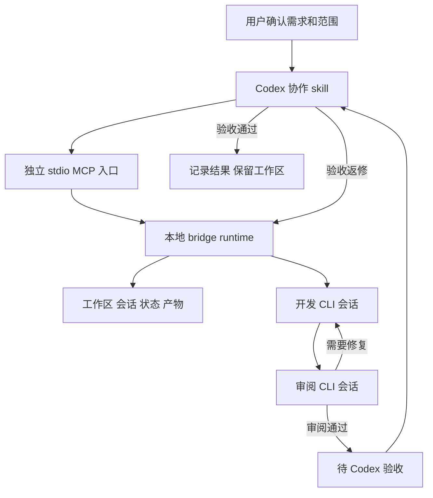

# Codex 与 CLI Agent 协作设计

日期：2026 年 9 月 30 日。状态：设计稿，待用户审阅；尚未实施。

本设计实现用户已经认可的流程：用户确认开发范围，Codex 派发任务，Claude Code 或 ZCode 通过 CLI 开发，由执行器侧独立审阅并修复，最后回到 Codex 验收。模型、供应商、账号和模型配置沿用执行器当前设置，不属于本项目的配置管理范围。

建议在 `ai-mcp` 新增独立的 `@ai-mcp/agent-bridge` 包，复用共享结果协议和现有 MCP 工程基础。第一版使用 Claude Code CLI 和独立 stdio MCP 入口。调度程序管理执行生命周期，Codex 保留需求判断与最终验收职责。ZCode 通过同一适配接口接入，在其能力通过真实验证后启用。

本轮只保存设计稿。以下目录、接口、默认值和里程碑均为拟议方案，不代表仓库已具备这些能力；设计审阅后再制定具体实施计划。

## 目标和范围

成功标准是完成一次可追溯的开发闭环：准确定位工作区与会话，取得真实改动和验证证据，完成执行器侧审阅，支持 Codex 退回原开发会话修复，并由 Codex 记录验收结果。

第一版覆盖单用户、单机器、本地 CLI 和 Git 项目。默认同时运行一个阶段；开发、审阅、验收轮流使用同一项任务的代码。跨项目使用通过项目登记实现。非 Git 目录、跨机器执行、桌面操作和多任务并行写入留到后续。

默认闭环是 `implementer → reviewer → implementer 修复 → reviewer 复审 → Codex 验收`。执行器可以是 Claude Code 或 ZCode；第一版同一任务的开发和审阅使用同一种执行器。

不自动提交、推送、合并或创建 PR。验收通过只记录结果并保留工作区与 diff。上述 Git 操作以及将改动搬回用户主工作区，分别保留明确的用户授权。

## 当前仓库能提供什么

源码检查基线为 `main` 的 `8dad112cb633bffbdc7ae893b7efc87acbb958a1`，检查开始时工作区干净。本轮未运行测试或真实 Agent 任务；表中“已有”表示源码存在，不表示当前运行已验收。

| 能力               | 当前证据                                                                                                                                                                                          | 在本设计中的用途和边界                                                                     |
| ------------------ | ------------------------------------------------------------------------------------------------------------------------------------------------------------------------------------------------- | ------------------------------------------------------------------------------------------ |
| 共享结果与引用模型 | [shared types](/Users/zhouze/Documents/git-projects/ai-mcp/packages/shared/src/types.ts:34) 中已有 `ArtifactRef`、`StandardToolResult`、`RunContext`、`StepContext`                               | 复用外部返回封装；这些类型本身不提供任务数据库、产物保存或进程管理                         |
| MCP 服务与注册     | [server](/Users/zhouze/Documents/git-projects/ai-mcp/packages/mcp-server/src/server.ts:80) 使用官方 SDK 注册工具并校验输出                                                                        | 复用工程模式；现有封装不能直接无改动承载新工具                                             |
| MCP 客户端         | [client](/Users/zhouze/Documents/git-projects/ai-mcp/packages/mcp-client/src/client.ts:46) 提供调用能力                                                                                           | 现有调用泛型与工具列表绑定 `echo/time`，新增包测试可直接使用官方 SDK                       |
| 工具聚合和路由     | [gateway core](/Users/zhouze/Documents/git-projects/ai-mcp/packages/gateway/src/gateway-core.ts:36) 构建 `backend__tool` 映射                                                                     | 可以在后续统一入口阶段接入 bridge MCP 服务                                                 |
| 下游 stdio 连接    | [stdio connector](/Users/zhouze/Documents/git-projects/ai-mcp/packages/gateway/src/connectors/stdio.ts:70) 启动 MCP 子服务并进行 MCP 握手                                                         | 连接的是 MCP 服务，不能将普通 `claude -p` CLI 直接当成 MCP 后端                            |
| 策略与能力元数据   | [policy](/Users/zhouze/Documents/git-projects/ai-mcp/packages/gateway/src/policy.ts:38) 和 [registry](/Users/zhouze/Documents/git-projects/ai-mcp/packages/gateway/src/capability-registry.ts:24) | 已有工具白名单、风险、条件策略、限流和元数据；不能替代子进程内的文件写入控制或真实用户授权 |
| 审计存储           | [audit JSONL](/Users/zhouze/Documents/git-projects/ai-mcp/packages/gateway/src/audit-jsonl.ts:5)                                                                                                  | 借鉴事件格式和记录方式；当前审计日志不是可恢复的任务执行日志                               |
| 工程检查           | `package.json`、`vitest.config.ts`、`.github/workflows/ci.yml`                                                                                                                                    | 已定义 lint、类型检查、测试、覆盖率、构建和 Gateway e2e；新包仍需新增实际测试              |

已有 `docs/ai-mcp_design_document.md` 中的“缺少统一结果模型、风险策略、能力 registry”等描述与当前源码有差异，应以源码为准。当前检出中没有历史记录所述的 `zcode-workflow/`，不能将其作为现成配套依赖。

### 接入前需要明确的现有限制

1. [工具名称类型](/Users/zhouze/Documents/git-projects/ai-mcp/packages/shared/src/types.ts:87) 和 [输入校验](/Users/zhouze/Documents/git-projects/ai-mcp/packages/mcp-server/src/server.ts:415) 仍绑定演示工具。第一版独立入口直接使用官方 MCP SDK，避免把协作需求混入演示协议；通用注册封装后续再改。
2. Gateway 的 [下游列表转换](/Users/zhouze/Documents/git-projects/ai-mcp/packages/gateway/src/connectors/stdio.ts:33) 只保留名称和描述；[注册映射工具](/Users/zhouze/Documents/git-projects/ai-mcp/packages/gateway/src/gateway-server.ts:79) 使用空对象 passthrough schema。当前统一入口无法完整告知上游协作工具的参数。
3. Gateway [HTTP 请求处理](/Users/zhouze/Documents/git-projects/ai-mcp/packages/gateway/src/gateway-server.ts:270) 与 [transport 切换](/Users/zhouze/Documents/git-projects/ai-mcp/packages/gateway/src/gateway-server.ts:315) 共享一个 SDK server；普通 server 也有相似结构。源码存在并发互相关闭连接的风险，本轮未复现。HTTP 多客户端接入前必须验证和修复会话所有权。
4. Gateway [构造函数](/Users/zhouze/Documents/git-projects/ai-mcp/packages/gateway/src/gateway-server.ts:54) 的 `runId` 是服务配置级值，`taskId` 被固定为 `undefined`。后续接入需要按单次任务调用关联身份与审计。
5. Gateway [结果归一化](/Users/zhouze/Documents/git-projects/ai-mcp/packages/gateway/src/connectors/result.ts:4) 未读取 MCP 原生 `isError`，非标准结果会包装为 `ok:true`。bridge 直接入口必须输出明确的标准结果；Gateway 接入阶段需补负路径契约测试。

这些问题构成后续 Gateway 接入工作的范围。独立 stdio 路径可以先验证协作闭环，不能据此宣布已有 HTTP 网关并发问题得到解决。

## 架构选择和职责

| 方案                                            | 影响                                                  | 判断                   |
| ----------------------------------------------- | ----------------------------------------------------- | ---------------------- |
| 在 monorepo 新增独立 bridge 包和 stdio MCP 服务 | 复用 shared 与工程基础，独立维护执行器和生命周期      | 推荐，适合本次范围     |
| 直接在现有 Gateway 中启动 Agent、管理开发循环   | 路由、协议治理和执行状态耦合，需要同时改 Gateway 限制 | 本次不采用             |
| 新建完整 Agent Runtime 项目                     | 隔离充分，但增加独立发布、运维和对接工作              | 当前闭环不需要这一规模 |

[原平台职责](/Users/zhouze/Documents/git-projects/ai-mcp/docs/ai-mcp_design_document.md:33) 将业务规划和复杂工作流留给上层。本设计做一个有限的职责扩展：bridge 管理通用执行生命周期与已经批准的开发审阅模板，不进行自主需求规划，不判断业务验收通过，不发展为通用业务工作流引擎。实现时需同步更新平台职责文档。



MCP 入口处理短请求，runtime 管理长任务。runtime 是普通程序；开发与审阅才调用执行器模型。完整执行日志留在本地，Codex 按阶段取证。

### 进程生命周期

第一版采用一个当前用户的本地 runtime，以及一个或多个 stdio MCP 代理。代理连接 runtime 的 Unix socket；本期仅支持当前 macOS 环境，Windows IPC 适配后续实现。

`agent-bridge serve` 启动 MCP 代理；代理通过 state root 锁确保 runtime 单实例，必要时启动独立进程。runtime 的 stdout/stderr 写自身日志，不能进入 MCP stdout。socket 和 state root 只允许当前用户访问；请求带实例凭据和角色，凭据不进入模型上下文。

MCP 连接断开不取消已登记的任务；runtime 崩溃会使活动阶段进入待恢复状态。机器关机时不能继续执行。第一版不安装系统服务或修改开机启动配置。停止 runtime 的显式操作先处理活动任务，再关闭服务；工作区和会话记录保留。

## 工作区要如何指定

**每个新会话必须绑定实际工作目录。会话 ID、项目目录和 Git 工作区是不同对象。**

项目登记由本地配置文件完成；MCP 提交使用登记的 `projectId`，不接受模型任意指定可执行文件和项目根目录。执行器配置只保存命令定位及适配器类型，不保存或替换模型、供应商、密钥。

| 字段                                    | 意义                                             |
| --------------------------------------- | ------------------------------------------------ |
| `projectId` / `repoRoot`                | 被授权的项目与规范化仓库根目录                   |
| `workspaceId` / `workspaceRoot`         | 该任务使用的 Git 工作区及其绝对路径              |
| `workingDirectory`                      | CLI 实际启动目录，可是工作区根目录或登记的子目录 |
| `baselineRef` / `baselineSnapshotId`    | 创建任务时的 Git 基线与已确认文件状态            |
| `workspacePolicy`                       | `isolated` 或明确指定的 `existing`               |
| `writeScope` / `contextPaths`           | 允许修改的范围与需要读取的上下文                 |
| `taskSpecVersion` / `permissionProfile` | 已批准需求版本和该角色的权限要求                 |

Claude Code 使用子进程的 `cwd=workingDirectory`，普通 CLI 主命令无需假设存在 `--cwd`。ZCode 使用已核对的 `--cwd`，同时统一设置进程 cwd。两者都按 argv 数组启动，提示词通过 stdin 或适配器支持的输入传递，避免 shell 拼接。Claude CLI 的参数能力见 [官方参考](https://code.claude.com/docs/en/cli-reference)。

角色模板不指定模型、供应商或推理档位，bridge 不传入覆盖这些设置的启动参数。worker 插件中的审阅角色也继承现有模型选择。bridge 只记录执行器可公开返回的实际模型标识，用于解释证据和用量。

启动前由程序执行目录规范化、`git rev-parse` 和基线检查。适配器如果返回执行目录或会话目录，必须与登记值比对。所有读写范围均解析真实路径；额外目录不因提示词出现就自动获得授权。

### 默认工作区政策

- 默认创建基于明确 Git 基线的 detached worktree，不自动创建开发分支或提交。创建行为属于后续已批准实施的一部分，本轮不执行。
- 用户主工作区存在未提交修改时，先明确采用已提交基线，还是将当前文件状态作为起点。默认不会复制未提交文件。选择后一种时先保存有清单与哈希的交接快照，再导入；被忽略文件和运行环境另行明确。
- `existing` 模式需要指明任务会直接修改哪个现有目录，登记开始时的完整文件状态，区分原有修改与任务新增修改。
- 开发、审阅和 Codex 验收使用该任务工作区。Codex 验收时暂停执行器写入；审阅阶段也不允许开发阶段并行运行。
- 工作区锁约束 bridge 管理的执行，不阻止用户或其他程序直接改文件。每次阶段切换和验收都重新检查代码状态。
- 验收通过后保留工作区。导出 patch、导入主工作区和清理工作区是后续明确动作；不会将 accepted 等同于已集成或已发布。

`cwd` 指定目录，worktree 隔离任务文件，permission profile 约束执行权限。三者都需要记录，不能互相替代。

## 任务 会话 运行与交付

| 对象             | 生命周期与关键内容                                                                             |
| ---------------- | ---------------------------------------------------------------------------------------------- |
| Task             | 一项已批准需求；包含目标、约束、验收项、工作区、预算、阶段及需求版本                           |
| ExecutionSession | 一段执行器会话；包含 engine、角色、真实 session ID、工作区、权限配置、前序会话与状态           |
| Run              | 一次实际 CLI 调用；每次续接也产生新 run ID，记录进程、超时、结果、事件和用量来源               |
| Delivery         | 一次供审阅或验收的代码状态；包括基线、完整任务 diff、文件清单、snapshot ID、测试证据及审阅记录 |
| Acceptance       | Codex 对某个 delivery 的判断；包含验收项、运行的验证、问题或通过结论                           |

另存 `originChatId`、`mcpTransportSessionId`。它们与 `executionSessionId` 分开命名，防止将 Codex 会话、MCP transport session 和 Claude/ZCode 会话混用。现有 `RunContext.sessionId` 不作为三类身份的统一主键。

Delivery 的代码状态覆盖基线之后的已跟踪改动、删除、新增文件、文件模式和 symlink 目标。不能只使用 `git diff` 或 HEAD 判断，因为默认交付保留未提交文件。ignored 构建产物不纳入代码快照；任务要求交付的 ignored 文件须单独登记。

## 新建和续接会话的规则

| 触发条件                 | 默认决策                       | 输入要求                                          |
| ------------------------ | ------------------------------ | ------------------------------------------------- |
| 独立新任务               | 新建开发会话                   | 完整 task spec、工作区和验收标准                  |
| 同任务补充说明或测试修复 | 续接开发会话                   | 已批准需求版本及增量信息                          |
| 自审问题或 Codex 返修    | 续接原开发会话                 | 带 issue ID、证据和 expected delivery 的问题单    |
| 首次审阅                 | 新建审阅会话                   | 需求、完整任务 diff、测试证据；不复制开发聊天历史 |
| 同一审阅范围的复审       | 续接审阅会话                   | 原问题单、修复后的完整当前 diff、新 snapshot      |
| 任务已通过后的独立工作   | 新建任务和会话                 | 新需求和基线                                      |
| CLI 中断或隔天继续       | 核对后续接                     | 原会话存在、工作区匹配、活动进程已退出            |
| 执行器更换或角色更换     | 新建目标执行器或角色会话       | 交接记录；不同执行器不能直接共享 session ID       |
| 上下文过长或持续偏离范围 | 保存交接记录后，经显式动作新建 | 已确认事实、当前代码状态、未完成项和权限          |
| 需求或工作区发生实质变化 | 暂停并调整任务绑定             | 新版本由用户/Codex 明确确认，不能自动重用旧验收   |

调度层提供 `new`、`resume` 两种显式策略和可审计的会话替换动作。第一版不提供自动分叉策略。用户可指定续接某个 ID 或强制新建，但需通过角色、任务、执行器和目录的绑定检查。

默认自动决策只依赖任务和角色绑定。上下文长度报告缺失时，不根据运行时间猜测长度；已证实耗尽或持续偏离时先进入 `needs_attention`，由上游选择交接并替换会话。更换会话不重置任务预算和返修计数。

Claude Code 新建时可预分配 UUID 并传入 `--session-id`，取得真实结果后确认 ID 一致；续接使用 `--resume <id>`。ZCode 的本机帮助确认了 `--resume sess_…`，但新建时取得 ID、JSON 事件结构和失败语义仍需真实验证。不能根据 `/new` 的 TUI 命令推断 headless 行为。

每个会话同时最多一个活动 run。原 run 仍在运行时不续接，不允许后台参数悄悄分叉后继续沿用旧绑定。每次 launch/resume 重放任务需要的权限参数和插件路径；不会假设这些参数全部从历史自动恢复。[Claude 续接文档](https://code.claude.com/docs/en/sessions) 明确列出了需要重传的部分启动配置。

会话找不到时进入待恢复，保留错误证据。新会话不会重置文件状态，恢复时先取得代码现状，再决定从哪一步继续。交接记录既可由程序收集，也可请求执行器摘要；来源和未核实结论须分开标注。

## 开发 审阅和最终验收

### 阶段转换

主状态为：`queued → implementing → reviewing → ready_for_acceptance → accepting → accepted`。

审阅有必须修复问题时：`reviewing → repairing → reviewing`。Codex 验收有问题时：`accepting → repairing → reviewing → ready_for_acceptance`。两类返修各自计数，均在已批准需求内进行。

异常进入 `needs_attention`、`paused`、`interrupted`、`failed` 或 `cancelled`，记录原阶段与原因。只有显式的恢复动作可以重启中断阶段。accepted、failed、cancelled 保留历史；后续独立需求建立新任务。

pause 首先停止安排下一阶段。若当前 CLI 正在运行，按取消机制中断并等其退出后进入 paused；resume 核对文件和会话现状后从中断阶段继续。pause 不承诺能冻结进程内存，不能将残留活动进程当成已暂停。

新需求超出当前批准范围时进入 `needs_attention`，要求确认新需求版本。执行器提出的附加功能建议不会自动启动新任务。

### 审阅侧输出

runtime 在开发结束并生成代码 snapshot 后启动独立 reviewer CLI 会话。审阅模板要求检查验收项、关键调用链、错误路径、兼容性、测试证据与范围外修改。

审阅记录包含 `reviewedSnapshotId`、覆盖的验收项、必须修复问题、建议项、未验证项。每个问题有稳定 issue ID、文件位置或产物引用、影响、复现/判断依据和修复预期。程序校验引用路径与必要字段；字段有效不等于判断正确。

reviewer 不修改项目代码。模型不直接运行 Bash；需要复跑的测试通过 runtime 执行已登记的验证命令，再返回证据。关闭模型写工具仍需核对插件/MCP 中可能的写能力；若不能满足该角色权限要求，不能自动启动审阅。

开发进程退出码为零只说明调用结束。只有取得有效交付、自检证据、有效 reviewer 结果，且必须修复问题已关闭，才进入 `ready_for_acceptance`。存在必需验证未完成时进入 `needs_attention`，不能自动宣称通过。

### Codex 验收

Codex skill 先请求 `begin_acceptance`，获得被冻结的 delivery 和验收 lease。程序核对当前代码与 delivery 一致，禁止启动开发/修复 run。

验收 lease 默认有效 15 分钟，可由同一上游持有人 renew。到期或持有人断开后进入待恢复，不自动启动修复或解除任务工作区写锁；重新开始验收要再次核对 snapshot。显式 release 可以将任务恢复为待验收。

Codex 阅读真实 diff 和相关调用链，按风险复跑必要验证。审阅结论和执行器声称的测试结果作为证据来源之一，不替代独立验收。测试记录明确区分 `worker_reported`、`runtime_executed`、`codex_reverified`。

Codex 记录通过时必须提供 expected delivery ID、snapshot ID、验收项和验证证据。程序再次检查文件状态，代码变化则拒绝旧结论，返回 `DELIVERY_CHANGED`。返修反馈也绑定同一个 delivery，释放验收 lease 后才启动修复。

通过结论只针对记录的 delivery snapshot；通过之后用户或其他程序再改代码，不会扩大历史验收的适用范围。后续导出或集成前重新核对该 snapshot 与待处理文件。

开发与审阅的运行凭据不能调用 acceptance 操作，worker 也不暴露 bridge 调度 MCP。验收判断只接受上游 Codex 调用路径。它区分模型角色，但不意味着程序可以证明人类已经读过 diff；人类批准和 Git 授权继续由明确的会话指令约束。

## 权限如何落实

项目说明、skill 和提示词说明行为；程序负责检验可执行约束。cwd、工具风险标签与一句“禁止 commit”都不足以证明约束有效。

每种执行器声明能力：会话续接、取得真实 ID、结构化事件、取消、工具限制、目录限制、只读审阅。preflight 返回该机器与版本下的验证状态。初次连接测试先验证会话与输出，再验证角色限制。

开发角色需要工作区内写入与已批准的构建/测试执行。正式自动写任务还要验证项目外写入及 Git 元数据写入的限制；验收测试覆盖直接 Git 命令、shell 间接调用和其他暴露工具，不能只验证提示词。实现阶段先评估现有权限机制与必要的进程隔离；无法满足规定权限时进入 `needs_attention`，保留只读连接能力，不默默退化为无限制执行。

`writeScope` 是任务契约。对能强制限制的执行器启用限制；对仅能事后检测的范围，记录 `scopeEnforcement=detect_only` 并对范围外修改阻止自动交付。代码快照检测不能宣称已阻止此前副作用。

reviewer 模型禁用写工具及 Bash，验证命令由受控 runner 执行。验证命令配置本身经授权，测试可能生成缓存与报告，这类写入与项目源代码权限分开处理。

CLI 继承现有认证环境，bridge 不输出环境变量值，不把凭据写入参数、任务正文或审计。插件里不放密钥；执行日志采用最小访问权限，并在模型读取前按结构化字段和配置规则脱敏。

## 持久化 恢复与幂等

状态默认保存在用户侧独立目录，例如 `~/.local/state/ai-mcp/agent-bridge/`，工作区可使用其中的 `workspaces/`；具体位置由本地配置覆盖。不把任务代码、原始聊天或日志默认写进工具仓库。

```text
state-root/
  runtime.lock
  runtime.sock
  runtime.log
  events.jsonl
  projects.json
  tasks/<task-id>/
    task.json
    spec/<version>.json
    sessions/<session-record-id>.json
    runs/<run-id>/
      launch.json
      stdout.jsonl
      stderr.log
      result.json
      verification.json
    deliveries/<delivery-id>/
      manifest.json
      diff.patch
      review.json
      handoff.json
    acceptances/<acceptance-id>.json
    notifications/<event-id>.json
```

第一版采用单 writer 的持久化事件日志和可重建 JSON snapshot，避免为了单机串行队列引入数据库。控制状态变化先追加完整带序号和校验的事件并同步落盘，再更新 snapshot；snapshot 通过临时文件、rename 和必要目录同步更新。启动时重放日志恢复状态。

截断的最后一条事件另存证据并按完整事件恢复；中间损坏阻止启动执行，不能悄悄忽略。模型 stdout 和一般审计日志不是状态恢复的真相源。

所有写操作携带 `requestId`，任务提交和反馈的重复请求返回原结果。同一个 request ID 对应不同请求内容时返回冲突。进程启动 intent 先写日志，再 spawn；启动是否已发生不能确认时标记待恢复，不自动重跑写任务。

运行记录包含 runtime 实例 ID、run ID、进程身份、活动会话和工作区 lease。恢复时核对进程存活与启动身份，不只检查 PID；确认旧进程退出后才释放锁或重试。租约过期不会直接认定代码可安全继续写入。

MCP 调用超时不取消长任务。用户取消或阶段超时则先尝试 interrupt，再按配置终止进程树，等待退出后标记结果。失败和取消都保留文件现状；不自动 reset、checkout 或删除目录。

## MCP 接口

第一版保留七个小工具；工具返回 `StandardToolResult`，具体输入输出 schema 位于 shared 的独立协作契约文件。旧 `echo/time` RPC 协议保持兼容。tool `ok:true` 表示该操作成功，Task 状态单独表达业务进度。

参数、权限或执行操作失败时，MCP 返回 `isError:true` 与 `ok:false` 的明确错误结果；成功查询一个失败任务则仍是操作成功，并在 task 状态中报告失败。模型完成文本不直接映射成 accepted。

| 工具                          | 核心输入                                                                                  | 返回与作用                                                                                            |
| ----------------------------- | ----------------------------------------------------------------------------------------- | ----------------------------------------------------------------------------------------------------- |
| `collaboration_preflight`     | project ID、engine、workspace policy                                                      | 目录/基线预览、CLI 能力、所需权限、阻塞项；不启动模型或创建工作区                                     |
| `collaboration_submit`        | project ID、task spec、批准范围引用、workspace policy、session policy、budget、request ID | 登记并排队，返回 task ID；先验证批准需求再产生文件和进程副作用                                        |
| `collaboration_status`        | task ID、cursor、waitMs                                                                   | 短状态、阶段、会话、用量来源和增量事件；`waitMs` 最长 50 秒，超时返回短标记                           |
| `collaboration_artifact_read` | task ID、artifact ID、offset、limit                                                       | 受限分页读取登记产物；不接受任意绝对文件路径                                                          |
| `collaboration_acceptance`    | action、task ID、expected delivery、snapshot、lease、request ID                           | `begin` 获取验收 lease；`renew` 延长有效期；`pass` 记录验收；`release` 结束未完成的验收；只有上游调用 |
| `collaboration_feedback`      | task ID、expected delivery、lease、问题清单、request ID                                   | 记录 Codex 返修，释放验收 lease，续接开发；超范围需求不自动执行                                       |
| `collaboration_control`       | task ID、action、expected state version、reason、request ID                               | pause、resume、cancel、replace-session；运行状态不符时拒绝                                            |

写请求以已批准 task spec 的摘要和版本作关联，不把自由填写的 `approved:true` 当作用户确认。上游 skill 依据真实用户消息提交批准范围引用，runtime 保证 worker 无法伪造上游角色；跨主机认证和组织审批不属于本期。

首个 MCP 服务直接用官方 SDK 暴露这些 schema；它连接自己的 runtime，不调用 `claude mcp serve` 代替 Agent 开发。现有 Gateway 后续连接的是 bridge 的 MCP 入口，再由 bridge 执行普通 CLI。

## 回到当前聊天验收

保存 `originChatId` 和一条可确认消费的交付事件。事件内容只有 task ID、delivery ID、状态和短摘要；完整日志按引用读取。相同事件可重复投递，上游按 event ID 去重。

第一版闭环限定在当前 Codex turn 保持活动的情况下：skill 使用有界等待取回交付，开始独立验收。长等待不读取完整输出；阶段摘要和必要进度更新仍有少量 Codex 消耗。

如果 turn 已经结束或应用退出，runtime 继续保存任务和 `ready_for_acceptance`，用户回来后可按 task ID 恢复。**MCP 的完成事件本身不构成唤醒当前聊天的保证。** 自动回到该聊天属于独立里程碑，需要验证宿主提供的唤醒/自动化能力。

后续若选择 Codex heartbeat，由用户授权后创建，只在完成、失败或需要行动时通知。每次 heartbeat 运行仍可能消耗 Codex 用量，不能宣称监控完全免费。若以后有经验证的事件触发接口，再替换定时检查；不编写依赖未公开桌面 API 的默认实现。

事件通知不建立新开发任务，不代替验收，也不将执行器输出直接作为新用户授权。自动唤醒、任务就绪和 Codex 真正验收分别记录。

## 用量与循环控制

| 控制            | 第一版建议默认值与规则                                                                                           |
| --------------- | ---------------------------------------------------------------------------------------------------------------- |
| 同时运行阶段数  | 1，开发和审阅串行                                                                                                |
| 自审返修        | 每项任务累计最多 2 轮；首次开发和首次审阅不算返修，Codex 退回不清零                                              |
| Codex 验收返修  | 每项任务累计最多 2 轮；计数与自审返修分开                                                                        |
| 单阶段超时      | 30 分钟，可按已批准任务覆盖                                                                                      |
| 单任务执行期限  | 活动阶段累计最多 2 小时，包含执行器、验证命令和自动返修；排队、暂停、等待用户或 Codex 验收不计入，另记录这些时长 |
| 普通工具输出    | 16 KiB，状态摘要建议 4 KiB；超出内容按引用和 cursor 分页，必须标明截断                                           |
| 产物分页        | 默认 16 KiB，单页最多 64 KiB                                                                                     |
| 单 run 日志上限 | 默认 64 MiB；接近上限提示，到达上限停止该 run 并保留已有证据                                                     |
| 用量上限        | 执行器能报告可靠值时按任务配置软限/硬限；只能估计时明确标记，未知值为 null                                       |

返回限制通过缩短摘要、减少事件条数和分页实现，不能裁掉 JSON 字符串导致协议失效。必须修复问题保留总数和产物引用，不因摘要截断变成“无问题”。验收验证写入的临时报告不计入代码 snapshot，但验证如果修改源代码仍触发 delivery 变化。

轮次或用量达到上限时进入 `needs_attention` 并报告当前交付和问题，用户可调整范围或预算。不会为减少调用次数跳过必要验证。

执行器调用与 Codex 调用分别记账。Claude 续接结果中的 `total_cost_usd` 可能是整个会话累计值，必须记录报告语义并按 session 去重/取差，不能把每轮累计值简单相加。token 字段也记录来源、累计或增量语义及覆盖区间。[Claude 输出说明](https://code.claude.com/docs/en/headless) 将其费用列为客户端估算，不当作实际账单。

Codex 侧优先记录宿主可取得的 task/turn 用量；账号剩余额度不能冒充单任务用量。无法取得逐任务 token 时显示 unknown，仍可约束返回长度、等待频率、验收轮次和上下文范围。当前桌面会话不能靠下游 worker budget 保证一个精确的 Codex token 硬上限。

新会话不必然更省 token。连续修复保留开发背景；独立任务新建；上下文过长时使用交接资料重新启动。执行日志不全量回灌 Codex，验收所需源码和原始证据仍可按需获取。

## Skill 和插件的配套

MCP 提供可执行工具，skill 规定使用顺序、会话策略、证据标准和异常处理。OpenAI 的 [skill 文档](https://developers.openai.com/plugins/build/skills) 将 skill 与 MCP 工具的可重复使用流程配合；[插件文档](https://developers.openai.com/plugins/build/plugins) 说明插件可封装 skill 和 MCP 配置。插件是分发方式，任务状态、锁和权限不能仅靠插件说明实现。

| 配套                              | 范围                                                                                              | 顺序                                                                                        |
| --------------------------------- | ------------------------------------------------------------------------------------------------- | ------------------------------------------------------------------------------------------- |
| Codex `agent-collaboration` skill | 识别委派需求，核对批准范围，preflight、submit、等待、按需取证、验收、返修；遵守返回长度和轮次预算 | 与第一版 MCP 一起落地，是稳定使用流程的必要配套                                             |
| worker 协作规范                   | TDD、修改范围、交付格式、禁止隐式扩展需求、执行中遇阻的报告方式                                   | 用版本化角色模板强制传入每次调用，不能依赖模型偶然触发 skill                                |
| worker skill / reviewer 角色定义  | 提供常用流程与审阅清单；开发和审阅使用独立角色                                                    | 与 CLI 适配器验证一起落地，模板与输出 schema 保持一个来源                                   |
| Codex 插件包                      | 打包协作 skill 与 MCP 接入声明，便于安装和版本管理                                                | 闭环验证后包装；不先做市场发布                                                              |
| Claude Code 插件包                | 打包 worker skill 与 reviewer 定义；支持时通过 `--plugin-dir` 加载                                | 按 [Claude 插件文档](https://code.claude.com/docs/en/plugins) 和实际 CLI 验证，续接重传路径 |
| ZCode 配套                        | 使用其实际支持的 skill / plugin 机制加载相同规则                                                  | ZCode 适配阶段验证，不假设与 Claude/Codex manifest 完全相同                                 |

拟议源码目录为 `plugins/codex-agent-collaboration/`、`plugins/claude-collaboration-worker/`，ZCode 配套在其 adapter 通过后新增。共用 task schema、输出 schema 和角色要求，平台 manifest 分别维护。

Codex 包采用官方当前的 root `plugin.json`、`mcp.json`、`skills/` 结构，Codex 配置放在 `extensions.com.openai`；若验收机器需要旧 manifest，则增加兼容声明。Claude 包使用 `.claude-plugin/plugin.json`、`skills/` 和 `agents/`。ZCode 使用其自身已验证格式，不能直接复制另一个平台的 manifest。分发包通过本地安装配置定位已构建 runtime；不把本机绝对 CLI 路径硬编码为所有机器的路径。

skill 描述只触发协作请求，不覆盖一般开发请求；不修改用户全局指令、模型配置或其他插件。MCP 安装、工具加载和 skill 触发需在真实新会话中验收。静态文件检查不能代替 runtime 接入成功。

## 代码组织与落地顺序

拟议新增目录如下；本轮不创建实现文件。

```text
packages/shared/src/agent-collaboration.ts
packages/agent-bridge/src/
  contracts/
  projects/
  workspaces/
  sessions/
  runtime/
  persistence/
  artifacts/
  adapters/claude-code/
  adapters/zcode/
  mcp/
  cli.ts
packages/agent-bridge/test/
plugins/codex-agent-collaboration/
plugins/claude-collaboration-worker/
examples/agent-collaboration/
```

外部输入输出契约放 shared；内部类型留 bridge；协议入口薄封装 runtime 服务。第一版只暴露独立 stdio MCP。之后接 Gateway 时保持已发布工具契约稳定。

### 依赖顺序和验收门槛

| 里程碑                  | 交付                                                           | 必须证明的行为                                                                                                                                  |
| ----------------------- | -------------------------------------------------------------- | ----------------------------------------------------------------------------------------------------------------------------------------------- |
| M0 真实连接和权限可行性 | disposable 样例、适配器能力记录、启动与续接证据                | 指定 cwd 新建，取得 ID，续接同一 ID，输出可解析，取消有效；开发和审阅角色的必要限制可验证。沿用当前模型配置，遇到问题报告兼容性，不替用户改配置 |
| M1 通用生命周期         | 项目登记、工作区、Task/Session/Run、持久化、幂等和恢复         | 错目录/错角色拒绝；同会话重复提交不重复启动；MCP 断开任务保留；runtime 崩溃不盲目重跑；包含新增文件的 snapshot 正确                             |
| M2 开发审阅循环         | Claude adapter、worker 角色模板、review schema、预算           | 新建独立 reviewer；问题回到原开发 session；复审读取新代码；失败/未知测试不能进入待验收；轮次上限有效                                            |
| M3 Codex 使用闭环       | 七个 MCP 工具、Codex skill、安装说明                           | 在真实 Codex 会话委派、读取精简结果、锁定交付验收、退回修复、再次验收；修改 delivery 后旧通过结论被拒绝                                         |
| M4 ZCode 等价适配       | ZCode adapter 和平台配套                                       | 使用相同契约跑通上述行为。`--json`、“帮助支持 resume”或进程退出零不能代替真实闭环                                                               |
| M5 分发和宿主唤醒       | Codex/worker 插件包，可选完成后唤醒                            | 新机器/新会话能加载工具与规则；宿主无活动 turn 时实际唤醒原聊天并开始验收；失败及重复通知处理正确                                               |
| M6 Gateway 接入         | schema 保留、动态 task/run 审计、结果错误契约、HTTP 会话所有权 | 两个独立 MCP 客户端并发不会互相关闭；协作工具 schema 完整；错误结果不被认定为成功                                                               |

M0 依赖详细设计与实施计划确认。M1 依赖 M0 的必要能力；M2、M3 按顺序完成。M4、M5 在基础闭环之后按实际优先级选择；M6 不阻塞独立 stdio 闭环。不会同时开发全部执行器和宿主能力。

落地采用 TDD：先覆盖可观察行为的失败路径，再实现；新增类型/实现不得只用镜像测试证明自身。修改 shared 的增量导出保持旧协议兼容，旧工具回归仍需通过。CI 继续使用 Node 20，不依赖 Node 22 才有的内置数据库功能。

### 必须覆盖的验证

- 工作区：目录不存在、跨仓库、symlink 越界、dirty 起点、新增/删除/文件模式、主目录外部变化。
- 会话：首次新建、同任务续接、独立 reviewer、错误 ID、原 run 仍活动、会话替换交接、执行器切换。
- 状态与持久化：重复 submit/feedback、状态版本冲突、spawn 前后崩溃、日志尾部截断、PID 复用、MCP 断开、取消和超时。
- 审阅与验收：假完成、无效 review、测试仅自报、必须问题未关闭、验收 lease 失效、验收期间代码变化、返修再自审。
- 权限：reviewer 无项目写入，必要目录/Git 限制的绕过路径，worker 无 acceptance/submit 能力；无法满足时停止自动阶段。
- 用量：累计费用不重复计数、未知不记零、日志大小限制、分页截断标记、两类返修计数、暂停/等待与执行时长分开。
- skill/插件：应触发、不应触发、缺少工具、缺少会话、需求越界、长任务恢复、完整真实交付。

真实样例至少包含一次小功能及其测试、一次执行器侧必须修复问题、一次 Codex 验收退回、原开发会话续接、最终通过。独立审阅结果、实际 diff、执行记录和复跑结果分别保留。测试通过、工具可见、接入成功、真实闭环通过和 Git 集成分别报告。

## 设计审阅要点

本稿提出的默认决策是：独立 bridge 包、Claude 优先、明确工作区、新任务新会话、连续修复续接、首次审阅独立会话、程序管理等待、Codex 最终验收、插件后置包装。

需要在实施计划中进一步具体化的可行性工作包括：M0 的权限实施手段与当前执行器输出兼容性、dirty 工作区交接的文件边界，以及宿主完成后唤醒的真实能力。这些都有相应里程碑和停止条件；在验证通过前不算已实现能力。

用户审阅本设计后，再编写按依赖拆分的实施计划，列出每步修改文件、失败测试、真实样例和交付检查。设计稿审阅不自动授权实现、安装插件、启动任务或任何 Git 操作。
