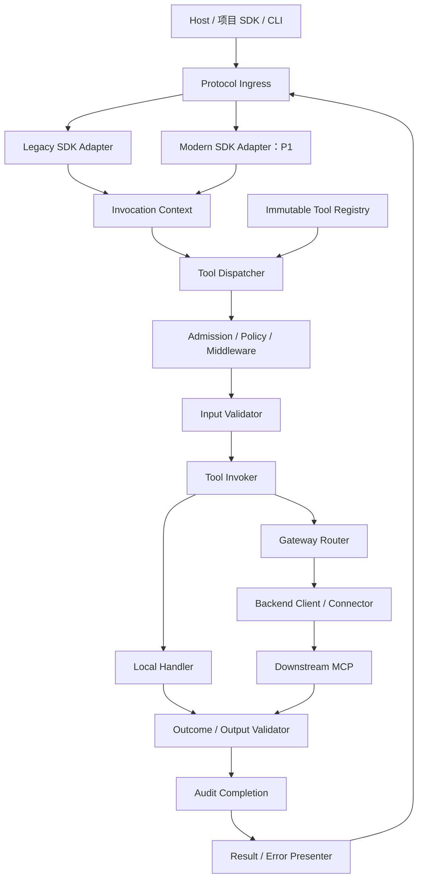
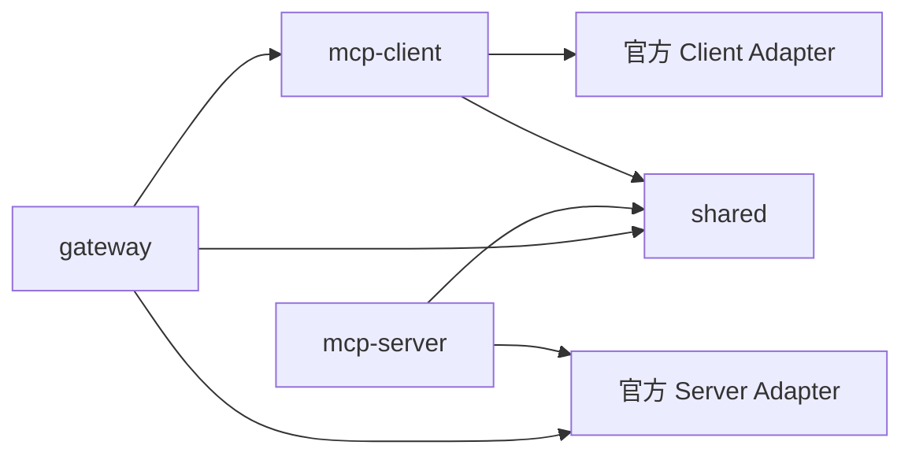
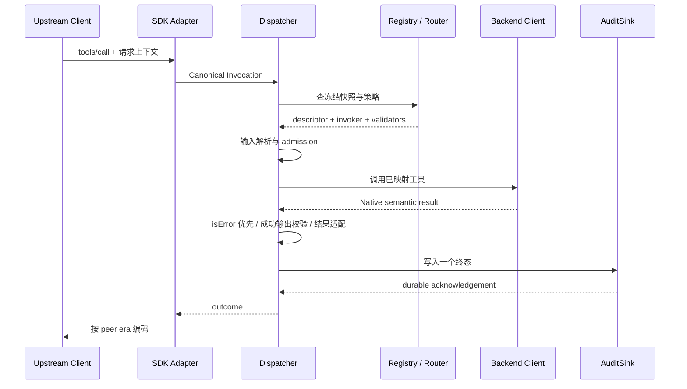
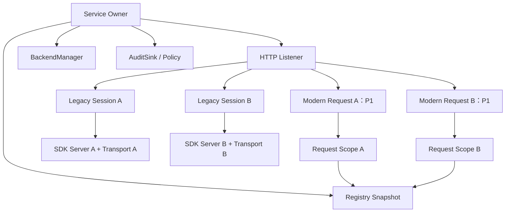
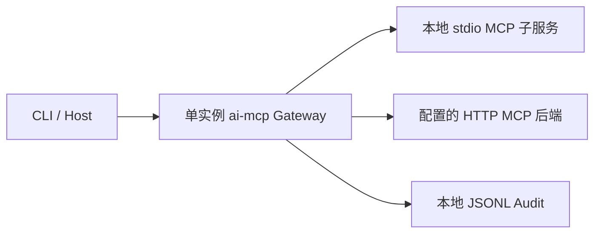

# ai-mcp 通用 MCP 底座架构设计

状态：待审阅，未实施。调研日期：2026-10-01（Asia/Shanghai）。源码基线：`main@8dad112cb633bffbdc7ae893b7efc87acbb958a1`。

本稿回答目标系统如何分层、谁持有资源、各协议版本如何共存，以及如何渐进替换当前实现。接口、算法、配置、失败路径与文件改造见 [详细改造设计](./2026-10-01-mcp-foundation-refactoring-detail.md)；当前源码证据仍见 [现状评估与 P0 设计](./2026-10-01-mcp-foundation-design.md)。三份文档是同一项建设的不同视图，均不构成开发授权。

## 1. 架构结论与范围

采用**服务级能力内核 + 请求级调用管线 + 官方 SDK 协议适配层 + Gateway 下游连接管理**。工具定义、路由、策略和审计可以长期存在；SDK protocol/server 与 transport 按对应协议规定的请求或连接生命周期存在。业务工具不感知 SDK 版本，不持有客户端连接。

本轮新增当下官方规范与 SDK 的调查：目标架构应能承接 `2026-07-28` 的请求级协议，同时明确保留已有 `2025-11-25/2025-03-26` 与显式开启的旧兼容路径。不会把旧协议的 session 管理直接当成所有 MCP 版本的统一架构。

建议实施顺序是 **P0 修好当前底座、建立版本无关内核 → P1 单独迁移 SDK v2 并启用现代协议**。P1 是明确的后续迁移建议，需单独确认；P0 完成不得对外宣称已支持 2026 协议。先迁移 SDK 再同时改契约、会话、错误和 CLI，会增加问题定位与回退难度。

本阶段仍不开发 CLI 执行器、Agent Runtime、Task 调度、自审/返修/验收工作流、skill、插件、聊天唤醒、模型/供应商/账号管理。OAuth、企业多租户、数据库、分布式 session、连接器市场也不属于此次底座改造。

## 2. 当前成熟实践及版本边界

“成熟”在本文指官方稳定规范、SDK 的公开部署入口和可验证的工程边界，不以网络文章中的功能数量为标准。

| 参考事实                                                       | 对 ai-mcp 的设计影响                                                     | 官方来源                                                                                                                                               |
| -------------------------------------------------------------- | ------------------------------------------------------------------------ | ------------------------------------------------------------------------------------------------------------------------------------------------------ |
| 当前稳定规范为 2026-07-28，请求自身携带协议元数据              | 内核按单次调用接收上下文，不从前一次调用推断 run/task/身份               | [当前规范](https://modelcontextprotocol.io/specification/2026-07-28)、[基础模型](https://modelcontextprotocol.io/specification/2026-07-28/basic/index) |
| TypeScript SDK v2 是稳定发布线，v1 是继续维护的旧线            | SDK 的运行对象与类型不得成为业务层不可替换依赖                           | [官方 SDK README](https://github.com/modelcontextprotocol/typescript-sdk)                                                                              |
| 新 HTTP 部署入口使用 server factory 服务每次请求               | 每请求只创建协议外壳，不重复创建业务服务、审计存储或下游进程             | [HTTP 部署指南](https://ts.sdk.modelcontextprotocol.io/v2/serving/http.html)                                                                           |
| 旧 sessionful 部署可置于现代入口之前，按官方分类路由           | 同一 /mcp 可分流到现代入口与独立旧会话管理；畸形现代请求不能降级绕过校验 | [旧客户端兼容](https://ts.sdk.modelcontextprotocol.io/v2/serving/legacy-clients.html)                                                                  |
| Gateway 可以复用已取得的下游 discovery 信息                    | 能力发现与每次工具执行分开；本期进程内缓存，不引入 Redis                 | [Gateway 指南](https://ts.sdk.modelcontextprotocol.io/v2/advanced/gateway.html)                                                                        |
| SDK v2 对 schema 库使用 Standard Schema，支持 JSON Schema 输入 | 本地继续 Zod；下游 JSON Schema 原样保存，不做 JSON Schema→Zod 的猜测转换 | [schema 库指南](https://ts.sdk.modelcontextprotocol.io/v2/advanced/schema-libraries)                                                                   |
| 升级 SDK v2 不自动启用现代协议                                 | SDK 包迁移与协议启用分为两个验收门槛                                     | [协议支持迁移](https://ts.sdk.modelcontextprotocol.io/v2/migration/support-2026-07-28)                                                                 |

### 2.1 两种协议时代不能混用的行为

| 维度              | 已有 2025 时代兼容路径                                    | 2026-07-28 目标路径                             |
| ----------------- | --------------------------------------------------------- | ----------------------------------------------- |
| 启动/能力         | initialize 握手，后续 initialized                         | server/discover 与每请求元数据，由 SDK 负责     |
| HTTP session      | 可选 Mcp-Session-Id；stateful 一会话一对 server/transport | 无协议 session；每请求独立                      |
| HTTP GET/DELETE   | 旧 stateful 的通知流/会话终止                             | 不当作现代 session API；按现代 binding 响应     |
| HTTP 取消         | 显式 MCP cancellation；单流断开不直接等于整个请求取消     | 请求响应流关闭即对应请求取消                    |
| structuredContent | 旧 wire 对象约束                                          | 可为一般 JSON 值；由对应 codec 处理旧客户端适配 |
| 项目结果          | 现有 StandardToolResult 保留                              | 继续同一项目结果，wire bookkeeping 由 SDK 添加  |
| 错误码            | 保留现有 Gateway 数字码兼容                               | 使用现代合法错误空间，不能复用被规范保留的码    |

取消和 session 的差异分别以 [2025 transport](https://modelcontextprotocol.io/specification/2025-11-25/basic/transports) 与 [2026 HTTP binding](https://modelcontextprotocol.io/specification/2026-07-28/basic/transports/streamable-http) 为准。现代协议允许更多结果类型，不代表本项目自动实现所有扩展和业务流程。

### 2.2 原设计需修正的三处架构决策

1. shared 不应绑定某一代 SDK 的运行时对象和 wire schema；公共 SDK 依赖移到 Server/Client adapters，shared 保持项目契约与通用校验。
2. “每 session 一 SDK server”只适用于旧 stateful 适配器；新协议采用请求外壳。旧 stateless 的局限也不能套用到现代 HTTP 取消。
3. 原 Gateway 的 `-32020/-32030/-32040` 不可直接用于现代 wire。规范将 `-32020` 至 `-32099` 保留给 MCP，当前 `-32020` 表示 HeaderMismatch；现代应用错误应使用保留范围之外的码。[错误空间规则](https://modelcontextprotocol.io/specification/2026-07-28/basic/index)

其余已确定的兼容标准包装、动态发现、错误优先、源码证据及 TDD 验收要求继续成立。

## 3. 方案比较与推荐

| 方案                                       | 收益                                               | 代价                                                              | 选择   |
| ------------------------------------------ | -------------------------------------------------- | ----------------------------------------------------------------- | ------ |
| 直接把现有 Server/Gateway 扩成大类         | 改动文件少                                         | 生命周期、schema、错误、审计继续耦合，升级 SDK 时再次穿透全部业务 | 不采用 |
| P0 同时升级 SDK v2、全协议与企业网关       | 一次接触新 API                                     | 验收面过大，无法隔离既有缺陷和迁移差异，超出本阶段需求            | 不采用 |
| **版本无关内核 + 受控适配器 + 分阶段迁移** | 当前问题可分别证明、旧契约可固定、新协议可独立接入 | 需要清楚的模块接口与适配器测试                                    | 采用   |

这是模块化单体，不拆成微服务。保留四个 workspace package，在 package 内分模块；只有真实部署/消费边界出现后再拆包。

## 4. 逻辑架构

Ingress 做协议识别与 wire 校验；Dispatcher 不知道 HTTP req/res；工具 Invoker 不知道原生 SDK server；Presenter 不执行工具，也不重试。ResultAdapter 和 OutcomeNormalizer 位于返回管线，Gateway 包装只发生一次。

### 4.1 服务启动与请求执行分开

启动阶段负责配置校验、注册定义、连接下游、发现所有分页、验证 descriptor/schema、形成映射、冻结公开目录。调用阶段只读取快照，执行策略/校验/调用/审计。

不在每个 HTTP factory 中再次执行 Gateway.initialize，不在 tools/list 时拉起新后端，不在每次调用时重新编译同一个 schema。发现与调用共用 snapshot revision，避免描述来自旧工具而路由已指向新工具。

### 4.2 模块职责

| 模块                 | 输入 / 输出                                           | 持有状态                           | 不承担                       |
| -------------------- | ----------------------------------------------------- | ---------------------------------- | ---------------------------- |
| ToolRegistry         | typed 定义或已验证 descriptor → 注册快照              | 定义、执行闭包、schema fingerprint | session、进程、业务工作流    |
| SchemaCompiler       | JSON Schema / Zod 边界 → validator 与 wire view       | 以内容指纹和方言为键的编译缓存     | 网络取 schema、填默认值      |
| ToolDispatcher       | name/arguments/context → InvocationOutcome            | 单次调用状态                       | HTTP 路由、SDK 私有状态      |
| Policy/Middleware    | 服务身份、工具元数据、ctx → allow/deny / continuation | 既有限流计数                       | 自动用户授权、模型决策       |
| BackendManager       | backend spec → 服务级 BackendClient                   | connector 生命周期、discovery 结果 | 上游 session 所有权          |
| GatewayRouter        | publicName → 保存的 backend/tool 键                   | immutable mappings                 | 字符串猜测路由、任务调度     |
| ResultAdapter        | 已校验原生结果 + contract → 项目标准结果              | 无业务可变状态                     | 无条件成功包装、业务完成判定 |
| AuditSink            | 单次终态事件 → 持久化成功/失败                        | 有界 append 队列                   | 项目任务日志数据库           |
| LegacySessionManager | session header → 固定 protocol pair                   | 旧 session entries、idle timer     | task/run ID、跨节点恢复      |
| RequestScope         | 单次 HTTP 生命周期 → dispose                          | 调用 controllers、协议外壳         | 共享 connector 关闭          |
| ProtocolAdapter      | 官方 SDK 原生对象 ↔ 上述契约                          | SDK 对象、wire era                 | 重写 MCP 协议                |

## 5. 包和依赖边界

- shared：JsonValue/JsonObject、已有 StandardToolResult/ArtifactRef/RunContext、project error/outcome/context、schema 编译和标准包装描述；不导出 SDK server/transport 实例。
- mcp-server：本地 typed registry、dispatcher、middleware 与 server factory，协议入口隐藏在 adapters。
- mcp-client：动态发现、动态原生语义调用、typed helper、stdio/HTTP Client 适配。Gateway 复用它的 backend client facade，避免再维护另一套错误优先与分页逻辑。
- gateway：backend 初始化、映射、目录视图、policy/capability/audit、标准包装和上游生命周期。策略模块继续位于原包，不迁出企业平台包。

P0 adapter 使用当前 SDK；P1 增量引入官方 `@modelcontextprotocol/server`、`client`、Node adapter 与必要公开 schema 包。直接依赖使用公开包，不依赖 core-internal。确切补丁版本在实施前锁定；不在本轮安装或执行 codemod。

调用方现有 `McpClient(transport)` 等公开构造签名有额外类型兼容门槛；不得仅因为源码已不 import v1 就删除旧类型依赖。未证明外部构造兼容时保留桥接或旧依赖，作为明确交付边界。

## 6. 请求与返回模型

### 6.1 三个模型各有职责

| 模型                                            | 用途                                                              | 规则                                                           |
| ----------------------------------------------- | ----------------------------------------------------------------- | -------------------------------------------------------------- |
| 原生 wire                                       | JSON-RPC/MCP 与 transport                                         | 官方 SDK 对相应版本解析/编码                                   |
| Native semantic result                          | 已由 adapter 解码的 content/structuredContent/isError/自定义 meta | 保留所有内容和错误标志，不把 resultType/session 字段塞到业务里 |
| Project invocation outcome / StandardToolResult | 分类、审计、已有 Gateway 返回兼容                                 | 表示此次操作，不推断业务 Task 成败                             |

typed local handler 的类型由实际 schema 推断；动态发现只能提供运行时保障，不虚构 TypeScript 的业务泛型。需要 T 的调用者须提交能实际解析结果的 schema。

### 6.2 成功调用序列

本地工具用 local invoker 替代 Backend Client；legacy handleRawRequest 也使用这条 dispatcher，只在入口/出口转换旧格式。

### 6.3 Gateway 包装策略

P0 保持 StandardToolResult 的既有层级。native-json/v1 的成功 payload 被放入外壳的 structuredContent；standard/v1 的有效结果保持原层级。公开 outputSchema 按实际变换生成，不能发布下游成功 schema 却返回外壳。

新工具显式声明 contract；旧无声明且无 outputSchema 的路径保留兼容识别。存在 schema 的旧工具不能通过一般 schema 推断算法猜测是否标准结果：仅对现有内置/已登记的兼容模式采用固定规则，其他工具需要声明或配置 override。返回式失败与查询失败任务的成功操作保持分离。

P1 对直接工具结果允许一般 JSON 值；旧 wire 的对象 envelope 由版本 codec 处理，Gateway 的标准外壳仍为对象。不能把现代 SDK 的版本转换再包装一次。

## 7. 生命周期、并发与所有权

### 7.1 核心不变量

1. 一 SDK protocol 实例一生只拥有一个 transport。
2. 一次调用一份 context 和 cancellation controller，requestId 不是全局身份。
3. 上游 A 关闭，只能释放 A 的协议/请求资源，不能关闭 B 或服务级 BackendManager。
4. 服务 close 能找到 active、pending initialization、stateless request、SSE、listener 和 audit queue。
5. shared registry、策略、schema cache 和下游连接在请求 factory 外创建；factory 只绑定引用。
6. 并发正确性由所有权和请求关联保证，不使用全局串行锁。

### 7.2 运行对象分层

旧 Gateway 保留 stateful 默认；旧普通 Server 保留 stateless 默认。P1 的现代分支必为现代请求模型，不读取 `sessionMode:'stateful'` 去创造现代 session。配置中的 sessionMode 只作用于 legacy 分支，避免同一名字出现两个含义。

stdio 的进程/连接仍可长期存活，现代协议无 session 不等于“每工具调用启动一个 stdio 进程”。单个进程可承载多次独立上下文；业务工具不得按最后一次 runId 保留调用者状态。

### 7.3 Gateway 下游连接

单团队同服务身份的 backend 可以由一个服务级 Client/transport 并发调用。该边界只保证本项目关联与关闭正确；不宣称自动提供下游业务租户隔离。以后若请求需要独立下游授权，应按身份/授权边界划分 BackendClient，另行设计连接池。

只在 bootstrap/显式 refresh 时完整发现；P0 不实现热更新。连接失败可有界重试；已提交的 tools/call 不自动重放。断线后“操作是否执行”未知时返回 unknown execution disposition，不能把重新连接等价于可以安全重试。

## 8. 可靠性与观测

| 机制        | 当前阶段做法                                                           | 验收                                     |
| ----------- | ---------------------------------------------------------------------- | ---------------------------------------- |
| schema 校验 | 注册/发现时编译，调用前后按同一快照执行                                | 错参不进 handler，错误输出不成功         |
| deadline    | 一个调用预算覆盖连接、等待、执行与清理；保留 timeoutMs 默认值          | 连接/执行超时分类准确，取消实际下游      |
| admission   | 有界活动调用，默认无排队；已有 rate limit 保留                         | 过载明确拒绝，双客户端正常并行           |
| discovery   | 全分页、稳定排序、循环 cursor 检测、全成功冻结                         | 不漏工具、不半注册                       |
| 返回体      | 保存合法内容块；超限明确错误/引用策略，不截断 JSON                     | 不产生不可解析或虚假成功                 |
| audit       | 一个终态、服务级有界写队列、flush                                      | 与 outcome 和 trace 对应，失败不重放工具 |
| shutdown    | stop admission → drain/cancel → 全 entries → backends → audit/listener | PID/端口/连接可回收                      |
| trace       | 每调用 UUID 或经校验的传播值，另存 requestId/sourceTraceId             | A/B 同 requestId 不混日志                |

P0 保留 /health 的现有输出；就绪事实来自 bootstrap 状态，真实工具可用性来自协议调用。结构化日志、审计和生命周期计数用于验收，不建设 Prometheus/OpenTelemetry 平台；以后接 exporter 无需改变 invoker。

HTTP 协议边界包含 body size、合法方法/路径、Origin/Host 配置与禁止自定义 meta 提权。它们是协议入口职责；不因此引入 OAuth/账号管理。对现有远程接入的配置影响必须列入兼容说明。

## 9. 部署模型与演进边界

首期支持单实例服务与本地 stdio。旧 stateful HTTP session 位于该实例，外部负载均衡若启用必须保持相应路由；本项目不声称已经具备高可用集群。现代 HTTP 请求本身可跨实例，但本项目现有内存限流/JSONL 审计/本地后端进程仍是单实例状态，不能仅靠 modern protocol 宣称分布式平台完成。

未来横向部署需要共享治理或分区策略、backend 身份边界、审计汇聚和启动就绪策略。这些属于后续部署方案，不塞进 P0。

## 10. 依赖排序与迁移门槛

| 阶段   | 交付                                          | 前置与停止点                                  |
| ------ | --------------------------------------------- | --------------------------------------------- |
| P0-0   | 固定旧 API/CLI/wire 样本                      | 用户确认后执行；先复核当前 dirty 状态         |
| P0-1   | 版本无关 shared 契约与 schema compiler        | 不让 SDK 原生类穿入内核                       |
| P0-2   | registry/dispatcher/middleware/server factory | 自定义工具与旧入口 TDD 通过                   |
| P0-3   | Client facade 与 Connector 统一边界           | 动态发现、原生错误、连接失败真实证明          |
| P0-4   | Gateway schema/结果/目录                      | 公布 schema 独立校验实际输出                  |
| P0-5   | legacy HTTP/SSE ownership                     | 两个真实独立客户端与关闭/资源验证             |
| P0-6   | context/audit                                 | trace/run/task 真正贯通                       |
| P0-7/8 | 全回归、七项命令、独立审阅、文档              | 保留未提交改动，P0 可单独交付                 |
| P1-1   | v2 SDK 适配，暂保留 legacy 行为               | 另行授权；Node 20/Zod/schema/公开构造类型门槛 |
| P1-2   | modern HTTP/stdio、版本分流与错误映射         | 单独证明 modern 的 body/header/取消/codec     |
| P1-3   | modern↔legacy Gateway 矩阵、文档              | 无 Agent Runtime，不删除旧兼容或变更默认协议  |

完整路线与失败测试见 [实施计划](../plans/2026-10-01-mcp-foundation-implementation-plan.md)。P1 不以“安装了 v2”通过，必须有现代 wire、旧路径回归和混合后端验证；不靠修改业务 echo text 证明协议版本。

## 11. 关键架构决策记录

| 决策                             | 原因                               | 放弃的替代                         |
| -------------------------------- | ---------------------------------- | ---------------------------------- |
| 四包内模块化内核                 | 现有规模与部署边界足够             | 微服务/多平台子包                  |
| shared 不依赖具体 SDK 运行时     | 可分别迁移两代 protocol            | 在 shared 导出当前 SDK 全部类型/类 |
| Gateway 复用 Client facade       | 发现、错误、deadline 不重复实现    | Connector 继续各自取第一个文本     |
| 单快照目录与调用                 | schema 与实际路由一致              | 列表与路由分别可变                 |
| 保留标准包装默认                 | 已有调用方兼容                     | 全部无声改成透传                   |
| 新工具契约显式                   | 无法可靠由任意 schema 猜测业务意图 | shape 检测自动认定 ok:false 是失败 |
| legacy 独立会话、modern 独立请求 | 每代遵循实际规范                   | transport 切换或全局队列           |
| era-aware 错误映射               | 避免 modern reserved code 冲突     | 所有版本固定 -320xx                |
| P0 与 P1 分开审批验收            | 不扩大原阶段，也不把旧协议当最新   | 一次升级同时改全部契约             |

## 12. 可评审交付与未验证边界

当前交付为设计文档与现状复核。引用的规范/SDK 是本轮在线检查结果；新 API 是否与最终选定 v2 补丁版本一致、v2 输入输出校验具体行为、旧公开构造类型和真实宿主消费仍需实施时验证。不存在“官方有该入口所以本仓库已通过”的推断。

用户确认后才编写失败测试与实现；无 commit/push/merge/PR 授权。已有协作设计稿不覆盖，本稿也不自动授权其后续 M0–M6。
