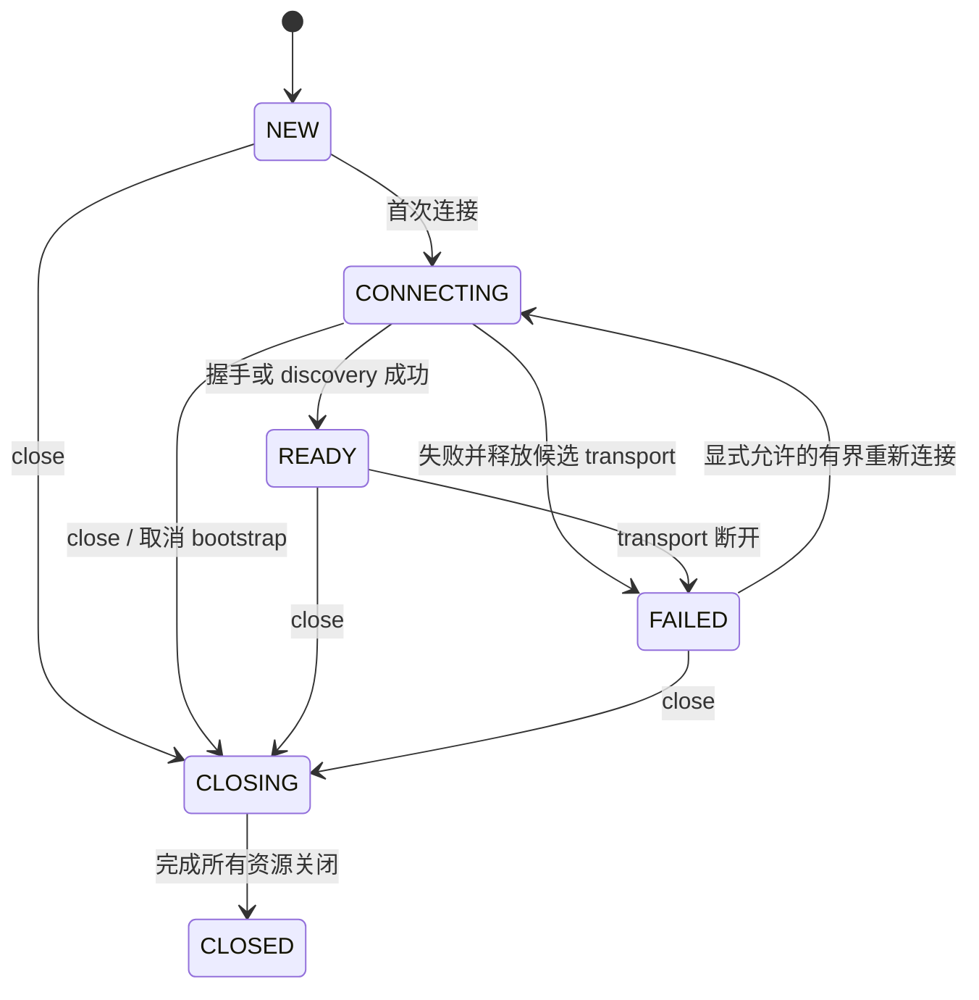

# ai-mcp 通用 MCP 底座详细改造设计

状态：待审阅，未实施。日期：2026-10-01。源码基线：`main@8dad112`。

本稿定义模块接口、数据流、算法、生命周期、配置和逐文件改造。架构决策见 [架构设计](./2026-10-01-mcp-foundation-architecture.md)；确定问题的首次产生位置与当前源码证据见 [现状评估](./2026-10-01-mcp-foundation-design.md)；执行步骤见 [实施计划](../plans/2026-10-01-mcp-foundation-implementation-plan.md)。下列 TypeScript 是拟议接口，不是已落地源码；本轮不创建测试或实现文件。

## 1. 改造包结构

```text
packages/shared/src/
  types.ts                       # 保留原导出，增量兼容别名
  invocation.ts                  # 项目调用上下文、outcome、错误分类
  tool-contract.ts               # descriptor、native semantic result、结果模式
  tool-schema.ts                 # JSON Schema 方言、编译与指纹
  result-schema.ts               # StandardToolResult wire schema / 包装视图
  error.ts                       # 兼容 McpError 与项目错误规范化

packages/mcp-server/src/
  server.ts                      # 公开 facade，bootstrap/close
  tool-registry.ts               # typed closure 与冻结快照
  tool-dispatcher.ts             # 校验、middleware、handler、outcome
  sdk-server-factory.ts           # 绑定相同业务内核到新协议外壳
  lifecycle/http-session.ts      # 旧 stateful session entries
  lifecycle/http-request.ts      # 旧 stateless request scope
  lifecycle/owner.ts             # listener、pending entry、shutdown
  adapters/legacy-server.ts      # 当前 SDK 公开 API
  adapters/modern-server.ts      # P1：v2 公开入口与 neutral/wire 边界

packages/mcp-client/src/
  client.ts                      # 保留公共 SDK facade
  discovery.ts                   # 全分页、验证、缓存与快照
  result-decoder.ts              # 先错误再 payload，typed helper
  backend-client.ts              # Gateway 使用的统一 Client facade
  adapters/legacy-client.ts      # 当前 SDK + 指定版本薄适配
  adapters/modern-client.ts      # P1：v2 版本协商/codec

packages/gateway/src/
  gateway-core.ts                # backend 管理与映射 facade
  gateway-server.ts              # 上游服务 owner / handler factory
  backend-manager.ts             # bootstrap、连接资源与关闭
  tool-catalog.ts                # 下游 descriptor→公开 view
  result-adapter.ts              # native/standard/compat 结果变换
  error-presenter.ts             # 按上游 era 编码
  connectors/{base,http,stdio}.ts # 兼容接口，委托 BackendClient
  policy.ts capability-registry.ts audit*.ts # 原模块增量复用
```

文件划分按职责，不要求为了对齐表格创建空文件；共享不超过一个调用方的小 helper 留在所属模块。没有新增 Agent 包、微服务、数据库或插件目录。

## 2. 核心契约

### 2.1 JSON 与 descriptor

JsonValue 继续复用 shared。JsonObject 是 `{[key:string]:JsonValue}`，由运行时 parser 确认，不能把 SDK 的 Record<string,unknown> 直接断言成它。

```ts
type ProtocolEra = 'legacy' | 'modern';
type ResultContract = 'native-json/v1' | 'standard/v1' | 'legacy-auto';
type JsonSchemaDocument = JsonObject;

interface ToolDescriptor {
  name: string;
  description?: string;
  title?: string;
  inputSchema: JsonSchemaDocument;
  outputSchema?: JsonSchemaDocument;
  annotations?: JsonObject;
  icons?: readonly JsonObject[];
  _meta?: JsonObject;
  extensions?: JsonObject;
}

interface NativeToolResult {
  content: readonly JsonObject[];
  structuredContent?: JsonValue;
  isError: boolean;
  _meta?: JsonObject;
}
```

NativeToolResult 是两代 SDK 解码后的公共语义，不是原生 wire schema。adapter 必须先通过本代官方 schema 校验内容块，再经 JSON 可序列化校验；content 使用 JsonObject 表示已验证的开放内容，不能据此绕过 type/mimeType/text/resource 等语义校验。旧 SDK 的对象 structuredContent 限制留在 legacy adapter；P0 的本地通用注册先维持对象根，P1 才扩展一般 JSON 根。

extensions 保留 SDK 支持、但项目不理解的 descriptor 扩展；未知执行能力不能因此自动宣告支持。官方保留 metadata 由 SDK 对应版本处理，Gateway 不把下游原封包的 reserved meta 当成本次上游身份。

### 2.2 调用上下文

```ts
interface InvocationContext {
  invocationId: string;
  traceId: string;
  requestId?: string | number;
  peerEra: ProtocolEra;
  protocolVersion: string;
  mcpSessionId?: string;
  runId?: string;
  taskId?: string;
  deadlineAt: number;
  signal: AbortSignal;
  actor: Readonly<{
    tenantId: string;
    who?: string;
    agent?: string;
  }>;
}

interface InvokeRequest {
  name: string;
  arguments: JsonObject;
  context: InvocationContext;
}
```

invocationId 总是服务生成的单次调用 UUID；traceId 可传播同一业务链。两次请求允许主动共用 trace，但不会共用 invocationId。deadlineAt 是本服务计算的预算终点，调用者传入 metadata 不能扩大服务最大预算。时长测量用单调时钟，跨进程传播 deadline 只是提示，不能假设机器时钟严格同步。

上下文优先级：受信服务 actor 配置 → 单次经验证的 run/task/trace → 服务 runContext.runId 缺省。sessionId、requestId、taskId、runId 不互相替代。

### 2.3 outcome 与错误

```ts
type ExecutionDisposition = 'not_started' | 'completed' | 'unknown';

interface InvocationFault {
  category: string;
  projectCode: string;
  message: string;
  traceId: string;
  invocationId: string;
  executionDisposition: ExecutionDisposition;
  source?: Readonly<{
    kind: 'local' | 'peer' | 'sdk' | 'transport' | 'audit';
    backendId?: string;
    protocolVersion?: string;
    code?: string | number;
    traceId?: string;
  }>;
  details?: JsonObject;
}

type InvocationOutcome =
  | { kind: 'success'; result: NativeToolResult }
  | { kind: 'tool_failure'; result: NativeToolResult; fault: InvocationFault }
  | { kind: 'failure'; fault: InvocationFault };
```

fault.category 的合法集合由 shared schema 定义：invalid_request、invalid_params、tool_failure、policy_denied、rate_limited、backend_timeout、backend_unavailable、invalid_result、cancelled、audit_unavailable、internal、unsupported_capability 等。这里的 string 是文档接口简写，实际不能无校验接收任意类别。

business payload `{task:{state:'failed'}}` 不产生 tool_failure。只有原生 isError 或明确 standard 契约的 ok:false 表达操作失败。业务状态未知/错误的含义由工具自己的 schema 和 handler 定义。

## 3. ToolRegistry 与类型安全注册

### 3.1 公开接口

```ts
interface ToolDefinition<TInput, TOutput> {
  name: string;
  description: string;
  inputSchema: ZodType<TInput>;
  outputSchema: ZodType<TOutput>;
  resultContract?: 'native-json/v1' | 'standard/v1';
  annotations?: JsonObject;
  _meta?: JsonObject;
  handler(input: TInput, context: InvocationContext): Promise<TOutput> | TOutput;
}

interface RegisteredTool {
  descriptor: Readonly<ToolDescriptor>;
  contract: Exclude<ResultContract, 'legacy-auto'>;
  invoke(input: unknown, context: InvocationContext): Promise<InvocationOutcome>;
}

interface RegistrySnapshot {
  revision: string;
  descriptors: readonly Readonly<ToolDescriptor>[];
  find(name: string): RegisteredTool | undefined;
}
```

现有 ToolHandlerContext 的 traceId 保留，额外 context 字段增量提供；原函数只接收 traceId 的结构化类型仍可消费新 context。旧 ToolDefinition 的 name 限制解除，其注册调用形式保留；旧 ToolName/InputMap/OutputMap 不扩枚举，保留兼容导出。

### 3.2 注册算法

1. 验证名称、重复、配置阶段状态，先拒绝问题，不先更新 Map。
2. 从定义的 schema 导出 input/output JSON Schema，并确认支持方言与根形状。
3. 编译 wire validators；将定义的 title/annotations/meta 与明确 resultContract 形成 descriptor。
4. 创建捕获具体 TInput/TOutput 的闭包：safeParseAsync(input) 成功后才调用 handler；safeParseAsync(output) 成功后才形成原生语义结果。
   捕获的是注册时的 handler/schema 引用与已克隆 descriptor，不从可变 ToolDefinition 对象临时取字段；snapshot freeze 不冻结或篡改调用者整个 Zod 对象。
5. 对解析数据做 JSON 校验，内容编码后用 wire validator 校验，防止 authoring schema 与公开 schema 不一致。
6. 所有步骤完成后才原子登记 RegisteredTool。启动时 copy/freeze 为 snapshot，计算 revision。

不将 `ToolDefinition<TInput,TOutput>` 强转为 `ToolDefinition<unknown,unknown>` 存储。defineTool 只帮助推断，不能自动把未校验 payload 标成某业务类型。

local Zod stripping/coercion 等既有语义只对 authoring 输入生效，必须能导出对应接受范围；Gateway 第三方 JSON Schema 校验不修改入参。不能导出或发生语义冲突的 schema 在注册时失败，不等到 tools/list 第一次才报错。

## 4. SchemaCompiler 与快照一致性

### 4.1 编译接口

```ts
interface ValidationIssue {
  path: string;
  keyword: string;
  message: string;
}

interface CompiledSchema {
  dialect: '2020-12' | 'draft-07';
  fingerprint: string;
  validate(value: unknown): { valid: true } | { valid: false; issues: readonly ValidationIssue[] };
}

interface SchemaCompiler {
  compile(document: JsonSchemaDocument): CompiledSchema;
  createStandardView(payload?: JsonSchemaDocument): JsonSchemaDocument;
}
```

动态 validator 只证明 unknown 是否符合 schema，不凭调用者给出的无绑定泛型 T 声称编译期类型。typed 数据由 Zod/调用者 schema 的 parse 返回。

### 4.2 编译与缓存规则

- 使用 declared `$schema`，缺省 2020-12；draft-07 单独处理，不支持的方言明确失败。
- 缓存键为 dialect + canonical schema 内容摘要 + 编译选项版本；不能只用 `$id` 或工具名，两个后端可以使用同一 `$id` 却有不同 schema。
- 禁用 coerceTypes/useDefaults/removeAdditional；保持入参字节所表达的语义。
- 支持自包含局部引用与组合；不联网取得外部 schema。
- 缓存属于服务 registry 生命周期，大小有界；本期不进行全局跨进程持久化。
- 不在应用层手写 JSON Schema 解释器；P0 用明确配置的 Ajv，P1 的 fromJsonSchema 使用同一能力明确的 provider。

### 4.3 包装后的引用作用域

原 S 的 `#/$defs/X` 是相对于 S 的资源根。将 S 直接塞进 envelope.properties.structuredContent 会使引用错误指向 envelope。构建公开 view 时，将 payload 放入带内容哈希绝对 $id 的内嵌资源，保留根及 nested $id 的 fragment 引用作用域；不递归改写业务 const/enum/default/examples。standard 透传视图也隔离根资源 ID 并规范化方言，避免共享 validator 的根 ID 缓存串工具；正文层级不变。保留 original S，独立验证源 S、公开 W(S) 或 standard 透传视图。已声明 `$id` 的碰撞按 descriptor 隔离，不能覆盖 compiler 内另一个后端的 schema。

W(S) 与 S 使用同一方言；错误分支不使用成功 payload schema。复杂 schema 无法正确生成可独立消费的 W(S) 时启动失败并报告工具/引用位置，不生成 passthrough 替代。

P0 同一 snapshot 内 descriptor、validator、invoker、route 的 revision 相同。Core.refreshTools 构建的是候选 snapshot；活动服务的热替换不在本期。公开 tools/list 使用稳定 publicName 排序。

Gateway invoker 捕获该 snapshot 保存的 backend/tool 二元键与 BackendClient，不在执行时回读另一份可变全局 toolMappings。Core 的独立手工 refresh 可更新其独立视图，不能借此隐式替换已经绑定的上游目录；若需要运行中刷新上游目录，进入后续热更新设计。

## 5. ClientFacade 与 BackendClient

### 5.1 兼容接口与新增接口

```ts
interface InvokeOptions {
  signal?: AbortSignal;
  timeoutMs?: number;
  context?: Readonly<{ traceId?: string; runId?: string; taskId?: string }>;
}

interface BackendClient {
  discoverTools(options?: InvokeOptions): Promise<readonly ToolDescriptor[]>;
  callToolResult(
    name: string,
    input: JsonObject,
    options?: InvokeOptions
  ): Promise<NativeToolResult>;
  close(): Promise<void>;
}
```

项目 McpClient 保留 listTools 的简要投影、内置 callTool 的原泛型和 CLI 输出；新增 discoverTools/callToolResult/callValidatedTool。通用原生结果 API返回 isError 工具失败，协议/transport 失败抛 project error；typed helper 与 CLI检查 isError 后才取数据。API名称“调用完成”不表示工具业务成功。

现有 Connector 的 listTools/callTool(name,args,signal)/close 继续保留，增加可选 context options；内部委托 BackendClient。返回的 core.output 维持 StandardToolResult 兼容投影，新增原生 semantic result 供 Gateway 的正确适配使用；不能只保留投影丢失原生错误。

### 5.2 全分页发现

ensureConnected → 请求当前页 → 校验所有 descriptor → 记录 cursor → 请求下一页 → 检测重复名字/循环 cursor → 编译并形成完整 snapshot → 一次性替换缓存。

失败不污染旧缓存；bootstrap 没有旧缓存则不就绪。建议页数上限 128，可配置；循环/超限/总 deadline 失败明确报告 incomplete，不把截断结果称为完整发现。分页过程中 SDK 自身的 schema cache 不作为全目录事实来源。

### 5.3 连接与调用状态



一个 connectPromise 只协调同一连接尝试；失败后释放并清除，不永久复用 rejected promise。close 发生在 connect 中时，候选 transport 一旦出现也必须进入 cleanup。close 后新连接拒绝，幂等 close 共享同一关闭 Promise。

自动连接重试默认最多三次，预算覆盖 backoff/连接；已发送业务 call 不重放。P1 SDK 在协议明确“尚未 dispatch”的校验拒绝上做恢复，必须另验执行次数；未知是否执行的错误一律不可当成安全重试依据。

## 6. Dispatcher、middleware 与审计算法

### 6.1 调用顺序

1. adapter 验证 wire envelope，创建 invocationId/context。
2. dispatcher 查 snapshot。未知工具是协议错误，不执行 handler。
3. admission 检查服务状态/并发界限；policy 使用服务 actor 与已解析 capability。
4. middleware(ctx, terminal) 中 terminal 包含输入解析、handler/remote invoke、结果校验与 outcome。
5. 原生 isError 先判定，不能先读取 structuredContent；错误路径不套成功 schema。
6. 成功结果必须通过已声明输出 schema；结果序列化约束也需通过。
7. Gateway 根据 contract 形成标准 view；本地直接工具按既有数据结构返回。
8. 终态槽以 invocationId 完成一次；记录 outcome 与执行位置，并提交 AuditSink。
9. Presenter 按 peer era 形成 wire 或 legacy RpcOutput。

policy decision 只表示 allow/deny；工具失败仍可 decision=allow。ServerContext 增量带实际 outcome，auditMiddleware 不仅捕获异常，也识别返回式 tool_failure。

### 6.2 终态竞态

每次调用内部状态为 admitted/running/settling/finished；成功、throw、deadline、cancel 和 shutdown 只能有一个 winning terminal transition。晚到 handler 结果不能再次回复或追加第二条终态；日志可以记录 late completion 的诊断，不能改写已经交付的失败为成功。

cancel 与 timeout 是不同原因。deadline 触发 controller.abort(timeout reason)，上游取消是 cancel reason；BackendClient 收到的 signal 只终止这个 call，不 close 共享 client。错误消息中的“abort”“not found”不决定分类。

取消是协作式：handler 必须观察 signal 并在 finally 释放自己持有的资源；MCP 取消不保证已经发生的业务副作用回滚。非协作 handler 不能由协议层强行终止 JavaScript；超时/关闭时报告 executionDisposition=unknown 和仍未释放的资源，不能宣称资源清理已完成。

### 6.3 审计格式

保留原 AuditEvent 字段，增量增加 invocationId、requestId、mcpSessionId、protocolVersion、outcome、resultCode、executionDisposition、downstreamTraceId。日志不存 arguments 全文；仍可配置 HMAC inputHash，outputSummary 有界。

同一事件含 policy decision 与操作 outcome；正文中查询对象的 taskId 不覆盖 invocation.taskId。result.\_meta 中的 org.ai-mcp/context 与审计同 trace；原下游正文 trace 可作为 sourceTrace 关联。

JSONL 写入由一个服务级有界队列排序；保留每行一个完整 JSON。record resolve 表示该事件写入已完成；关闭停止新入队并 flush。写失败不再执行工具，返回 audit_unavailable，details.operationCompleted 为 true/false/null 分别表示完成/未开始/未知。审计失败时没有成功持久化事件本身是边界，不能宣称“每个错误仍有完整落盘”。

建议 maxPendingEvents 默认 1024，可配置；审计已不可写或容量不足时，在 handler 前拒绝新调用并报告 not_started。已接受的调用保留终态写入预算；磁盘在执行后失败仍只能报告 completed/unknown，不能许诺绝不发生“已执行但审计写失败”。既有自定义 AuditStore.record 接口保留，容量预留由内部 AuditSink 包装提供。

## 7. Gateway 目录与结果算法

### 7.1 CatalogEntry

```ts
interface CatalogEntry {
  publicName: string;
  backendId: string;
  backendToolName: string;
  source: Readonly<ToolDescriptor>;
  advertised: Readonly<ToolDescriptor>;
  contract: ResultContract;
  inputValidator: CompiledSchema;
  sourceOutputValidator?: CompiledSchema;
  publicOutputValidator: CompiledSchema;
  snapshotRevision: string;
}
```

BackendManager 全部发现成功后创建 CatalogEntry；验证 backend ID/publicName 唯一；保存二元路由键。allowlist/visibility 生成公开 view，calling policy 仍再次检查，不能仅凭 tools/list 隐藏工具就算授权完成。

annotations、icons、title、description、\_meta 保留。Gateway 既有描述后缀继续；新 source 信息在 org.ai-mcp/downstream-tool 中，不能覆盖同名不明来源字段。capability 自定义 metadata 先验证 shape；配置 overrides 优先，下游提示不得自动提权。

### 7.2 contract 决策

优先级：tool override → 显式 backend.resultContract（含 legacy-auto）→ descriptor 声明 → legacy-auto 兼容回退。Gateway 对上游公开的契约始终为 standard/v1，内部生效 contract 连同 source descriptor 放入 org.ai-mcp/downstream-tool；传到 Connector/Client 的显式调用契约优先于下游 metadata，不跳过成功输出 schema 校验。

新本地普通工具默认 native-json/v1，标准返回工具显式 standard/v1。legacy-auto 且缺 outputSchema 时保留旧运行时完整 StandardToolResult 识别；有 outputSchema 时仅对已登记的兼容模式（如现有 echo/time 输出）提供固定规则，不能通过一般 schema 可满足性/shape 推断业务意图。其他工具明确报 RESULT_CONTRACT_AMBIGUOUS，要求配置；显式 native/standard 都支持复杂自包含 JSON Schema。

### 7.3 三类结果

| 输入结果                                              | 归一化结果                                      | 必须保留                                           |
| ----------------------------------------------------- | ----------------------------------------------- | -------------------------------------------------- |
| 原生 isError:true，含结构化错误                       | tool_failure，standard ok:false；有意义诊断保留 | 全部 content、原 SC、source trace；不套成功 schema |
| 原生成功，standard/v1 的 ok:false                     | tool_failure，并上行 isError:true               | code/message/details/artifacts                     |
| 原生成功，native payload 包含 ok:false 或 failed task | success，标准外壳 ok:true                       | 完整业务 payload，由业务 schema 验证               |

声明 standard 却 envelope 无效，是 invalid_result，不能退回 native 成功包装。原生 isError:true 与标准 ok:true 冲突，原生失败优先，记录 contract conflict。

原生 content-only 是合法结果；不能只取第一个 text 忽略媒体。旧单文本 JSON fallback 仅作明确兼容解码：原始 content 一直保存，没有 outputSchema 时并不声称已经验证业务 shape。

### 7.4 可独立校验的包装输出

以下是 native 成功 payload `{text:string}` 的公开 schema 结构示意，实际由 shared 工厂生成并保持可选旧字段：

```json
{
  "type": "object",
  "required": ["ok", "code", "message"],
  "properties": {
    "ok": { "type": "boolean" },
    "code": { "type": "string", "minLength": 1 },
    "message": { "type": "string" },
    "structuredContent": {},
    "traceId": { "type": "string" }
  },
  "allOf": [
    {
      "if": { "properties": { "ok": { "const": true } }, "required": ["ok"] },
      "then": {
        "required": ["structuredContent"],
        "properties": {
          "structuredContent": {
            "type": "object",
            "required": ["text"],
            "properties": { "text": { "type": "string" } },
            "additionalProperties": false
          }
        }
      }
    }
  ]
}
```

示意的 structuredContent 基础字段由 success/failure 分支进一步约束，其真实 wire 根仍有 JsonValue 限制；成功分支受 S 完整约束，错误分支受标准错误 schema。生产工厂包含 content/artifacts/run/task/details 等字段，不能复制本示意省略它们。没有 S 的工具才允许未声明的 JSON payload。

standard/v1 已有完整 S 时不二次包装；保持正文并校验。trace/run/task 增补仅在 S 允许时进入正文，否则放 result.\_meta。若错误结构不匹配该工具成功 S，使用 content + meta 错误，不发布一个与成功 S 冲突的 structuredContent。

验收必须从上游 tools/list 取得 advertised.outputSchema，对真实响应 SC 做独立正/负验证。只测试生成函数内部的字段，或只检查原 S 保存过，不足以证明公开契约正确。

## 8. 错误呈现与两代 wire

### 8.1 稳定项目错误与版本映射

内部 projectCode/category 不随 SDK 类名变化；Presenter 决定数字码。拟议现代应用码取 450xx，位于 JSON-RPC 保留范围之外；只用于本项目拒绝/基础设施错误，工具业务失败仍返回 isError。

| 分类                                        | legacy 上游          | modern 上游（P1）                          |
| ------------------------------------------- | -------------------- | ------------------------------------------ |
| rate_limited                                | -32010               | 45010                                      |
| policy_denied                               | -32020               | 45020                                      |
| backend_unavailable                         | -32030               | 45030                                      |
| backend_timeout                             | -32040               | 45040                                      |
| audit_unavailable                           | -32603 + category    | 45060                                      |
| invalid_result / internal                   | -32603 + category    | -32603 + category                          |
| 坏 envelope / 未知工具                      | 原标准 JSON-RPC code | 本代标准 JSON-RPC code                     |
| HeaderMismatch / UnsupportedProtocolVersion | 不套现代定义         | 官方 SDK -32020 / -32022                   |
| 工具执行失败                                | isError:true         | isError:true，wire bookkeeping 由 SDK 编码 |

依据 [现代错误空间](https://modelcontextprotocol.io/specification/2026-07-28/basic/index)，450xx 是项目设计决策，不是 MCP 标准码。现代客户端调用旧下游时，旧下游 -32020 可能是 policy，不能直接透传成现代 HeaderMismatch；source code/version 保存到 details。下游协议能力错误属于下游 hop，不冒充上游 metadata 出错。

SDK v2 的 Client/Server 包各自错误类不保证跨包 instanceof 成立；adapter 使用对应包的类型/公开判别，再转成项目 fault。[官方迁移指南](https://ts.sdk.modelcontextprotocol.io/v2/migration/upgrade-to-v2) 描述此边界。字符串消息只保留呈现，不作为主分类。

### 8.2 SDK adapter 策略

P0：工具原生 handlers 使用公开低层 request handler，避免高层 broad catch 丢失 code/data；动态 Client 通过公开 request API 取得结果，再执行项目错误优先校验。

P1：采用 SDK v2 的公开类型/codec 与 fromJsonSchema；重新证明错误优先顺序，不把 v1 callTool 的缺陷直接假定为 v2 行为。modern resultType、保留 envelope、header mirroring 由 SDK负责；应用不自行拼接 resultType，也不把 SDK neutral result当 raw wire验收。

Catalog 完整保存 x-mcp-header。现代上游的 Mcp-Name 是 publicName，下游的 Mcp-Name 是保存的 backendToolName；BackendClient 根据原 descriptor 让 SDK 生成下游 header，不能复制上游 HTTP header。SDK client 工具调用使用真实 toolDefinition 以支持 mirroring 和校验；异常处理是否已正确跳过错误结果的成功 schema 由 P1 负路径证明。仅修改名字段却透传整组 header 的代理会形成 HeaderMismatch，应有专项失败样本。

P1 input_required、tasks、subscriptions 等能力不在本阶段宣告或实现。收到不能代理的交互能力时明确拒绝 unsupported_capability，不能自动调用模型填答，也不能包装成成功结果。现代协议基础兼容不等于全功能代理。

## 9. 传输生命周期详细设计

### 9.1 ServiceOwner 与资源句柄

```ts
interface LifecycleEntry {
  id: string;
  kind: 'legacy-session' | 'request' | 'stdio' | 'sse';
  state: 'pending' | 'active' | 'closing' | 'closed';
  close(reason: string): Promise<void>;
}

interface ServiceOwner {
  register(entry: LifecycleEntry): void;
  beginShutdown(): Promise<void>;
  close(): Promise<void>;
}
```

entries 覆盖尚未拿到 sessionId 的 pending 初始化。服务开始 stopping 后，新 entry 登记必须立即关闭；防止 shutdown 快照之后并发初始化漏资源。每个 entry 的 close-once Promise 是唯一释放入口，异常不跳过其他 entry。

### 9.2 legacy stateful

NEW→CONNECTING→INITIALIZING→ACTIVE→CLOSING→CLOSED。初始化成功时记录固定 server/transport、协商版本、snapshot revision、活动请求计数与 lastActive。失败关闭候选实例，不登记成功会话。

已知 session 命中同一 entry；未知 ID 404，未初始化 call 400；重复 header拒绝。正常 POST finish/GET关闭仅关闭那个响应流，不关闭 session。DELETE、idle TTL、真实 transport close、listener/service close释放 session，SDK close 引发的各请求取消仅影响该 session。

默认 idle TTL 15min、maxSessions 256、shutdownGraceMs 5000 均为项目建议值，须可配置；不是已测容量或 SLO。idle 有活动请求时不回收，调用自身 deadline 保证有界。

### 9.3 legacy stateless

每次 POST 单独 protocol pair；initialize/notification/call 不复用实例。响应流结束后 dispose，不能在 handleRequest 只返回流头时就提前 close。正常 req body 读完不是 cancel。

跨 HTTP cancellation notification 在 request-local 模式不能可靠关联另一个客户端可能同 requestId 的原请求；P0 保留并披露此局限，通过请求资源终止/deadline/shutdown回收。需要完整旧跨请求取消的消费者选择 stateful。

### 9.4 modern HTTP（P1）

使用 createMcpHandler(factory) 与 Node 官方 adapter；每次 factory绑定同一 kernel snapshot。使用 strict modern handler 加 legacy 分流，legacy Gateway仍保持旧默认stateful。调用 wire带现代元数据时，即使 malformed也由modern处理，不走legacy回退。

现代响应流关闭只取消对应 RequestScope，其 signal传播到这个 downstream call；不关闭其他RequestScope或BackendClient。不会mint Mcp-Session-Id、不会建立现代 session map。现代 wire测试观察实际header/body，不能以SDK返回对象判断wire字段。

接口行为依据 [modern HTTP](https://modelcontextprotocol.io/specification/2026-07-28/basic/transports/streamable-http) 和 [官方旧入口分流](https://ts.sdk.modelcontextprotocol.io/v2/serving/legacy-clients.html)。自定义低层连接只升级 import 不会自动变成现代协议。

### 9.5 stdio/SSE 与 shutdown

P0 stdio 一服务连接一 protocol pair；P1 serveStdio 使用官方连接时代选择，业务context仍每调用创建。旧 SSE 一session一pair，原/sse和/sse/call保留；P1如需保留SSE使用官方冻结兼容transport，不把现代HTTP伪装成旧SSE。

Server.close/Gateway.close拥有所有listener、entry、backend、timer与auditqueue；返回的NodeHTTPServer.close也绑定所属listener的entries清理，不能等Node close event才释放长连接。单listener关闭不等于服务Core关闭。

shutdown顺序：stopping/停止admission→取消或有界drain活动call→allSettled释放pending与active entries→全部backend→auditflush→listeners/timers。非协作handler与关闭失败单独报告remaining资源；不得只等固定sleep即宣布退出。

## 10. 配置模型与兼容示例

下列是拟议配置，字段未实现；沿用已有 backends/tenant/policy/capabilities/audit 字段。

```json
{
  "tenantId": "default",
  "httpSession": {
    "sessionMode": "stateful",
    "sessionIdleTimeoutMs": 900000,
    "maxSessions": 256
  },
  "shutdownGraceMs": 5000,
  "resultContracts": {
    "toolOverrides": {
      "catalog__lookup": "native-json/v1"
    }
  },
  "backends": [
    {
      "id": "catalog",
      "transport": "http",
      "endpoint": "http://127.0.0.1:3100/mcp",
      "timeoutMs": 30000,
      "resultContract": "native-json/v1"
    }
  ]
}
```

配置优先级保持“原文件 + 已有 CLI override”。新增字段只有可选值；client --protocolVersion、server --transport/--port、Gateway --config 及默认输出层级保持。新 --full 输出完整目录，新 --sessionMode 仅改变 legacy hosting。

P1 增量的 protocol.supportedVersions/modernEnabled 与 Client negotiationMode（legacy/auto/modern）是独立选项；原 --protocolVersion 在 legacy 值时仍固定旧时代，现代值时选择modern，未指定保持既有legacy默认。不能一次升级把全部已有client改成auto probe，尤其stdio probe可能启动额外进程。

HTTP body上限建议4MiB，admission并发建议全局128/每backend32、排队默认0；均需明确可配置和过载分类，不作为压测结论。新的硬上限及Origin/Host配置对既有远程调用的影响须在发布说明中提前列出；不静默截断输入输出。P0不添加账号、凭据透传、OAuth配置或公网平台功能。

## 11. 文件改造、失败证据与验收矩阵

| 当前文件 / 新模块                                      | 修改目的                                   | 必须先失败的外部行为                                     |
| ------------------------------------------------------ | ------------------------------------------ | -------------------------------------------------------- |
| shared/types.ts、invocation/tool-contract/schema/error | 保留旧类型、隔离SDK、定义outcome/validator | 自定义名字/不合法JSON/错误schema被当前路径拒绝或误处理   |
| server.ts、types.ts、tool-registry/dispatcher/factory  | typed注册、共享管线与实例分离              | 自定义schema被全局demo校验；handler失败却审计ok          |
| client.ts、cli.ts、discovery/result-decoder            | 完整发现、通用调用、正确失败与旧CLI输出    | SC错误变成功；schema/分页丢失；CLI靠ToolName断言         |
| connectors/http/stdio/result                           | 复用ClientFacade、保留原生语义、deadline   | isError丢失；连接阶段未分类；无效standard变成功          |
| gateway-core/types/catalog/backend-manager             | 完整descriptor、快照和路由                 | schema不见、后页工具缺失、半初始化泄漏                   |
| gateway-server/result-adapter/presenter                | 公开schema符合包装、版本错误与审计         | 标准失败不isError；用下游schema校验实际外壳失败          |
| lifecycle/http-session/http-request/owner              | 真正多客户端与清理                         | A初始化/关闭导致B失败，响应流提前结束或遗留资源          |
| audit-jsonl/middleware/context                         | 每调用身份与终态                           | 相同requestId混trace；taskId/runId无链路；日志终态不一致 |
| e2e三脚本、examples、CI                                | 真实wire/客户端/资源门槛                   | 只includes回显不能识别错误结构或实际版本                 |
| P1 legacy/modern adapters与依赖                        | v2与现代迁移独立                           | modern元数据/取消/错误码/codec与legacy混用               |

### 11.1 P0 真实验收

自定义catalog.lookup与schema正负路径；Gateway包装schema独立验证；SC错误和standard失败；成功查询failed task；真实不可达端口/进程退出/超时/取消/无效结果；Server与Gateway各模式双独立客户端重叠调用、关闭A时B仍完成与继续调用；旧SSE/stdio/CLI/Resource/Prompt/legacyRPC；trace/run/task→JSONL；初始化失败、退出PID/端口、审计失败及关闭失败。

并发fixture用handler进入/释放barrier证明重叠，不用串行化或随机sleep绕过竞态。mock能验证分支，但真实TCP与stdio子进程证据必须存在。非协作handler超时要证明报告remaining/unknown，不能将其作为“全部资源回收”通过样本。

### 11.2 P1 增量验收

1. SDK迁移但仍legacy：旧API/构造签名/CLI/三版本及SSE兼容通过，Zod描述和实际schema不丢失。
2. modern客户端→modern入口：真实请求元数据、headers、wire结果、错误空间、流关闭取消正确。
3. legacy客户端→modern hosting的legacy leg：保留旧会话行为与数据shape，不走误降级。
4. modern Gateway上游→legacy下游，legacy上游→modern下游：normalization、数组/标量输出codec、标准外壳与源错误分类正确。
5. 两独立modern客户端并行；A流取消，B不受影响；无sessionid且资源回收。
6. 新旧相同整数错误码来自不同era时不误分类；未知result kind不能成功包装；不宣告未代理的扩展。

modern 的 false、0、空字符串与 null 结果按实际 schema 接受；structuredContent 存在性检查不能使用 truthiness。

P1的HTTP进程内测试用官方fetch handler，in-memory legacy transport测试不冒充modern wire。最终仍需真实NodeHTTP/SDKClient消费与旧CLI运行。

## 12. 实施门禁、回退与交付

按实施计划P0-0→P0-8顺序，每步先Red再Green，独立审阅真实diff。依次执行pnpm lint/typecheck/test:coverage/build及三条Gateway e2e；dist使用前构建，保留80%覆盖阈值。文档和格式检查不当作产品测试。

P1单独审批并按“新依赖加入但保持旧语义→各adapter替换→现代入口显式启用→混合矩阵”的顺序验收。修改依赖范围需确认Node20/Zod最低版本等实际要求，不在本轮运行安装或codemod。自动codemod只可能帮助机械import改写，不能证明结果、生命周期或兼容完成。

开发阶段保留未提交变更。回退到上一个已验证snapshot/配置的动作需结合部署授权；不能为回退自动git reset、删除用户文件或停用已有工具。modernEnabled=false只关闭新协议分支，保留现有legacy行为；不能靠删旧入口来让新测试通过。

交付包含：实际diff、行为到测试/真实记录的映射、schema样本与校验、双客户端marker/关闭记录、执行次数/资源计数、错误与审计对应、七项命令、Node环境、独立审阅结论和未验证边界。源码可读、单元绿、协议通过、真实客户端通过、部署以及Git动作分别说明。

用户确认之前，本稿只完成设计；commit/push/merge/PR与已有协作稿的后续功能仍未授权。
