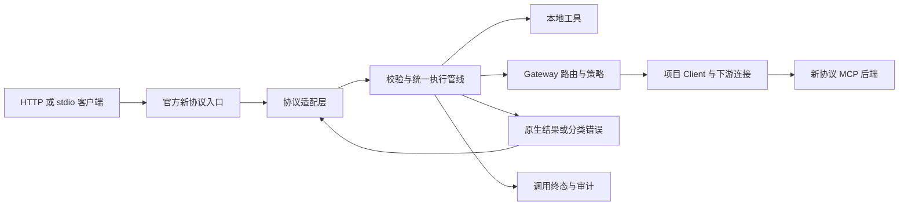

# ai-mcp SDK v2 与新协议一次性改造设计

日期：2026-10-03。状态：设计稿，待审阅；本稿不表示实现或运行验证已经完成。

## 1. 本次决定与目标

用户已选择 SDK v2／新协议方向，并明确更正：此前版本没有生产使用，不需要向后兼容。本稿据此替代旧设计中“先迁移 SDK 保留 legacy，再启用 modern，再验证新旧混合网关”的路线。

**目标是一套新公开 API、一套原生工具结果契约、一种协议版本，以及 HTTP／stdio 两种传输。Server、Client、Gateway、CLI、示例和测试同时按新契约改造，最终一次验收。** 内部按依赖分步开发，不发布双栈过渡版本。

完成后应能：注册任意合法业务工具，完整发现与严格校验，经一层或多层 Gateway 调用仍保持结果语义一致；两个独立客户端并发、取消和关闭互不干扰；错误和审计能够解释工具是否已执行。

本次不建设 CLI Agent 执行器、协作工作流、MCP Tasks、模型／账号管理、OAuth 平台、多租户隔离、动态工具热更新或跨机器调度。新协议基础支持不等于所有可选能力均已代理。

## 2. 调查基线与证据边界

- 仓库为 `main@8dad112` 加当前未提交 P0 改造；锁文件中的旧 SDK 为 1.27.1。Git HEAD 本身不包含现有底座成果。
- P0 会话为 `01a0f307-3b7c-7f01-8ddc-841527a96650`。起草时最新进度是两组独立复审通过、342 项测试通过，最终跨 Node 检查正在收尾。这是该会话记录，不是本设计重新执行的测试。
- 实施前取得 P0 最终报告及完整文件清单／内容哈希，作为开发起点；包括未跟踪源码，排除 node_modules、dist、coverage 等生成内容。不能只从旧 HEAD 建工作区而遗漏 P0。
- 本次只读调查了当前源码、官方规范、迁移文档、npm 发布元数据，以及发布包 source map 中的源代码。没有安装新依赖、执行 SDK 样例或修改产品实现。
- 本稿仅新增独立设计文件，避免与原会话仍在整理的 P0 文件互相覆盖。旧设计作为历史保留；实施时统一更新入口文档，注明本稿已取代旧兼容路线。

## 3. 技术版本与公开依赖

目标协议固定为 `2026-07-28`。Server 和 Gateway 拒绝 legacy 请求；Client 与下游 Connector 固定该版本，不进行旧握手降级或自动兼容探测。

2026-10-03 查询发布元数据得到以下设计选型；实施时复核这些**确切版本**可安装且公开 API 与本稿一致，不自动追逐 latest：

| 包                             | 选定版本 | 使用位置                                    |
| ------------------------------ | -------- | ------------------------------------------- |
| `@modelcontextprotocol/server` | 2.2.0    | Server／Gateway 协议适配层                  |
| `@modelcontextprotocol/client` | 2.2.0    | Client 适配层；Gateway 通过项目 Client 使用 |
| `@modelcontextprotocol/core`   | 2.2.0    | 仅在需要公开 wire schema 的适配层直接依赖   |
| `@modelcontextprotocol/node`   | 2.1.0    | Node HTTP 接入                              |

不引入 `server-legacy`，不直接导入 SDK 的内部入口或从 SDK 安装目录跨文件引用。发布包内部如何打包不成为项目依赖契约。node@2.1.0 的 server peer 为 ^2.1.0，可满足本次 2.2.0；Hono peer 被标为 optional，本项目使用原生 Node 入口，不因可选 peer 引入 Hono 应用框架。实施时仍核对冻结安装结果，不能由本机偶然已有的包满足依赖。

SDK 发布元数据要求 Node >=20，server/client/core 依赖 Zod ^4.2.0。项目本次运行与 CI 基线选择 **Node 22，最低 22.16.0**，延用现有 ESM、TypeScript 和 pnpm 工程；不扩大到其他运行时。Zod 使用同一可满足 SDK 约束的直接依赖版本，并记录实际 lockfile 解析值。SDK 包版本不同步并不等于可任意混配，组合必须经过冻结安装和真实运行验证。

来源：[官方 SDK](https://github.com/modelcontextprotocol/typescript-sdk)、[server 发布元数据](https://registry.npmjs.org/@modelcontextprotocol/server/2.2.0)、[client 发布元数据](https://registry.npmjs.org/@modelcontextprotocol/client/2.2.0)、[node 发布元数据](https://registry.npmjs.org/@modelcontextprotocol/node/2.1.0)、[core 发布元数据](https://registry.npmjs.org/@modelcontextprotocol/core/2.2.0)。

## 4. 架构选择

| 方案                                               | 评价                                             |
| -------------------------------------------------- | ------------------------------------------------ |
| 双 SDK／新旧协议共存                               | 用户已明确无需兼容；不采用                       |
| 完全重写协议编解码与 HTTP 协议栈                   | 重复官方实现，增加协议偏差；不采用               |
| **单代官方 SDK + 项目工具内核 + 原生结果 Gateway** | 采用；保留可靠的执行与治理能力，替换协议与兼容层 |



仍保留 shared、mcp-server、mcp-client、gateway 四个包。shared 只含项目数据与校验接口，不依赖 SDK 实例。协议适配层拥有 SDK 类型、wire 编解码和 SDK 错误判别；业务 registry、policy、audit 不读取 transport 或 SDK 私有状态。

Server 默认无演示工具；echo/time 移到 examples，通过同一通用注册接口使用。Resource／Prompt 的本地能力也使用通用名称与原生定义，移除 `server-info/tool-guide` 全局枚举；Gateway 本期只聚合 tools，不虚假声明聚合资源或提示词。

## 5. 唯一结果契约

### 5.1 对外采用原生 MCP 工具结果

项目内部使用版本无关的 `ToolResult`，表达 `content`、可选 `structuredContent`、`isError` 和 `_meta`。`content` 在 SDK 边界按官方内容块 schema 验证，不能仅因它是 JSON 对象就接受。

规则如下：

1. `isError` 是工具失败依据；业务数据中出现 `ok:false`、`status:failed` 不改变调用成败。
2. `outputSchema` 约束整个 `structuredContent`。成功且有输出 schema 时，缺少 structuredContent 或校验失败必须报错。
3. structuredContent 可以为对象、数组、字符串、数字、布尔值或 null；字段缺失与 null 不同，不能用 truthiness 判断。
4. `isError:true` 先识别为工具失败，不用成功 outputSchema 校验错误数据；内容块本身仍要合法。
5. 没有 outputSchema 时允许合法的纯文本／图片／音频／资源内容；不自动把文本解析成业务 JSON，也不补写 JSON 文本块。
6. SDK 负责 `resultType` 和 wire 编码；项目 `ToolResult` 不是未经校验的 wire 对象。
7. 未知 result type 归为无效结果；本期不能代理的 `input_required` 明确报 unsupported_capability，保留来源和执行状态。

Gateway 不再增加 StandardToolResult 外壳，取消 `legacy-auto`、`standard/v1`、`native-json/v1` 的基础设施自动识别与重包装。若某业务工具需要 `ok/code/message/artifacts`，这些字段作为该工具 schema 定义的业务数据正常传递，由工具自己明确设置 isError；不丢弃这些业务字段。

调用 trace/run/task 与来源放在项目命名空间 `_meta` 和审计中，不写入业务 payload。外部同名项目保留字段不直接可信；Gateway 重建本跳字段，来源只记录为来源，不能覆盖服务端 actor。

### 5.2 Gateway 的透明边界

“透明”指工具结果和 schema 语义保持一致，不是逐字节 HTTP 代理。Gateway 可以改公开名称、执行策略、过滤发现目录和增加自己的 `_meta`，但不能改写 content 顺序、媒体数据、业务 structuredContent 或业务 isError。

同一工具通过两层 Gateway 时，structuredContent 层级与直接调用一致。公开 outputSchema 与 source outputSchema 语义相同，不再为外壳做 `$defs` 重定位。

来源依据：[工具规范](https://modelcontextprotocol.io/specification/2026-07-28/server/tools)。这些结果约束与业务成功／失败判断均需真实 wire 正反例验证。

## 6. 新公共 API 与包边界

下面是**项目 API 设计**，不是已经存在的 SDK API；最终实现要有公开声明文件的消费测试。

```ts
type ConnectionSpec =
  | { transport: 'http'; url: string }
  | { transport: 'stdio'; command: string; args: string[]; cwd?: string };

type CallOptions = {
  timeoutMs?: number;
  signal?: AbortSignal;
  context?: { traceId?: string; runId?: string; taskId?: string };
};

interface ToolClient {
  connect(): Promise<void>;
  listTools(options?: CallOptions): Promise<readonly ToolDescriptor[]>;
  callTool(name: string, args: JsonObject, options?: CallOptions): Promise<ToolResult>;
  close(): Promise<void>;
}
```

- `createClient({ connection, timeoutMs })` 自己创建并拥有连接，不公开接收任意 SDK Transport 的构造器。
- listTools 是完整 descriptor 目录；删除简版／完整列表双入口。callTool 查找已验证目录；首次调用可按同一 deadline 完成发现，发现失败不得无校验调用。
- 工具失败作为 `ToolResult.isError:true` 返回；协议、连接、取消、超时和无效结果抛出统一 `AiMcpError`。CLI 再明确映射退出码，不混合“抛异常／返回成功外壳”两套语义。
- Server 保留通用 `defineTool/registerTool/use` 思路。工具定义的 input schema 对应对象 arguments；handler 返回 `ToolResult<TOutput>`，output schema 对应其 structuredContent。通过类型推导和运行时校验共同约束，不靠 any 或强制类型断言。
- 本地 Zod 校验继续支持异步；输入、handler、输出和 middleware 共用调用期限。输入 schema 发布输入视图、输出 schema 发布输出视图；不可表达为 JSON Schema 的定义在启动时拒绝。
- Server 的 `serveHttp`／`serveStdio` 返回项目拥有的可关闭句柄；Gateway 使用同一 hosting 约定。公开 API 不导出内部 RegistrySnapshot、SDK server factory 或裸 HTTP session 管理器。
- Resource／Prompt 使用独立的通用定义及正常的 MCP 内容结构；不用旧自定义 RpcOutput 承载。
- 各包 index.ts 显式列出公共导出。依赖注入的测试接口留在内部模块，不为测试把 SDK 运行对象泄露到公共 API。

## 7. 官方 SDK 接入方式与必须处理的实际行为

### 7.1 新协议入口

HTTP 使用 `createMcpHandler(factory, { legacy: 'reject' })`，Node 层通过 `toNodeHandler` 连接请求与响应。stdio 使用 `serveStdio(factory, { legacy: 'reject' })`。服务端 supportedProtocolVersions 限定为目标版本。不增加自己的新旧请求路由器。删除的是独立旧 SSE 入口，目标 HTTP 协议的 SSE 响应流仍由 SDK 正常处理。

Client 使用以下公开配置，Connector 统一通过它接入：

```ts
{
  versionNegotiation: { mode: { pin: '2026-07-28' } },
  inputRequired: { autoFulfill: false },
  jsonSchemaValidator: isolatedSchemaProvider
}
```

每次 SDK callTool 必须传入当前冻结目录的 `toolDefinition`、剩余 timeout 和本调用 signal。这样明确下游工具名、header 镜像及输出校验依据；不依赖 SDK 未填充的目录缓存。

### 7.2 不照搬 SDK 默认行为

对 2.2.0 发布包静态核验发现以下边界；实施第一步要用真实 SDK 测试证实：

| SDK 行为                                                                              | 本项目处理                                                                                                  |
| ------------------------------------------------------------------------------------- | ----------------------------------------------------------------------------------------------------------- |
| fromJsonSchema 默认 validator 跨调用共享；Ajv 优先按 `$id` 取已有 validator           | 显式注入按 schema 内容与作用域隔离的 provider；不用默认全局 provider                                        |
| 高层 listTools 自动聚合逐页复用 timeout；重复游标可能结束聚合                         | 自管显式逐页 tools/list，限制总期限、游标循环、页数和体积；失败不发布部分目录                               |
| callTool 缺少 descriptor 时可能缺失输出 validator，并在 HeaderMismatch 后刷新重试     | 每次传 toolDefinition；本期没有自动业务重放                                                                 |
| input_required 默认可自动推进多轮                                                     | 显式 autoFulfill:false；不执行 sampling／elicitation／自动续跑                                              |
| 高层 McpServer 工具执行 funnel 可将抛出的协议错误改成工具文本错误，并修改部分输出内容 | 工具调用使用公开低层 handler 执行项目 dispatcher，同时保留官方入口的 schema/header 校验能力，具体组合见下段 |

采用以下接入组合，2.2.0 发布源码已确认其公开接口和调用顺序可行：

1. 构造 McpServer 时显式声明 tools capability，listChanged:false；空目录也声明，确保 SDK 工具 handler 初始化已经完成。
2. 从同一不可变 snapshot 经公开 registerTool/fromJsonSchema 登记完整工具 schema；登记回调为防御性不可达回调，不承载第二条业务执行路径。
3. 完整登记后，通过公开 `mcp.server.setRequestHandler('tools/list'/'tools/call', ...)` 替换为项目 handlers，再返回 McpServer。注册完成后冻结，不在服务期间追加登记。
4. SDK 入口继续从其登记信息读取 inputSchema 做 header 校验；项目 dispatcher 负责输入、成功输出和内容块的完整业务校验。低层 handler 的协议形状校验不能替代业务校验。
5. 项目返回显式 content 数组，不依赖 SDK 的缺省补齐。SDK 登记视图、公开列表和 dispatcher 必须引用同一 snapshot revision。

SDK schema 转换失败或非法 header 声明可能只发 warning 并跳过 header 核对，因此项目必须在登记前完成严格 schema／header 准入，不能把 SDK 成功返回注册句柄当成校验通过。

**以上是源码可行性确认，真实 handler 覆盖时序、header 校验、错误与内容透传仍是实现起点的运行门槛。** 不得为了通过而访问 `_registeredTools`、调用私有方法、关闭 header 校验或 fork SDK。若真实验证否定该组合，先修订本节接入设计，不能偷偷替换成改变结果语义的高层路径。

官方迁移参考：[升级说明](https://ts.sdk.modelcontextprotocol.io/v2/migration/upgrade-to-v2)、[新协议接入](https://ts.sdk.modelcontextprotocol.io/v2/migration/support-2026-07-28)。发布包源码用于核验行为，应用只使用公开导出。

## 8. Schema、目录和 Gateway 路由

### 8.1 编译与校验

保留 P0 SchemaCompiler 的严格校验和真实 schema 节点遍历，支持 JSON Schema 2020-12 及现有 draft-07。默认 2020-12；未知方言、JSON Schema `$async`、不能解析的外部引用明确拒绝，不自动联网取 `$ref`。本地 Zod 异步校验与 JSON Schema `$async` 是两件事。

输入 arguments 为 JSON 对象，inputSchema 根显式 type:object。schema 文档必须是合法 JSON Schema 对象；输出文档允许描述任意 JSON 数据根，包括数组与标量。不能把“schema 文档是对象”误写成“输出数据只能是对象”。所有结果都必须是可序列化 JSON；undefined、NaN、Infinity、函数及循环对象不能通过类型断言越过运行时校验。

每个不可变 schema 以规范化内容哈希为缓存键，编译上下文隔离；同 `$id` 不同内容必须使用不同 validator。同一资源内的 nested `$id`、anchor 与 `$ref` 保持原语义，业务 const/enum/default/examples 不进入 schema 关键词重写。传给 SDK 的 provider 复用此契约；若 SDK 默认 provider 不满足就显式替换，不降低校验。

成功结果校验可缓存，但不得因工具名相同、同 `$id`、异步 Promise 或 validator 编译异常而放行。schema-only 相同内容复用需包含方言与解析资源集身份。

### 8.2 完整发现和冻结目录

服务启动时完成后端连接、发现、descriptor 校验、schema 编译和路由构建，再发布完整目录。新增或移除工具需要重启；本期不宣告 listChanged。

每次显式发现使用一个总 deadline，覆盖首次连接与所有分页；重复／循环 cursor、无效页和页数／体积超限都失败，旧目录不被部分结果替换。目录保存 source descriptor、public descriptor、validator、backend client 与 revision，调用固定引用同一 snapshot。

公开工具名使用 `backendId__toolName`，在发布前验证名称合法、长度和唯一性。非法名称或冲突拒绝目录启动，不等待第一次调用才失败。

构造 public descriptor 时，对所有来源重新校验 `x-mcp-header`，包括 stdio 后端。项目统一采用可安全公开到 HTTP 的 descriptor 准入规则，避免同一配置因传输方式不同而出现隐藏的无效目录。非法 header annotation 的远端工具被排除并记录明确诊断，其他合法工具继续进入候选目录；本地注册的无效声明直接拒绝启动。不能因为 stdio 下游 Client 可忽略 annotation，就把无效声明发布到 HTTP 上游。

失败的 schema 编译或其他无效 descriptor 使该后端目录失败。本期所有配置后端都要求 ready，不引入“部分后端失败仍启动”的模式。所有工具均被过滤的目录可为空，但 ready 诊断须显示数量及过滤原因。

### 8.3 Header、元数据与缓存作用域

Gateway 上游的 Mcp-Name 对应 publicName，下游对应原 backendToolName。保留 source inputSchema 的 x-mcp-header，并让 SDK 根据下游 descriptor 与 arguments 重新生成 headers；不整组复制上游 HTTP header。参数矛盾必须在执行前失败。

本期后端连接使用固定的服务配置，不透传终端用户认证。目录 snapshot 的作用域固定为 backend 配置及服务身份；客户端自报的 tenant/actor 不能改变身份或扩大权限。策略、可见性、风险 overrides、元数据取同一目录来源。未实现权限授予体系的 requiredPermissions 仍只作为能力元数据，不声称已强制鉴权。

## 9. 请求生命周期与资源所有权

移除 HTTP session map、sessionMode、TTL、maxSessions、DELETE 会话销毁，以及“连接等于一次业务会话”的假设。HTTP 每请求协议实例由官方入口创建；stdio 进程可以长存，但 trace/run/task、client capabilities 和调用身份每请求读取。

| 资源                                            | 拥有者        | 释放边界                                   |
| ----------------------------------------------- | ------------- | ------------------------------------------ |
| registry、catalog、policy、audit store          | 服务          | 服务关闭                                   |
| 下游 HTTP Client／stdio 子进程                  | backend owner | 永久断线淘汰或服务关闭                     |
| SDK HTTP 请求实例、响应流、调用 AbortController | 单次请求      | 完成、断连、取消、deadline 或服务关闭      |
| stdio 协议连接                                  | stdio host    | stdin 结束或服务关闭；不代表业务 Task 身份 |
| listener、socket、未读完 body                   | HTTP host     | 请求结束或服务关闭后的有界清理             |

调用预算从请求执行管线入口开始，包含校验、前后 middleware、连接等待、分页／目录取得、handler、输出校验和调用审计。协议解码前的 body 读取另受读取期限和体积限制，不能成为无限等待漏洞。

调用 A 的取消仅中止 A 的本地等待和下游请求，不关闭共享 backend Client；B 的在途及后续调用继续成功。HTTP 流中断与 stdio 取消按目标 SDK／规范真实验证，不自行把 socket close 等同于业务停止。

关闭顺序：标记 closing 并停止接入 → 取消活动请求及 body 读取 → 关闭协议实例／流 → 关闭 listener 与残留 socket → 关闭 backend 活动、候选、退休连接及子进程 → 完成审计排空 → closed。停止接入时启动 listener.close，但不先等待其完成而阻塞活动流清理。close 幂等，共享同一完成 Promise。初始化与 closing 交接后不得再次发布新实例。

shutdownGraceMs 是服务关闭的总等待预算；审计排空最多使用 flushTimeoutMs 与剩余总预算的较小者。预算耗尽就输出准确的 CloseReport，不把每个清理步骤重新获得完整 grace 而无限延长。

不配合取消的 handler 可能仍在执行，报告 executionDisposition=unknown 和剩余活动信息；不能宣称业务已终止。下游执行可能发生后遇到断线、超时或审计失败，不重放调用。

## 10. 错误与审计

### 10.1 单一错误模型

`AiMcpError` 保存 category、projectCode、message、traceId、invocationId、executionDisposition 和 source。SDK 本地错误、peer JSON-RPC 错误、HTTP 状态和工具失败分别判别；不要用错误消息字符串或跨包 instanceof 作为唯一分类方法。

协议请求形状、未知方法、未知工具等按官方语义使用 JSON-RPC／MCP 错误。已知工具参数不满足工具 schema、本地业务拒绝与下游 isError 属于工具错误，返回 isError:true；无效成功输出属于 invalid_result，不包装成工具成功。

项目治理／基础设施错误使用项目自定义的 450xx 范围，SDK 自身协议错误保留规范含义：

| 项目分类                    | 对外应用码 |
| --------------------------- | ---------- |
| policy_denied               | 45001      |
| rate_limited                | 45002      |
| backend_timeout             | 45003      |
| backend_unavailable         | 45004      |
| invalid_result              | 45005      |
| audit_unavailable           | 45006      |
| unsupported_capability      | 45007      |
| cancelled（连接仍可响应时） | 45008      |
| schema_unsupported          | 45009      |
| overloaded                  | 45010      |

450xx 是项目决定，不是 MCP 标准码。不得继续把旧 -32020/-32030/-32040 当作项目策略码。下游来源 code/version 保存在 source；下游 header 错误不能冒充上游发错 header。客户端取消导致连接已断时，通过本地错误和审计报告，不伪造已发送响应。

### 10.2 审计终态

每调用记录一条执行终态：输入摘要、公开／下游工具名、catalog revision、协议实际版本、trace/run/task、策略决定、executionOutcome、耗时和 executionDisposition。actor 来源是服务配置或受信入口，不来自任意调用 metadata。日志中的执行终态不表示客户端一定收到该响应。

audit sink 初始化失败使服务不进入 ready。采用严格审计：正常返回前完成本次终态记录；审计失败返回 audit_unavailable，并准确说明工具是否已经执行。原业务结果不能自动重跑。执行终态竞争由统一管线决定，取消、超时和迟到成功不能各写一条相互矛盾的记录。

审计跨越调用 deadline 时采用以下确定规则：

1. handler／结果校验完成或执行期限先到时，先冻结 executionOutcome。之后进入 audit_pending；已完成业务不能因落盘等待而改写成“未执行”。
2. 记录键为 invocationId。单 writer 对同键同内容最多追加一次；同键异内容是冲突。JSONL 完整追加并完成持久化同步后才确认 committed，可合并多条同步但每条 acknowledgement 都在同步之后。
3. 正常结果仅在审计 committed 且调用仍可响应时发送。执行已完成、审计阶段到期时，返回 audit_unavailable，原因 AUDIT_TIMEOUT，executionDisposition 保持 completed；无法确认写入是否完成时 auditDisposition=unknown，而不是重新发起一次 append。
4. 延迟完成的同一 append 只更新内部审计状态，不再写第二条相反的执行终态。连接已关闭或调用已结束时，不恢复发送迟到成功。对外响应 outcome 与执行 outcome 分开记录；需要记录传输结果时使用独立事件类型，不冒充第二条调用终态。
5. 注入 sink 必须明确 acknowledgement 的持久化语义、幂等键和失败／不确定结果；仅实现普通 log(message) 的 sink 不满足严格审计契约。

审计排空也有关闭期限；超时返回 CloseReport 的未完成数量和错误，CLI 非零退出，不把无限挂起或日志未落盘标成成功关闭。由调用方注入但不转交所有权的 sink 必须显式声明 ownership，避免随意关闭外部资源。

错误空间来源：[基础协议](https://modelcontextprotocol.io/specification/2026-07-28/basic)。

## 11. 配置、CLI 与运行限制

配置采用 `configVersion: 1` 的新格式，所有对象递归严格校验。旧字段是配置错误，没有别名、静默忽略或自动转换。用户／仓库中的示例一次性更新。

```json
{
  "configVersion": 1,
  "listen": {
    "transport": "http",
    "host": "127.0.0.1",
    "port": 4000,
    "path": "/mcp"
  },
  "limits": {
    "requestTimeoutMs": 60000,
    "bodyReadTimeoutMs": 15000,
    "maxBodyBytes": 4194304,
    "maxConcurrentRequests": 128,
    "maxConcurrentPerBackend": 32,
    "shutdownGraceMs": 5000
  },
  "backends": [
    {
      "id": "catalog",
      "connection": { "transport": "http", "url": "http://127.0.0.1:3000/mcp" }
    }
  ],
  "audit": { "path": "./logs/gateway.jsonl", "flushTimeoutMs": 5000 }
}
```

这些是本项目建议默认值，不是压测得出的容量结论。并发满时直接拒绝，不添加无界队列；限制涵盖读取 body 的请求。413 响应应真正到达客户端，不能先 destroy socket 再声称已返回。

stdio connection 用 command、args 数组、cwd；环境由受控进程配置处理，不通过命令字符串拆词或 shell 拼接执行。配置日志不输出 env 值或凭据。连接为 service-owned，每个后端至多一个活动 client 与受管理的连接建立过程。

Server／Gateway CLI 统一为 `--config <path>`，Client CLI 也读取同一 connection 结构。HTTP 和 stdio 是唯一传输值；协议版本固定在实现与发现结果中，不提供 runtime legacy/auto 开关。

Client CLI 的 tools list 输出完整目录，tools call 输出完整 ToolResult JSON。成功 exit 0；工具 isError exit 2；协议／连接／配置错误 exit 1。正文只输出结构化结果，诊断输出 stderr，媒体块不转成丢信息的文本摘要。

HTTP 默认 loopback；使用官方 Node 接入的 Host／Origin 校验，并明确允许项。保留 `/health` 与增加 `/ready` 的明确语义：前者仅存活，后者为配置、catalog、后端初始化和 audit 可用；都不能替代真实工具调用验收。

## 12. 删除清单与保留清单

| 当前内容                                                                      | 一次性改造动作                                                 |
| ----------------------------------------------------------------------------- | -------------------------------------------------------------- |
| `@modelcontextprotocol/sdk` v1 依赖与旧 imports                               | 从工作区依赖、源码、测试、fixtures、示例及锁文件直接依赖中移除 |
| `mcp-client/src/adapters/legacy-client.ts`、`pinProtocolVersion`              | 删除                                                           |
| `gateway/src/protocol.ts` 旧版本允许列表／默认值                              | 删除；目标版本在单一协议常量与 SDK 配置中定义                  |
| `Server.handleRawRequest`、自定义 RpcRequest/RpcOutput 与自定义 RPC transport | 删除；`/mcp` 只处理官方目标协议                                |
| `startSse`、旧 `/sse`／`/sse/call`、自定义 transports 目录                    | 删除；保留目标 HTTP 协议使用的 SSE 响应流                      |
| session map、sessionMode、TTL、maxSessions、DELETE session                    | 删除，替换为请求资源管理                                       |
| Client(旧 Transport)、echo/time 专用泛型与简版 listTools                      | 替换为新公开接口                                               |
| 全局 ToolName/ToolInputMap/ToolOutputMap 与 demo schemas                      | 从 shared 移出，演示定义进入 examples                          |
| Gateway resultContracts、legacy-auto 与形状猜测                               | 删除                                                           |
| Connector 同时返回 output/native                                              | 统一为一个 ToolResult 和调用诊断                               |
| StandardToolResult 自动包装、createStandardView、外壳引用重定位               | 删除基础设施路径；业务字段按工具 schema 处理                   |
| 旧四字符串 RPC 错误与新 fault 双模型                                          | 合并为新 fault 模型和唯一 wire 呈现                            |
| 客户端文本 JSON 自动回退、CLI `{output}` 投影                                 | 删除，输出完整原生语义结果                                     |
| `allowLegacyHttpSse`、`httpSession`、`--protocolVersion` 等配置               | 新 schema 明确拒绝，更新全部调用样例                           |

保留并适配：类型安全 registry、统一 dispatcher、严格 SchemaCompiler、真实 schema 遍历、完整 descriptor、冻结目录、风险策略、限流、trace/run/task、执行状态、审计落盘、总 deadline、单调用取消和资源所有权。

旧回归中与这些不变量有关的测试必须迁到新协议路径。只删除证明已取消功能的断言；不得连同 malformed body、并发、关闭竞态、schema 污染和不重复执行等回归一起删除。

## 13. 文件与职责范围

| 包／位置                                              | 主要改造                                                                  |
| ----------------------------------------------------- | ------------------------------------------------------------------------- |
| shared/types、tool-contract、invocation、error、index | 唯一公共数据模型、通用 descriptor／result／fault；移除旧 RPC 和 demo 枚举 |
| shared/tool-schema、json-schema-walk                  | 保留严格编译和遍历；增加隔离 SDK provider 所需的适配契约                  |
| server/tool-registry、tool-dispatcher、types          | handler 返回 ToolResult；输出任意 JSON；通用资源和提示词；保留执行管线    |
| server/sdk-server-factory、server、lifecycle          | 替换为 modern protocol factory、HTTP host、stdio host、request owner      |
| client/client、discovery、errors、result-decoder      | 新连接配置、显式逐页发现、descriptor-bound 调用、原生结果与 typed errors  |
| gateway/gateway-server、gateway-core、tool-catalog    | 薄协议入口、语义透传、同 snapshot 路由、schema 不再包外壳                 |
| gateway/connectors、audit-jsonl、types、cli           | 统一 Client 使用、连接所有权、审计关闭报告、新配置                        |
| packages/\*/index.ts、package.json、pnpm-lock.yaml    | 显式导出、精确新依赖、Node 支持声明、冻结安装                             |
| examples、scripts/fixtures                            | 演示工具搬迁；HTTP／stdio／Gateway 使用全新接口；删除 SSE 示例            |
| scripts/e2e-gateway-\*、vitest.config、CI             | 新协议真实矩阵；清理已删除旧 transport 的覆盖率豁免；新核心纳入 80% 门槛  |
| README.md、README.zh-CN.md、运维和历史设计入口        | 新契约、新命令、新能力边界；旧兼容设计标为历史                            |

模块按职责拆分，避免把生命周期、目录、错误转换和 CLI 再堆到一个 gateway-server.ts。共享协议适配实现可以复用，但 shared 包不承载 SDK 运行对象。

## 14. 执行依赖顺序

以下是本次整体改造的内部顺序，不是兼容版本或多次发布计划：

1. **冻结 P0 起点与新设计。** 记录源文件清单，明确现有修改归属，冻结新 API／配置／结果契约。
2. **验证发布版 SDK 接入组合。** 先证明 modern-only HTTP／stdio、公开 handler 组合、严格错误与内容保持、隔离 provider、descriptor-bound call、无自动续跑。失败则修订设计，不扩展主体实现。
3. **统一 shared 与 Server 内核。** 清除旧 RPC 和 demo 依赖，落地新 ToolResult、注册和执行模型。
4. **完成 Client 与下游连接。** 逐页发现、总期限、schema/header、错误分类和连接关闭。
5. **完成 Server／Gateway hosting 与语义透传。** 请求所有权、统一治理、审计、嵌套网关和全传输调用链。
6. **同步 CLI、示例、文档和删除项。** 清除旧导出、配置、测试入口及死依赖。
7. **冻结最终源码，独立审阅并完整验收。** 所有发现先补失败回归、修复后重新审阅，交付实际 diff 与证据。

每一步采用 Red → Green，不先写主体实现再补镜像测试。源码修改在设计审阅后进入单独的逐文件实施计划；不把当前设计文件当作测试已经编写或安装已经完成。

## 15. 验收矩阵

| ID  | 必须证明的行为                                                       | 验证方式                                                                  |
| --- | -------------------------------------------------------------------- | ------------------------------------------------------------------------- |
| V01 | 仅接受目标新协议，旧 initialize／旧配置／旧公开入口不可用            | 原始请求和 CLI 负例；不需要安装旧 SDK 来构造负例                          |
| V02 | discovery、每请求 metadata、header、resultType 均为真实新 wire       | 真实 Node HTTP／stdio 抓取并用官方 schema 检查                            |
| V03 | 本地自定义工具注册、输入校验、异步校验和输出校验一致                 | 类型消费测试 + SDK 集成                                                   |
| V04 | false、0、空字符串、null、数组、对象、纯媒体都保持语义               | 直接调用、一层和两层 Gateway 对照                                         |
| V05 | outputSchema 校验的是实际 structuredContent，isError 不走成功 schema | 独立 validator 正反例                                                     |
| V06 | 文本不被 JSON 猜测，Gateway 不增加外壳、不改 content                 | payload 带 ok:false、JSON 字符串、图片／音频／资源样例                    |
| V07 | 同根 `$id` 不同 schema、nested `$id`、anchor、循环引用正确           | 两个真实工具正反调用；默认 SDK provider 问题先 RED                        |
| V08 | const 内 `$ref`／业务 `$async` 不被误改，远程 ref 不自动联网         | schema 安全与离线解析回归                                                 |
| V09 | 分页全量、循环 cursor、首次连接超时及取消覆盖一个总预算              | 真实可控后端，失败不产生部分目录                                          |
| V10 | x-mcp-header 正确，publicName／backendToolName 分别匹配各跳          | HTTP 参数镜像正负例；stdio 来源在 HTTP 上游发布前的非法声明过滤           |
| V11 | 已提交工具调用不因 HeaderMismatch、断线、超时或 input_required 重放  | 后端执行计数；关闭 SDK 默认续跑                                           |
| V12 | 两个独立 HTTP 客户端真实重叠；取消 A 不影响 B                        | handler barrier，B 在途及后续调用成功                                     |
| V13 | 两个客户端使用相同 requestId 不串取消或上下文                        | 原始独立 HTTP 请求 + trace/run/task 检查                                  |
| V14 | body 未完成、JSON null、超大 body、初始化停机竞态不会崩溃或挂死      | 真实 TCP／子进程，413 可读，端口可重新绑定                                |
| V15 | candidate／retired client、stdio 子进程、响应流和 socket 归属清晰    | 退出与重连探针，最终资源计数与进程检查                                    |
| V16 | 协议错误保留 code/data，工具失败保留内容，分类不依赖字符串           | 真实 v2 SDK 与 Gateway fault 链                                           |
| V17 | policy／risk／visibility 未丢失或被调用 metadata 覆盖                | 发现过滤、拒绝执行和审计交叉核对                                          |
| V18 | deadline 包住前后 middleware，迟到成功不能覆盖超时                   | 受控迟到 handler 与单一终态断言                                           |
| V19 | audit 初始化、写入、排空失败正确；业务不重跑                         | 可控 sink，deadline 与迟到持久化竞态、幂等键、exit/CloseReport 与执行计数 |
| V20 | 未代理交互能力明确失败，未知 resultType 不成功透传                   | input_required／未知类型 fixture                                          |
| V21 | HTTP↔HTTP、HTTP↔stdio、stdio↔HTTP、stdio↔stdio及两层网关             | 真实进程矩阵，全部使用新协议                                              |
| V22 | 本地 Resource／Prompt 新 API 可发现和调用                            | 官方新协议客户端，无旧 demo 枚举入口                                      |
| V23 | 新公共 API、CLI、示例可独立消费                                      | 从构建产物导入；配置错误、退出码、媒体输出检查                            |
| V24 | 无直接 v1 imports、旧 API、旧配置和遗留兼容包                        | 静态搜索 + lockfile／导出／依赖检查                                       |

每个新核心模块参与原有四项 80% 覆盖率门槛；测试数量可以随旧入口删除而变化，交付要列出旧不变量到新用例的映射。不能用“删了旧测试所以全绿”作为证据。

执行 lint、typecheck、coverage、build，以及三组重新定义的新协议 Gateway e2e。协议矩阵命令可更名为 transport matrix，根 scripts、CI 和文档必须同步；构建后才运行 dist 脚本。默认 CI 使用 Node 22；本地 macOS 和实际运行的 Linux CI 结果分开报告。

## 16. 交付与停止条件

最终交付：新公开接口说明、完整删除／改写 diff、版本与安装证据、关键 Red→Green、V01–V24 逐项结果、真实并发和进程清理证据、独立审阅结论、未验证宿主边界。

任何以下情况阻止宣称完成：官方公开入口组合未验证；schema 被放宽；原生错误／内容被 SDK 悄悄转换；自动重放仍存在；关闭仍留未知资源却报告成功；真实新 wire 未覆盖；旧配置被静默接受。

此前版本无生产使用，因此不建设旧配置转换器、兼容发布、混合协议矩阵或生产流量切换。保留 P0 文件快照是为了源代码可追溯与问题定位，不是生产兼容要求。开发产物继续保持未提交；commit、push、merge、PR 仍分别需要用户明确授权。

设计审阅后再生成具体实施计划，列出每步文件、失败测试、依赖与并行边界。本稿的发布包检查仅为静态证据，不能代替 SDK 集成或真实宿主验证。
